# 学生成绩管理系统 设计报告

<div STYLE="page-break-after: always;"></div>

<h1><center>目录</center></h1>

该作业已托管至 [GitHub](https://github.com/Panxuc/System-Of-Students-Grade-Management)。

[TOC]

<div STYLE="page-break-after: always;"></div>

## 一、设计内容与设计要求

#### 1. 课程设计目的

　　面向对象程序设计课程设计是集中实践性环节之一，是学习完《计算机程序设计基础2》C++面向对象程序设计课程后进行的一次全面的综合练习。要求学生达到熟练掌握C++语言的基本知识和技能；基本掌握面向对象程序设计的思想和方法；能够利用所学的基本知识和技能，解决简单的面向对象程序设计问题，从而提高动手编程解决实际问题的能力。__尤其重视创新思维培养。__

#### 2. 课题题目

　　1）学生成绩管理系统（或公司人事管理系统）

#### 3. 文档设计要求

　　3.1 设计课题题目：每个同学都单独完成1道课题。后面有范题，仅供同学们参考，不列入本次课程设计的课题。
　　3.2 对于程设题目，按照范题的格式。自行虚构软件需求。并按照第4点要求，编写设计文档。基本要求系统中设计的类的数目不少于4个，每个类中要有各自的属性（多于3个）和方法（多于3个）；需要定义一个抽象类，采用继承方式派生这些类。并设计一个多重继承的派生类。在程序设计中，引入虚函数的多态性、运算符重载等机制。

#### 4. 程序设计的基本要求

　　（1）要求利用面向对象的方法以及C++的编程思想来完成系统的设计；
　　（2）要求在设计的过程中，建立清晰的类层次；
　　（3）根据课题完成以下主要工作：①完成系统需求分析：包括系统设计目的与意义；系统功能需求（系统流程图）；输入输出的要求。②完成系统总体设计：包括系统功能分析；系统功能模块划分与设计（系统功能模块图）。③完成系统详细设计：数据文件；类层次图；界面设计与各功能模块实现。④系统调试：调试出现的主要问题，编译语法错误及修改，重点是运行逻辑问题修改和调整。⑤使用说明书及编程体会：说明如何使用你编写的程序，详细列出每一步的操作步骤。⑥关键源程序（带注释）。
　　（4）自己设计测试数据，将测试数据存在文件中，通过文件进行数据读写来获得测试结果。
　　（5）按规定格式完成课程设计报告，并在网络学堂上按时提交。
　　（6）不得抄袭他人程序、课程设计报告，每个人应独立完成，在程序和设计报告中体现自己的个性设计。

#### 5. 进度安排

<table border="1" align="center">
    <tr><td rowspan="5">小学期<br>第2周</td><td>对学生成绩管理系统的总体架构进行规划</td><td>设计学生成绩管理系统的核心类</td><td>完成链表、学生类、课程类的编写</td></tr>
    <tr><td>设计数据库类及各项功能</td><td>完成添加、保存、读取学生成绩信息功能的编写</td><td>完成修改、删除学生成绩信息功能的编写</td></tr>
    <tr><td>设计用户界面类及各项功能</td><td>完成查询学生成绩信息功能的编写、调整输出格式</td><td>完成输出、打印学生成绩信息功能的编写</td></tr>
    <tr><td>设计账号类及各项功能</td><td>完成账号等各项功能的编写</td><td>为账号进一步设计、优化用户界面</td></tr>
    <tr><td>在不同编程环境配置中测试程序的兼容性</td><td>进行运行测试，观察程序在极端条件下的运行情况</td><td>调试程序，寻找漏洞与错误</td></tr>
</table>
<div STYLE="page-break-after: always;"></div>

## 二、系统需求分析

　　学生成绩管理系统记录了学生的成绩情况，它包括：学生学号、学生姓名、课程名称、课程类型（必选、限选及任选）、课程学分、课程成绩、课程绩点等。试设计学生成绩管理系统，使之能提供以下功能：

- 录入学生的信息及成绩。通过程序中的提示从键盘输入数据。
- 修改学生的信息及成绩。可以对学生的学号、姓名以及所选科目的任何信息进行修改，并实现对应课程信息的自动更新。
- 删除学生的信息及成绩。可以对任何学生和课程进行删除。
- 查询学生的信息及成绩。可以通过学号和姓名查询学生信息，通过课程名称查询课程信息。
- 排序学生的信息及成绩。可以以学号、姓名、总成绩、总学分、总绩点、平均成绩、平均绩点等排序学生，以课程名称、课程学分、学生数量、平均成绩、平均绩点等排序课程。
- 打印学生的信息及成绩。可以将学生信息及课程信息输出到`Markdown`文件。
- 保存与载入学生的信息及成绩。可以读取和载入学生及课程信息。
- 以菜单方式工作，便于用户选择。

<div STYLE="page-break-after: always;"></div>

## 三、总体设计

　　学生成绩管理系统包含七个大的功能，分别是：录入学生成绩信息、修改学生成绩信息、删除学生成绩信息、查询学生成绩信息、排序学生成绩信息、打印学生成绩信息、保存与载入学生信息。学生的信息主要包含学号、姓名、选课信息、总学分、平均成绩、平均绩点等。课程的信息主要包含课程名称、课程学分、课程类型、选课学生信息、平均成绩、平均绩点等。

- 在录入学生成绩信息时根据系统提示逐一输入。每输入完一条信息，系统会提示是否继续输入，用户可以选择继续输入或返回上一级。
- 在修改学生成绩信息时，用户首先输入要修改的学生姓名或学号，系统会进行检索。如果系统中有该学生的相关信息，则系统则会提示用户进行修改。如果系统中没有该学生的相关信息，则系统会给相关提示，并让用户返回主菜单。同时，用户可以输入要修改的课程名称，修改课程信息。
- 在删除学生成绩信息时，用户首先输入要修改的学生姓名或学号，系统会进行检索。如果系统中有该学生的相关信息，则系统则会提示用户进行删除。如果系统中没有该学生的相关信息，则系统会给相关提示，并让用户返回主菜单。同时，用户可以输入要删除的课程名称，删除课程信息。
- 在查询学生成绩信息时，用户首先输入要查询的学生姓名或学号，系统会进行检索。如果系统中有该学生的相关信息，则系统则会展示用户查询的学生信息。如果系统中没有该学生的相关信息，则系统会给相关提示，并让用户返回主菜单。同时，用户可以输入要查询的课程名称，查询课程信息。
- 在排序学生课程信息时，用户可以通过选择菜单选择进行排序的关键列，并且选择升序和降序。学生的关键列有：学号、姓名、总成绩、总学分、总绩点、平均成绩、平均绩点；课程的关键列有：课程名称、课程学分、学生数量、平均成绩、平均绩点。
- 在打印学生成绩信息时，用户首先输入要打印的学生姓名或学号，系统会进行检索。如果系统中有该学生的相关信息，则系统则会以输出到`output_student_学号_姓名.md`的方式打印学生成绩单。用户也可以选择打印全部学生信息（输出到`output_student_all.md`）、打印课程信息（输出到`output_lecture_课程名称.md`）、打印全部课程信息（输出到`output_lecture_all.md`）。

学生考勤管理系统中功能模块图：
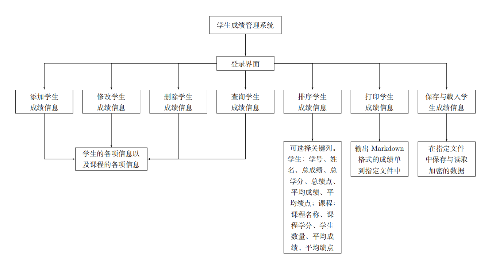

<div STYLE="page-break-after: always;"></div>

## 四、详细设计

#### 1. 学生成绩管理系统中类的类层次图


#### 2. 学生成绩管理系统中各功能模块的实现

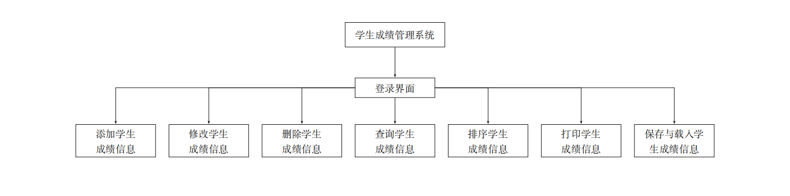

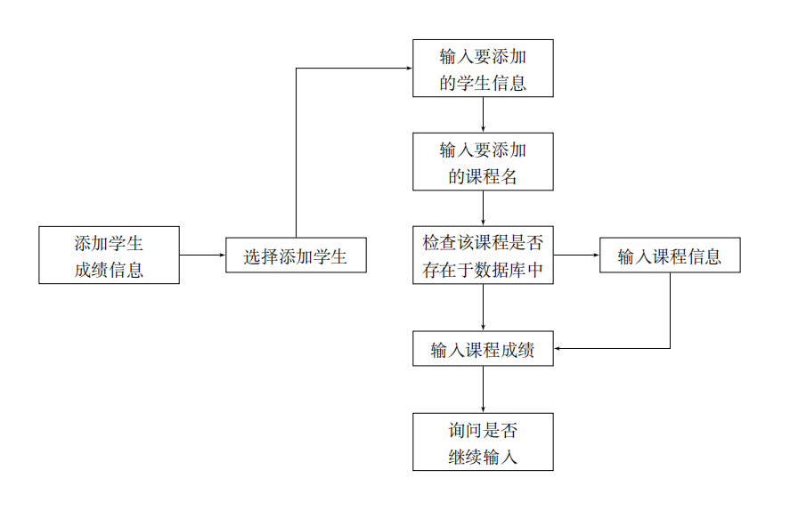

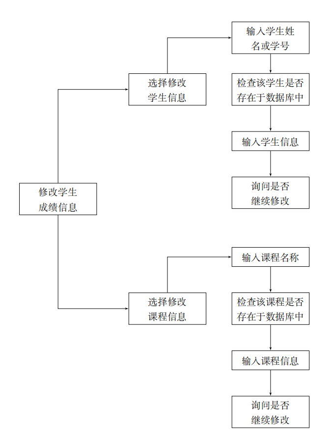

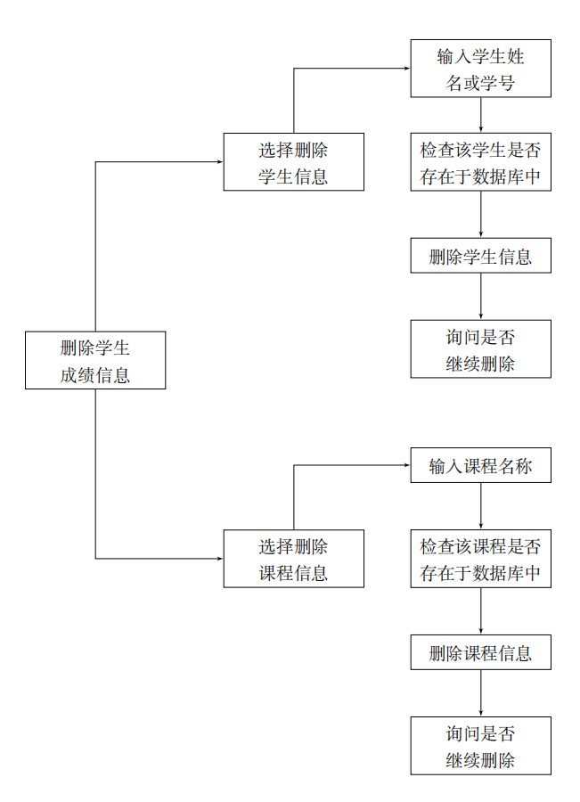

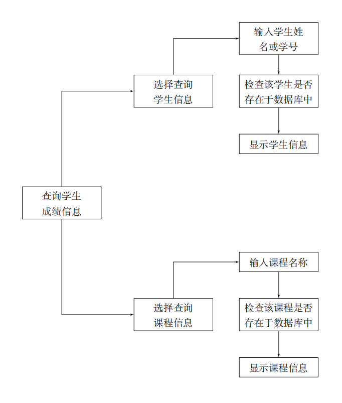


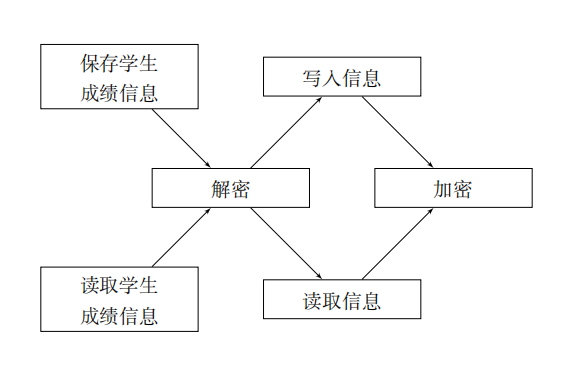

<div STYLE="page-break-after: always;"></div>

#### 3. 类的UML图

若不清晰可参见[PDF(纵向)](assets/uml_portrait.pdf)或[PDF(横向)](assets/uml_landscape.pdf)。

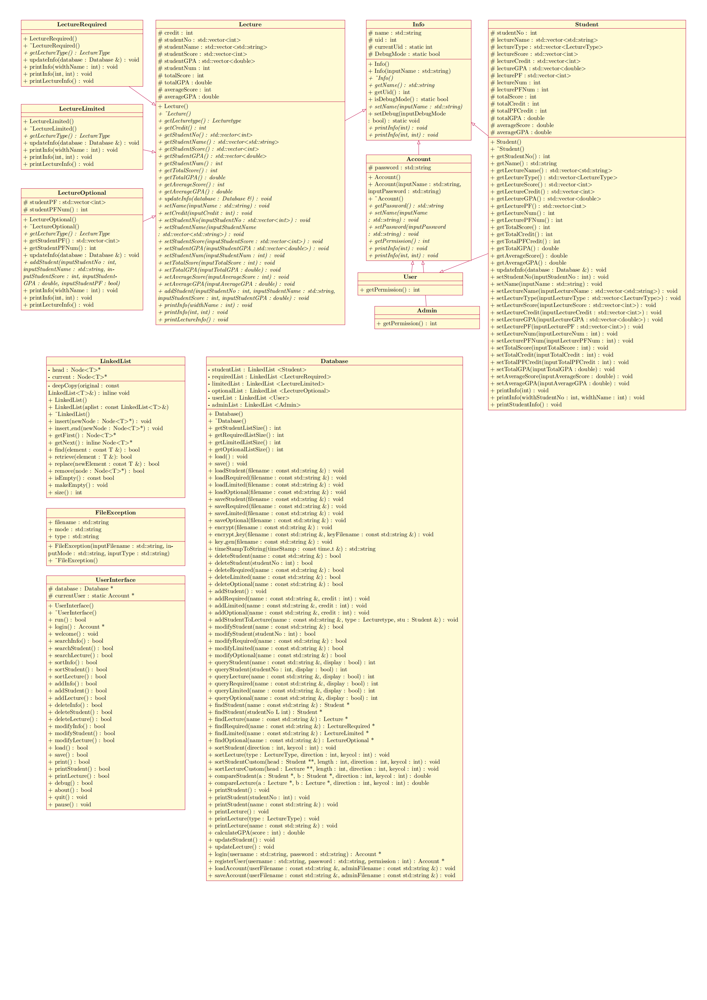

<div STYLE="page-break-after: always;"></div>

## 五、系统调试

　　在“学生成绩管理系统”编写完成后，我对程序进行了系统调试。在调试过程中，我遇到了一些问题。

　　首先是键盘输入问题。起初，我使用`cin`来处理输入选项。但是当输入格式与设想的格式不符时，程序可能会出现众多异常情况。于是，我选择使用`_getch()`来直接读取键盘输入值，在一定程度上避免了麻烦。

　　文件保存上也遇到了一些问题。我为保存设计了加密算法，原理是对每个字符直接取反。但是在实际使用中，部分字符取反为文件终止符，导致读取失败。后来，我对算法进行了改进，现在已经可以正常在保存读取时加密、解密了。另外，我设想过通过密钥的方式进行加密，不过因为效果不是很理想，最终放弃了。

　　在数据存储形式上，我使用了比较传统的链表来存储数据。同时，我将学生成绩分为两份，同时存储在学生类和课程类中。这样做偶尔会出现删除不干净的情况，同时由于某一语句中括号放在了错误的位置，导致删除失败。后来我重新设计了将两边数据进行同步的算法，解决了这个问题。

　　总体而言，我的“学生成绩管理系统”的调试较为成功。虽然出现了一些小问题，但是基本都是因为我开发过程中的粗心和疏忽导致的，并不存在功能上面的缺陷。同时，由于我在一定程度上运用了模块化的编程思想，总体上解决问题也较为容易。

<div STYLE="page-break-after: always;"></div>

## 六、测试结果与分析

　　由于本程序在`UTF-8`(`Codepage 65001`)编码环境下在输出一些含有汉字的表格时可能出现不对齐的情况，而我的电脑使用`UTF-8`编码环境，故以下截图是本程序运行在一台Windows 7虚拟机（使用`GBK` (`Codepage 936`)编码环境）上时的截图。

首先注册教师账户。

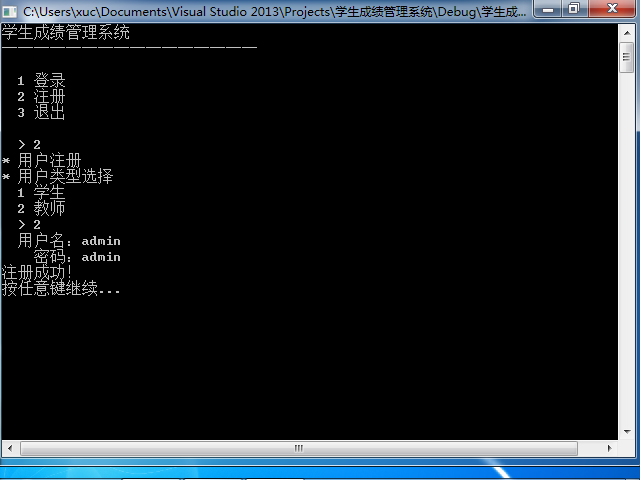

添加一名学生。

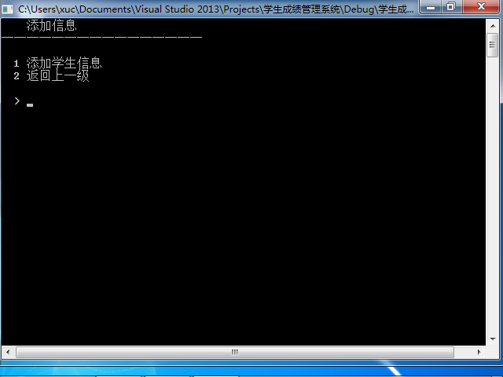

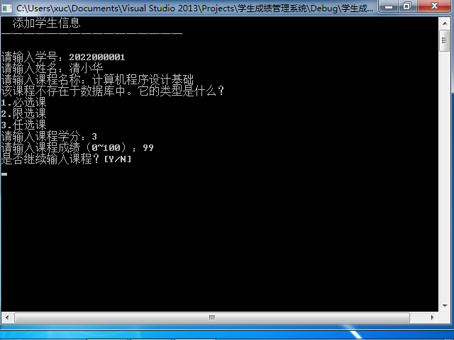


添加完成后查询到该学生，说明添加成功。

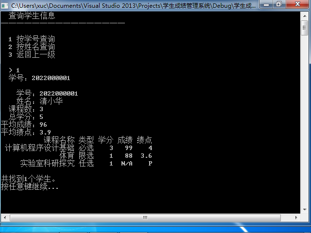

继续添加一些学生。

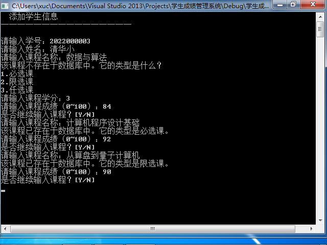


将学生成绩按平均绩点升序排序。

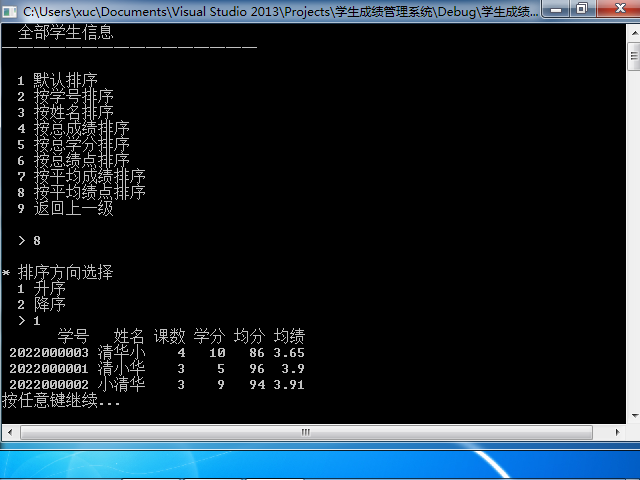

打印学生成绩。

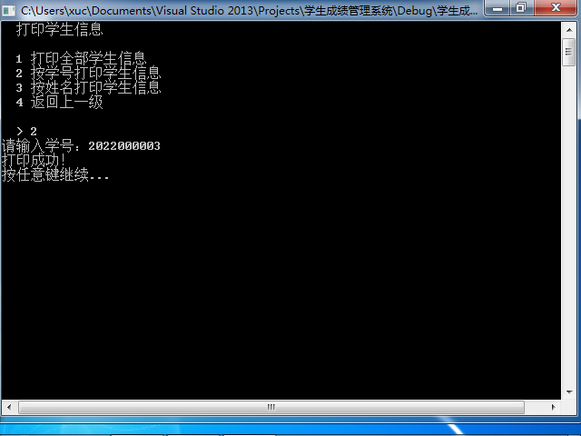

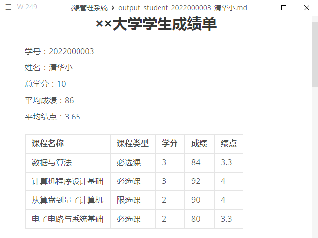

保存学生成绩，得到加密文件。

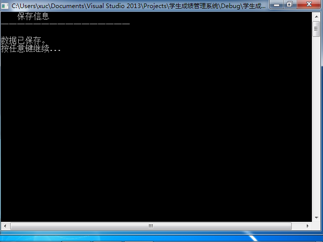

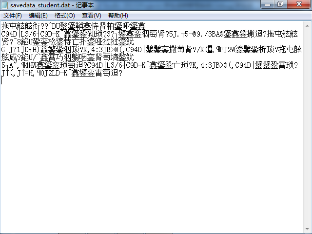

登录学生账户。

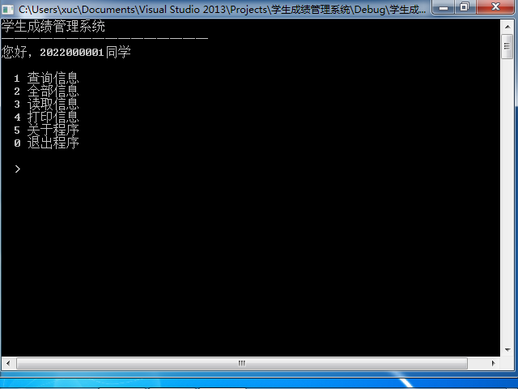

学生只可对自己的信息进行查看。


返回教师账号，修改学生信息。

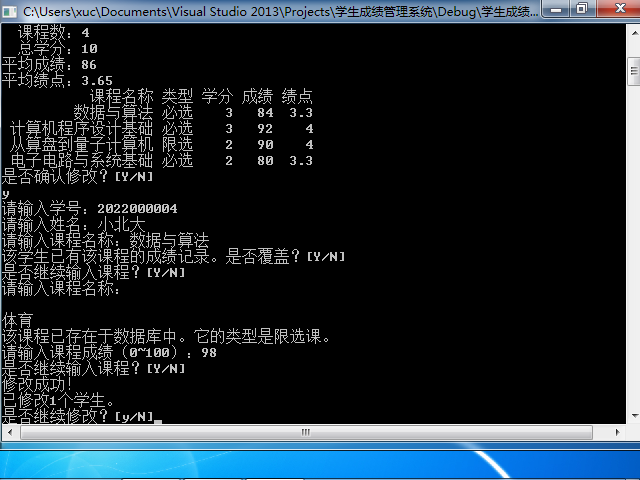

成功修改。

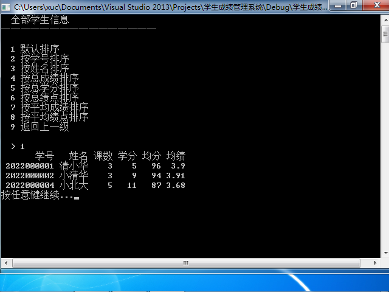

<div STYLE="page-break-after: always;"></div>

## 七、总结

　　通过完成本次《计算机程序设计基础2》大作业，我对面向对象的程序设计、C++语言以及计算机与操作系统等多方面有了更加深入的认识。

　　在程序设计的过程中，我使用了大量的类和对象，在编写过程中比从春季学期的作业中更加深刻地体会到面向对象的编程思想。在设计类的时候，我尽可能使各个类的功能分开，将一些全局的方法设置在数据库类（`Database`）中，将不同的类的方法设置在相应的类中，在一定程度上实现了“高内聚低耦合”的设计原则。在程序运行的过程中，我充分使用了堕胎和虚函数的特性，赋予不同对象不同特性，提高了程序的灵活性和可扩展性。在测试过程中，我尝试使用了异常处理机制，增强程序安全性。

　　在具体方法上，我学习了一些C++语言的语法和特性，如模板、容器、迭代器、智能指针等，这些都是C++语言相比于C语言的优势所在。我尝试使用了一些STL标准库中的内容（如`string`、`vector`等），来对数据进行更好地管理，使得代码更加简洁高效、易于维护。

　　在计算机层面，我对文件操作有了更加深入的理解。我使用了文件流来读取和写入数据文件，实现了数据的持久化存储。同时，我采用了一种加密算法，并通过实践排除了其中的漏洞。除此之外，我还学习了使用`Git`、 $\LaTeX$等工具帮助我进行程序编写与报告写作。这使我对计算机和程序设计理解更加深入。

　　总而言之，本次大作业使我对C++和计算机认识更加深入，程序设计水平得到一定程度提升。

　　当然，这次大作业也存在一些缺憾和不足。各个类之间仍然存在一定依赖性，没有完全达到封装的效果。另外，一些功能设计（如目前修改对象不能只针对一个特定的属性进行修改）仍然存在可改进的地方，如现在在程序运行时常常需要遍历所有学生和课程，造成资源浪费；同时，该程序只支持一个数据库，且没有为用户手动修改数据文件做好十分充分的准备。这可能主要是因为我最初拟定的计划不明确导致的。同时，如果本程序能够拥有图形化界面就更好了，然而我对`Qt`等不是很熟练，只好暂时搁置。

<div STYLE="page-break-after: always;"></div>

## 附录1：评分表

<table border="1" align="center">
    <tr><th><center>项 目</center></th><th colspan="2"><center>评 价</center></th></tr>
    <tr><td>设计方案的合理性与创新性</td><td>6　</td><td>　　</td></tr>
    <tr><td>设计与调试结果</td><td>8　</td><td>　　</td></tr>
    <tr><td>设计说明书的质量</td><td>2　</td><td>　　</td></tr>
    <tr><td>程序基本要求涵盖情况</td><td>8　</td><td>　　</td></tr>
    <tr><td>程序代码编写素养情况</td><td>4　</td><td>　　</td></tr>
    <tr><td>课程设计周表现情况</td><td>2　</td><td>　　</td></tr>
    <tr><td>综合成绩</td><td>30　</td><td>　　</td></tr>
</table>
<div STYLE="page-break-after: always;"></div>

## 附录2：使用说明

　　若要输入含有汉字的名称，推荐使用`GBK` (`Codepage 936`)编码环境运行本程序。本程序在`UTF-8`(`Codepage 65001`)编码环境下在输出一些含有汉字的表格时可能出现不对齐的情况，不过功能一切正常。

　　此程序虽然经过大量调试，但是仍然可能出现无法应对用户非正常输入的情况，运行本程序请遵照使用说明。

　　此程序开始运行时会自动读取存储在`savedata_user.dat`中的用户数据（包括用户名和密码）。该文件由程序自动生成并加密，应该尽量避免修改。

　　注册或登录账号后进入主菜单。若该用户为学生，则功能较少，且仅能查看与自己有关的信息，不能写入信息；若该用户为教师（管理员），则可添加信息、删除信息、修改信息，并可查看任意学生和课程信息。

　　进入主菜单后，学生与课程信息默认为空。故先需要读取存储在文件中的学生信息和课程信息。若读取成功，则数据库中有相关信息。需要注意的是，若读取时数据库中已存在学生或课程信息，则学生和课程信息会被清空。

　　数据库中存在相关信息后，即可对这些信息进行相应查询、打印等操作。学生的信息主要包含学号、姓名、选课信息、总学分、平均成绩、平均绩点等。课程的信息主要包含课程名称、课程学分、课程类型、选课学生信息、平均成绩、平均绩点等。其中，对于任选课，学生可以选择对该科成绩计“P/F”，从而不参加GPA的计算。

　　完成操作后，应及时保存信息。在退出程序时也会提示是否保存信息。

<div STYLE="page-break-after: always;"></div>

## 附录3：源程序清单

### 头文件

#### `commonheader.h`

```cpp
#pragma once
#define _CRT_SECURE_NO_WARNINGS
#include <iostream>
#include <fstream>
#include <iomanip>
#include <string>
#include <vector>
#include <string.h>
#include <conio.h>
#include <time.h>

class Database;

enum LectureType
{
	DEFAULT,
	REQUIRED,
	LIMITED,
	OPTIONAL
};

class Info
{
protected:
	// 名称（name）、唯一标识符（uid）、调试模式（DebugMode）
	std::string name;
	int uid;
	static int currentUid;
	static bool DebugMode;

public:
	Info();
	Info(std::string inputName);
	virtual ~Info() = 0;

	virtual std::string getName();
	int getUid();
	static bool isDebugMode();

	// virtual void updateInfo(Database& database) = 0;
	virtual void setName(std::string inputName) = 0;
	static void setDebug(bool inputDebugMode)
	{
		DebugMode = inputDebugMode;
	}

	virtual void printInfo(int) = 0;
	virtual void printInfo(int, int) = 0;
};

class Account : virtual public Info
{
protected:
	std::string password;

public:
	Account();
	Account(std::string inputName, std::string inputPassword);
	~Account();
	virtual std::string getPassword();
	virtual void setName(std::string inputName);
	virtual void setPassword(std::string inputPassword);
	virtual int getPermission() { return 0; }
	virtual void printInfo(int) {}
	virtual void printInfo(int, int) {}
	friend std::istream& operator>>(std::istream&, Account&);
	friend std::ostream& operator<<(std::ostream&, Account&);
};

class User : virtual public Account
{
public:
	int getPermission() { return 1; }
};

class Admin : virtual public Account
{
public:
	int getPermission() { return 2; }
};

// Student类，对学生信息进行封装
class Student : virtual public Info, User
{
protected:
	// 学号（studentNo）、姓名（name）、各科名称（lectureName）、各科类型（lectureType）、各科成绩（lectureScore）、各科学分（lectureCredit）、学分绩点（lectureGPA）、平均学分绩点（averageGPA）
	int studentNo;
	std::vector<std::string> lectureName;
	std::vector<LectureType> lectureType;
	std::vector<int> lectureScore;
	std::vector<int> lectureCredit;
	std::vector<double> lectureGPA;
	std::vector<int> lecturePF;
	int lectureNum;
	int lecturePFNum;
	int totalScore;
	int totalCredit;
	int totalPFCredit;
	double totalGPA;
	double averageScore;
	double averageGPA;

public:
	// 构造函数
	Student();

	// 析构函数
	~Student();

	// 访问数据成员的接口函数
	int getStudentNo();
	std::string getName();
	std::vector<std::string> getLectureName();
	std::vector<LectureType> getLectureType();
	std::vector<int> getLectureScore();
	std::vector<int> getLectureCredit();
	std::vector<double> getLectureGPA();
	std::vector<int> getLecturePF();
	int getLectureNum();
	int getLecturePFNum();
	int getTotalScore();
	int getTotalCredit();
	int getTotalPFCredit();
	double getTotalGPA();
	double getAverageScore();
	double getAverageGPA();

	// 修改数据成员的接口函数
	void updateInfo(Database &database);
	void setStudentNo(int inputStudentNo);
	void setName(std::string inputName);
	void setLectureName(std::vector<std::string> inputLectureName);
	void setLectureType(std::vector<LectureType> inputLectureType);
	void setLectureScore(std::vector<int> inputLectureScore);
	void setLectureCredit(std::vector<int> inputLectureCredit);
	void setLectureGPA(std::vector<double> inputLectureGPA);
	void setLecturePF(std::vector<int> inputLecturePF);
	void setLectureNum(int inputLectureNum);
	void setLecturePFNum(int inputLecturePFNum);
	void setTotalScore(int inputTotalScore);
	void setTotalCredit(int inputTotalCredit);
	void setTotalPFCredit(int inputTotalPFCredit);
	void setTotalGPA(double inputTotalGPA);
	void setAverageScore(double inputAverageScore);
	void setAverageGPA(double inputAverageGPA);

	// 打印学生信息
	void printInfo(int) {}
	void printInfo(int widthStudentNo, int widthName);
	void printStudentInfo();

	// 运算符重载
	friend std::istream &operator>>(std::istream &, Student &);
	friend std::ostream &operator<<(std::ostream &, Student &);
};

class Lecture : virtual public Info
{
protected:
	// 课程名称（name）、课程学分（credit）
	int credit;
	std::vector<int> studentNo;
	std::vector<std::string> studentName;
	std::vector<int> studentScore;
	std::vector<double> studentGPA;
	int studentNum;
	int totalScore;
	double totalGPA;
	int averageScore;
	double averageGPA;

public:
	// 构造函数
	Lecture();

	// 析构函数
	virtual ~Lecture();

	// 访问数据成员的接口函数
	virtual LectureType getLectureType() { return DEFAULT; }
	virtual int getCredit();
	virtual std::vector<int> getStudentNo();
	virtual std::vector<std::string> getStudentName();
	virtual std::vector<int> getStudentScore();
	virtual std::vector<double> getStudentGPA();
	virtual int getStudentNum();
	virtual int getTotalScore();
	virtual double getTotalGPA();
	virtual int getAverageScore();
	virtual double getAverageGPA();

	// 设置数据成员的接口函数
	virtual void updateInfo(Database &database);
	virtual void setName(std::string inputName);
	virtual void setCredit(int inputCredit);
	virtual void setStudentNo(std::vector<int> inputStudentNo);
	virtual void setStudentName(std::vector<std::string> inputStudentName);
	virtual void setStudentScore(std::vector<int> inputStudentScore);
	virtual void setStudentGPA(std::vector<double> inputStudentGPA);
	virtual void setStudentNum(int inputStudentNum);
	virtual void setTotalScore(int inputTotalScore);
	virtual void setTotalGPA(double inputTotalGPA);
	virtual void setAverageScore(int inputAverageScore);
	virtual void setAverageGPA(double inputAverageGPA);
	virtual void addStudent(int inputStudentNo, std::string inputStudentName, int inputStudentScore, double inputStudentGPA);

	// 打印课程信息
	virtual void printInfo(int widthName);
	virtual void printInfo(int, int) {}
	virtual void printLectureInfo();

	// 运算符重载
	friend std::istream &operator>>(std::istream &, Lecture &);
	friend std::ostream &operator<<(std::ostream &, Lecture &);
};

class LectureRequired : virtual public Lecture
{
protected:
public:
	// 构造函数
	LectureRequired();

	// 析构函数
	~LectureRequired();

	// 访问数据成员的接口函数
	virtual LectureType getLectureType() { return REQUIRED; }

	// 设置数据成员的接口函数
	void updateInfo(Database &database);

	// 打印课程信息
	void printInfo(int widthName);
	void printInfo(int, int) {}
	void printLectureInfo();

	// 运算符重载
	friend std::istream &operator>>(std::istream &, LectureRequired &);
	friend std::ostream &operator<<(std::ostream &, LectureRequired &);
};

class LectureLimited : virtual public Lecture
{
protected:
public:
	// 构造函数
	LectureLimited();

	// 析构函数
	~LectureLimited();

	// 访问数据成员的接口函数
	virtual LectureType getLectureType() { return LIMITED; }

	// 设置数据成员的接口函数
	void updateInfo(Database &database);

	// 打印课程信息
	void printInfo(int widthName);
	void printInfo(int, int) {}
	void printLectureInfo();

	// 运算符重载
	friend std::istream &operator>>(std::istream &, LectureLimited &);
	friend std::ostream &operator<<(std::ostream &, LectureLimited &);
};

class LectureOptional : virtual public Lecture
{
protected:
	std::vector<int> studentPF;
	int studentPFNum;

public:
	// 构造函数
	LectureOptional();

	// 析构函数
	~LectureOptional();

	// 访问数据成员的接口函数
	virtual LectureType getLectureType() { return OPTIONAL; }
	std::vector<int> getStudentPF();
	int getStudentPFNum();

	// 设置数据成员的接口函数
	void setStudentPF(std::vector<int> inputStudentPF);
	void setStudentPFNum(int inputStudentPFNum);
	void updateInfo(Database &database);
	virtual void addStudent(int inputStudentNo, std::string inputStudentName, int inputStudentScore, double inputStudentGPA, bool inputStudentPF);

	// 打印课程信息
	void printInfo(int widthName);
	void printInfo(int, int) {}
	void printLectureInfo();

	// 运算符重载
	friend std::istream &operator>>(std::istream &, LectureOptional &);
	friend std::ostream &operator<<(std::ostream &, LectureOptional &);
};

// 基于模板的链表结点定义
template <class T>
struct Node
{
	T data;
	Node<T> *next;
};

// 基于模板的链表类声明
template <class T>
class LinkedList
{
private:
	Node<T> *head;										 // 头结点
	Node<T> *current;									 // 当前结点
	inline void deepCopy(const LinkedList<T> &original); // 内联函数，用于深拷贝
public:
	// 构造函数、复制构造函数、析构函数
	LinkedList();
	LinkedList(const LinkedList<T> &aplist);
	~LinkedList();

	void insert(Node<T> *newNode);	   // 在头部之前插入元素
	void insert_end(Node<T> *newNode); // 在尾部插入
	Node<T> *getFirst();			   // 获得链表头的数据
	inline Node<T> *getNext();		   // 获得当前结点的下一个数据
	bool find(const T &element);	   // 查找一个数据
	bool retrieve(T &element);		   // 检索一个数据
	bool replace(const T &newElement); // 替换一个数据
	bool remove(Node<T> *node);		   // 移除一个数据
	bool isEmpty() const;			   // 判断链表是否为空
	void makeEmpty();				   // 清空链表
	int size();						   // 获得链表的大小

	// 重载"="运算符
	LinkedList<T> &operator=(const LinkedList<T> &rlist);
};

// 无参构造函数
template <class T>
LinkedList<T>::LinkedList()
{
	head = current = nullptr;
}

// 复制构造函数
template <class T>
LinkedList<T>::LinkedList(const LinkedList<T> &aplist)
{
	deepCopy(aplist);
}

// 析构函数
template <class T>
LinkedList<T>::~LinkedList()
{
	makeEmpty();
}

// 在头部之前插入函数
template <class T>
void LinkedList<T>::insert(Node<T> *newNode)
{
	current = nullptr;
	newNode->next = head;
	head = newNode;
}

// 在尾部之后插入函数
template <class T>
void LinkedList<T>::insert_end(Node<T> *newNode)
{
	current = nullptr;
	Node<T> *tail = head;
	newNode->next = nullptr;
	if (tail == nullptr)
	{
		head = newNode;
	}
	else
	{
		while (tail->next != nullptr)
		{
			tail = tail->next;
		}
		tail->next = newNode;
	}
}

// 获得链表头的函数
template <class T>
Node<T> *LinkedList<T>::getFirst()
{
	if (head == nullptr)
	{
		return nullptr;
	}
	current = head;
	return head;
}

// 获得下一个数据
template <class T>
Node<T> *LinkedList<T>::getNext()
{
	if (current == nullptr)
	{
		return nullptr;
	}
	if (current->next == nullptr)
	{
		current = nullptr;
		return nullptr;
	}
	current = current->next;
	return current;
}

// 查找一个数据
template <class T>
bool LinkedList<T>::find(const T &element)
{
	Node<T> *n;
	n = getFirst();
	if (n == nullptr)
	{
		return false;
	}
	do
	{
		if (n->data == element)
		{
			return true;
		}
		n = getNext();
	} while (n != nullptr);
	return false;
}

// 检索一个数据
template <class T>
bool LinkedList<T>::retrieve(T &element)
{
	if (!find(element))
	{
		return false;
	}
	element = current->data;
	return true;
}

// 替换一个数据
template <class T>
bool LinkedList<T>::replace(const T &newElement)
{
	if (current == nullptr)
	{
		return false;
	}
	current->data = newElement;
	return true;
}

// 移除一个数据
template <class T>
bool LinkedList<T>::remove(Node<T> *n)
{
	current = nullptr;
	if (head == nullptr)
	{
		return false;
	}
	Node<T> *tmp = head;
	if (tmp == n)
	{
		head = tmp->next;
		delete tmp;
		return true;
	}
	while (tmp->next != nullptr)
	{
		if (tmp->next == n)
		{
			Node<T> *ptr = tmp->next;
			tmp->next = ptr->next;
			delete ptr;
			return true;
		}
		tmp = tmp->next;
	}
	return false;
}

// 判断是否为空
template <class T>
bool LinkedList<T>::isEmpty() const
{
	return head == nullptr;
}

// 将链表清空
template <class T>
void LinkedList<T>::makeEmpty()
{
	while (head != nullptr)
	{
		current = head;
		head = head->next;
		delete current;
	}
	current = nullptr;
}

// 获得链表大小
template <class T>
int LinkedList<T>::size()
{
	int size = 0;
	Node<T> *tmp = head;
	while (tmp != nullptr)
	{
		size++;
		tmp = tmp->next;
	}
	return size;
}

//"="运算符重载
template <class T>
LinkedList<T> &LinkedList<T>::operator=(const LinkedList<T> &rlist)
{
	if (this == &rlist)
	{
		return *this;
	}
	makeEmpty();
	deepCopy(rlist);
	return *this;
}

// 深拷贝函数
template <class T>
void LinkedList<T>::deepCopy(const LinkedList<T> &original)
{
	head = current = nullptr;
	if (original.head == nullptr)
	{
		return;
	}
	Node<T> *copy = head = new Node<T>;
	Node<T> *origin = original.head;
	copy->data = origin->data;
	if (origin == original.current)
	{
		current = copy;
	}
	while (origin->next != nullptr)
	{
		copy->next = new Node<T>;
		origin = origin->next;
		copy = copy->next;
		copy->data = origin->data;
		if (origin == original.current)
		{
			current = copy;
		}
	}
	copy->next = nullptr;
}

class FileException
{
public:
	std::string filename;
	std::string mode;
	std::string type;

	FileException(std::string inputFilename, std::string inputMode, std::string inputType)
	{
		filename = inputFilename;
		mode = inputMode;
		type = inputType;
	};

	~FileException(){};
};

// 数据库类，对程序使用的数据结构进行封装
class Database
{
private:
	LinkedList<Student> studentList;
	LinkedList<LectureRequired> requiredList;
	LinkedList<LectureLimited> limitedList;
	LinkedList<LectureOptional> optionalList;
	LinkedList<User> userList;
	LinkedList<Admin> adminList;

public:
	// 构造函数与析构函数
	Database();
	~Database();

	// 列表相关函数
	int getStudentListSize();
	int getRequiredListSize();
	int getLimitedListSize();
	int getOptionalListSize();

	// 文件读写函数
	void load();
	void save();

	void loadStudent(const std::string &filename);
	void loadRequired(const std::string &filename);
	void loadLimited(const std::string &filename);
	void loadOptional(const std::string &filename);

	void saveStudent(const std::string &filename);
	void saveRequired(const std::string &filename);
	void saveLimited(const std::string &filename);
	void saveOptional(const std::string &filename);

	void encrypt(const std::string &filename);
	void encrypt_key(const std::string &filename, const std::string &keyFilename);
	void key_gen(const std::string &filename);
	std::string timeStampToString(const time_t &timeStamp);

	// 删除学生与课程函数
	bool deleteStudent(const std::string &name);
	bool deleteStudent(int studentNo);
	bool deleteRequired(const std::string &name);
	bool deleteLimited(const std::string &name);
	bool deleteOptional(const std::string &name);

	// 添加学生与课程函数
	void addStudent();
	void addRequired(const std::string &name, int credit);
	void addLimited(const std::string &name, int credit);
	void addOptional(const std::string &name, int credit);
	void addStudentToLecture(const std::string &name, LectureType type, Student &stu);

	//// 显示学生与课程函数
	// void displayStudent(const std::string& name);
	// void displayStudent(int studentNo);
	// void displayLecture(const std::string& name);
	// void displayRequired(const std::string& name);
	// void displayLimited(const std::string& name);
	// void displayOptional(const std::string& name);
	// int displayAllStudent();
	// int displayAllLecture(LectureType type);

	// 修改学生与课程函数
	bool modifyStudent(const std::string &name);
	bool modifyStudent(int studentNo);
	bool modifyLecture(const std::string &name);
	bool modifyRequired(const std::string &name);
	bool modifyLimited(const std::string &name);
	bool modifyOptional(const std::string &name);

	// 查询学生与课程函数
	int queryStudent(const std::string &name, bool display = true);
	int queryStudent(int studentNo, bool display = true);
	int queryLecture(const std::string &name, bool display = true);
	int queryRequired(const std::string &name, bool display = true);
	int queryLimited(const std::string &name, bool display = true);
	int queryOptional(const std::string &name, bool display = true);
	Student *findStudent(const std::string &name);
	Student *findStudent(int studentNo);
	Lecture *findLecture(const std::string &name);
	LectureRequired *findRequired(const std::string &name);
	LectureLimited *findLimited(const std::string &name);
	LectureOptional *findOptional(const std::string &name);

	// 排序函数
	void sortStudent(int direction, int keycol);
	void sortLecture(LectureType type, int direction, int keycol);
	void sortStudentCustom(Student **head, int length, int direction, int keycol);
	void sortLectureCustom(Lecture **head, int length, int direction, int keycol);
	double compareStudent(Student *a, Student *b, int direction, int keycol);
	double compareLecture(Lecture *a, Lecture *b, int direction, int keycol);

	// 打印函数
	void printStudent();
	void printStudent(int studentNo);
	void printStudent(const std::string &name);
	void printLecture();
	void printLecture(LectureType type);
	void printLecture(const std::string &name);

	// 百分制成绩转化为绩点
	double calculateGPA(int score);

	// 在修改后更新学生与课程
	void updateStudent();
	void updateLecture();

	// 登录与注册函数
	Account *login(std::string username, std::string password);
	Account *registerUser(std::string username, std::string password, int permission);
	void loadAccount(const std::string &userFilename, const std::string &adminFilename);
	void saveAccount(const std::string &userFilename, const std::string &adminFilename);
	int queryAccount(const std::string &username);
};

// 用户界面类
class UserInterface
{
private:
	Database *database;			 // 数据库指针
	static Account *currentUser; // 当前用户指针

public:
	// 构造函数
	UserInterface();

	// 析构函数
	~UserInterface();

	// 运行与交互主函数
	bool run();

	// 功能函数
	Account *login(); // 登录界面
	void welcome();	  // 欢迎界面
	bool searchInfo();
	bool searchStudent(); // 查询学生信息
	bool searchLecture(); // 查询课程信息
	bool sortInfo();
	bool sortStudent(); // 排序学生信息
	bool sortLecture(); // 排序课程信息
	bool addInfo();
	bool addStudent(); // 添加学生信息
	bool addLecture(); // 添加课程信息
	bool deleteInfo();
	bool deleteStudent(); // 删除学生信息
	bool deleteLecture(); // 删除课程信息
	bool modifyInfo();
	bool modifyStudent(); // 修改学生信息
	bool modifyLecture(); // 修改课程信息
	bool load();		  // 读取文件信息
	bool save();		  // 保存文件信息
	bool print();		  // 打印信息
	bool printStudent();  // 打印学生信息
	bool printLecture();  // 打印课程信息
	bool debug();		  // 调试模式
	bool about();		  // 关于程序
	void quit();		  // 退出程序
	void pause();		  // 暂停程序
};

```

<div STYLE="page-break-after: always;"></div>

### 源文件

#### `account.cpp`

```cpp
#include "commonheader.h"

// 构造函数
Account::Account()
{
	name = "DefaultName";
	uid = currentUid++;
}

// 构造函数
Account::Account(std::string inputName, std::string inputPassword)
{
	name = inputName;
	password = inputPassword;
	uid = currentUid++;
}

// 析构函数
Account::~Account() {}

// 获取密码
std::string Account::getPassword()
{
	return password;
}

// 设置用户名
void Account::setName(std::string inputName)
{
	name = inputName;
}

// 设置密码
void Account::setPassword(std::string inputPassword)
{
	password = inputPassword;
}

// 重载">>"运算符
std::istream &operator>>(std::istream &is, Account &account)
{
	is >> account.name >> account.password;
	return is;
}

// 重载"<<"运算符
std::ostream &operator<<(std::ostream &os, Account &account)
{
	os << account.name << "\t"
	   << account.password << std::endl;
	return os;
}

```

#### `database.cpp`

```cpp
#include "commonheader.h"

// 构造函数
Database::Database()
{
	studentList.makeEmpty();
	requiredList.makeEmpty();
	limitedList.makeEmpty();
	optionalList.makeEmpty();
	userList.makeEmpty();
	adminList.makeEmpty();
}

// 析构函数
Database::~Database()
{
	studentList.makeEmpty();
	requiredList.makeEmpty();
	limitedList.makeEmpty();
	optionalList.makeEmpty();
	userList.makeEmpty();
	adminList.makeEmpty();
}

// 从文件中读取
void Database::load()
{
	studentList.makeEmpty();
	requiredList.makeEmpty();
	limitedList.makeEmpty();
	optionalList.makeEmpty();
	try
	{
		loadStudent("savedata_student.dat");
		loadRequired("savedata_required.dat");
		loadLimited("savedata_limited.dat");
		loadOptional("savedata_optional.dat");
	}
	catch (FileException e)
	{
		throw e;
	}
}

// 向文件中保存
void Database::save()
{
	try
	{
		saveStudent("savedata_student.dat");
		saveRequired("savedata_required.dat");
		saveLimited("savedata_limited.dat");
		saveOptional("savedata_optional.dat");
	}
	catch (FileException e)
	{
		throw e;
	}
}

// 获取学生列表长度
int Database::getStudentListSize()
{
	return studentList.size();
}

// 获取必选课列表长度
int Database::getRequiredListSize()
{
	return requiredList.size();
}

// 获取限选课列表长度
int Database::getLimitedListSize()
{
	return limitedList.size();
}

// 获取任选课列表长度
int Database::getOptionalListSize()
{
	return optionalList.size();
}

// 从文件中读取学生信息
void Database::loadStudent(const std::string &filename)
{
	encrypt(filename);
	std::ifstream in(filename.c_str(), std::ios::in);
	Node<Student> *stu;
	// 打开文件成功
	if (in)
	{
		in.seekg(0, std::ios::end);
		int fileSize = in.tellg();
		in.seekg(std::ios::beg);
		while (fileSize - in.tellg() > 2)
		{
			stu = new Node<Student>;
			if (in >> stu->data)
			{
				studentList.insert_end(stu);
			}
			else
			{
				FileException e(filename, "operate", "read");
				throw e;
			}
		}
	}
	else
	{
		FileException e(filename, "open", "read");
		throw e;
	}
	in.close();
	encrypt(filename);
}

// 从文件中读取必选课信息
void Database::loadRequired(const std::string &filename)
{
	encrypt(filename);
	std::ifstream in(filename.c_str(), std::ios::in);
	Node<LectureRequired> *req;
	// 打开文件成功
	if (in)
	{
		in.seekg(0, std::ios::end);
		int fileSize = in.tellg();
		in.seekg(std::ios::beg);
		while (fileSize - in.tellg() > 2)
		{
			req = new Node<LectureRequired>;
			if (in >> req->data)
			{
				requiredList.insert_end(req);
			}
			else
			{
				FileException e(filename, "operate", "read");
				throw e;
			}
		}
	}
	else
	{
		FileException e(filename, "open", "read");
		throw e;
	}
	in.close();
	encrypt(filename);
}

// 从文件中读取限选课信息
void Database::loadLimited(const std::string &filename)
{
	encrypt(filename);
	std::ifstream in(filename.c_str(), std::ios::in);
	Node<LectureLimited> *lim;
	// 打开文件成功
	if (in)
	{
		in.seekg(0, std::ios::end);
		int fileSize = in.tellg();
		in.seekg(std::ios::beg);
		while (fileSize - in.tellg() > 2)
		{
			lim = new Node<LectureLimited>;
			if (in >> lim->data)
			{
				limitedList.insert_end(lim);
			}
			else
			{
				FileException e(filename, "operate", "read");
				throw e;
			}
		}
	}
	else
	{
		FileException e(filename, "open", "read");
		throw e;
	}
	in.close();
	encrypt(filename);
}

// 从文件中读取任选课信息
void Database::loadOptional(const std::string &filename)
{
	encrypt(filename);
	std::ifstream in(filename.c_str(), std::ios::in);
	Node<LectureOptional> *opt;
	// 打开文件成功
	if (in)
	{
		in.seekg(0, std::ios::end);
		int fileSize = in.tellg();
		in.seekg(std::ios::beg);
		while (fileSize - in.tellg() > 2)
		{
			opt = new Node<LectureOptional>;
			if (in >> opt->data)
			{
				optionalList.insert_end(opt);
			}
			else
			{
				FileException e(filename, "operate", "read");
				throw e;
			}
		}
	}
	else
	{
		FileException e(filename, "open", "read");
		throw e;
	}
	in.close();
	encrypt(filename);
}

// 向文件中保存学生信息
void Database::saveStudent(const std::string &filename)
{
	encrypt(filename);
	std::ofstream out(filename.c_str(), std::ios::out | std::ios::trunc);
	Node<Student> *stu;
	// 打开文件成功
	if (out)
	{
		stu = studentList.getFirst();
		while (stu != nullptr)
		{
			if (!(out << stu->data))
			{
				FileException e(filename, "operate", "write");
				throw e;
			}
			stu = stu->next;
		}
	}
	else
	{
		FileException e(filename, "open", "write");
		throw e;
	}
	out.close();
	encrypt(filename);
}

// 向文件中保存必选课信息
void Database::saveRequired(const std::string &filename)
{
	encrypt(filename);
	std::ofstream out(filename.c_str(), std::ios::out | std::ios::trunc);
	Node<LectureRequired> *req;
	// 打开文件成功
	if (out)
	{
		req = requiredList.getFirst();
		while (req != nullptr)
		{
			if (!(out << req->data))
			{
				FileException e(filename, "operate", "write");
				throw e;
			}
			req = req->next;
		}
	}
	else
	{
		FileException e(filename, "open", "write");
		throw e;
	}
	out.close();
	encrypt(filename);
}

// 向文件中保存限选课信息
void Database::saveLimited(const std::string &filename)
{
	encrypt(filename);
	std::ofstream out(filename.c_str(), std::ios::out | std::ios::trunc);
	Node<LectureLimited> *lim;
	// 打开文件成功
	if (out)
	{
		lim = limitedList.getFirst();
		while (lim != nullptr)
		{
			if (!(out << lim->data))
			{
				FileException e(filename, "operate", "write");
				throw e;
			}
			lim = lim->next;
		}
	}
	else
	{
		FileException e(filename, "open", "write");
		throw e;
	}
	out.close();
	encrypt(filename);
}

// 向文件中保存任选课信息
void Database::saveOptional(const std::string &filename)
{
	encrypt(filename);
	std::ofstream out(filename.c_str(), std::ios::out | std::ios::trunc);
	Node<LectureOptional> *opt;
	// 打开文件成功
	if (out)
	{
		opt = optionalList.getFirst();
		while (opt != nullptr)
		{
			if (!(out << opt->data))
			{
				FileException e(filename, "operate", "write");
				throw e;
			}
			opt = opt->next;
		}
	}
	else
	{
		FileException e(filename, "open", "write");
		throw e;
	}
	out.close();
	encrypt(filename);
}

// 加密文件
void Database::encrypt(const std::string &filename)
{
	std::vector<std::string> codestr;
	std::ifstream in(filename.c_str(), std::ios::in);
	std::string tmp;
	while (std::getline(in, tmp))
	{
		codestr.push_back(tmp);
	}
	in.close();
	std::ofstream out(filename.c_str(), std::ios::out | std::ios::trunc);
	for (int i = 0; i < codestr.size(); i++)
	{
		for (int j = 0; j < codestr[i].size(); j++)
		{
			if ((char)~codestr[i][j] != 0x1a)
			{
				out << (char)~codestr[i][j];
			}
			else
			{
				out << (char)codestr[i][j];
			}
		}
		out << std::endl;
	}
	out.close();
}

// 更安全的加密文件
void Database::encrypt_key(const std::string &filename, const std::string &keyFilename)
{
	std::string key;
	std::ifstream key_in(keyFilename.c_str(), std::ios::in);
	std::getline(key_in, key);
	key_in.close();
	std::vector<std::string> codestr;
	std::ifstream in(filename.c_str(), std::ios::in);
	std::string tmp;
	while (std::getline(in, tmp))
	{
		codestr.push_back(tmp);
	}
	in.close();
	std::ofstream out(filename.c_str(), std::ios::out | std::ios::trunc);
	for (int i = 0; i < codestr.size(); i++)
	{
		for (int j = 0; j < codestr[i].size(); j++)
		{
			out << (codestr[i][j] ^ key[(i + j) % key.length()]);
		}
		out << std::endl;
	}
	out.close();
}

// 生成密钥
void Database::key_gen(const std::string &filename)
{
	std::string key = std::to_string(time(0));
	std::ofstream out(filename.c_str(), std::ios::out | std::ios::trunc);
	out << key;
	out.close();
}

// 时间戳转换
std::string Database::timeStampToString(const time_t &timeStamp)
{
	struct tm *timeinfo;
	char buffer[80];
	timeinfo = localtime(&timeStamp);
	strftime(buffer, 80, "%Y-%m-%d %H:%M:%S", timeinfo);
	return std::string(buffer);
}

// 以姓名为准删除学生
bool Database::deleteStudent(const std::string &name)
{
	Node<Student> *stu = studentList.getFirst();
	bool flag = false;
	if (stu != nullptr)
	{
		do
		{
			if (stu->data.getName() == name)
			{
				stu->data.printStudentInfo();
				std::cout << "是否确认删除？[Y/N]" << std::endl;
				char input;
				std::cin >> input;
				if (input == 'Y' || input == 'y')
				{
					studentList.remove(stu);
					flag = true;
					std::cout << "删除成功！" << std::endl;
				}
				else
				{
					std::cout << "取消删除！" << std::endl;
				}
			}
			stu = studentList.getNext();
		} while (stu != nullptr);
	}
	return flag;
}

// 以学号为准删除学生
bool Database::deleteStudent(int studentNo)
{
	Node<Student> *stu = studentList.getFirst();
	bool flag = false;
	if (stu != nullptr)
	{
		do
		{
			if (stu->data.getStudentNo() == studentNo)
			{
				stu->data.printStudentInfo();
				std::cout << "是否确认删除？[Y/N]" << std::endl;
				char input;
				input = _getch();
				if (input == 'Y' || input == 'y')
				{
					studentList.remove(stu);
					flag = true;
					std::cout << "删除成功！" << std::endl;
				}
				else
				{
					std::cout << "取消删除！" << std::endl;
				}
			}
			stu = studentList.getNext();
		} while (stu != nullptr);
	}
	return flag;
}

// 以课程名称为准删除必选课
bool Database::deleteRequired(const std::string &name)
{
	Node<LectureRequired> *req = requiredList.getFirst();
	bool flag = false;
	if (req != nullptr)
	{
		do
		{
			if (req->data.getName() == name)
			{
				req->data.printLectureInfo();
				std::cout << "是否确认删除？[Y/N]" << std::endl;
				char input;
				std::cin >> input;
				if (input == 'Y' || input == 'y')
				{
					requiredList.remove(req);
					flag = true;
					std::cout << "删除成功！" << std::endl;
				}
				else
				{
					std::cout << "取消删除！" << std::endl;
				}
			}
			req = requiredList.getNext();
		} while (req != nullptr);
	}
	return flag;
}

// 以课程名称为准删除限选课
bool Database::deleteLimited(const std::string &name)
{
	Node<LectureLimited> *lim = limitedList.getFirst();
	bool flag = false;
	if (lim != nullptr)
	{
		do
		{
			if (lim->data.getName() == name)
			{
				lim->data.printLectureInfo();
				std::cout << "是否确认删除？[Y/N]" << std::endl;
				char input;
				std::cin >> input;
				if (input == 'Y' || input == 'y')
				{
					limitedList.remove(lim);
					flag = true;
					std::cout << "删除成功！" << std::endl;
				}
				else
				{
					std::cout << "取消删除！" << std::endl;
				}
			}
			lim = limitedList.getNext();
		} while (lim != nullptr);
	}
	return flag;
}

// 以课程名称为准删除任选课
bool Database::deleteOptional(const std::string &name)
{
	Node<LectureOptional> *opt = optionalList.getFirst();
	bool flag = false;
	if (opt != nullptr)
	{
		do
		{
			if (opt->data.getName() == name)
			{
				opt->data.printLectureInfo();
				std::cout << "是否确认删除？[Y/N]" << std::endl;
				char input;
				std::cin >> input;
				if (input == 'Y' || input == 'y')
				{
					optionalList.remove(opt);
					flag = true;
					std::cout << "删除成功！" << std::endl;
				}
				else
				{
					std::cout << "取消删除！" << std::endl;
				}
			}
			opt = optionalList.getNext();
		} while (opt != nullptr);
	}
	return flag;
}

// 新增学生
void Database::addStudent()
{
	Node<Student> *stu = new Node<Student>;
	stu->data.updateInfo(*this);
	studentList.insert_end(stu);
}

// 新增必选课
void Database::addRequired(const std::string &name, int credit)
{
	Node<LectureRequired> *req = new Node<LectureRequired>;
	req->data.setName(name);
	req->data.setCredit(credit);
	requiredList.insert_end(req);
}

// 新增限选课
void Database::addLimited(const std::string &name, int credit)
{
	Node<LectureLimited> *lim = new Node<LectureLimited>;
	lim->data.setName(name);
	lim->data.setCredit(credit);
	limitedList.insert_end(lim);
}

// 新增任选课
void Database::addOptional(const std::string &name, int credit)
{
	Node<LectureOptional> *opt = new Node<LectureOptional>;
	opt->data.setName(name);
	opt->data.setCredit(credit);
	optionalList.insert_end(opt);
}

// 将学生信息添加到课程
void Database::addStudentToLecture(const std::string &name, LectureType type, Student &stu)
{
	int dest = 0;
	for (int i = 0; i < stu.getLectureName().size(); i++)
	{
		if (stu.getLectureName()[i] == name)
		{
			dest = i;
			break;
		}
	}
	switch (type)
	{
	case REQUIRED:
	{
		Node<LectureRequired> *req = requiredList.getFirst();
		if (req != nullptr)
		{
			do
			{
				if (req->data.getName() == name)
				{
					req->data.addStudent(stu.getStudentNo(), stu.getName(), stu.getLectureScore()[dest], stu.getLectureGPA()[dest]);
				}
				req = requiredList.getNext();
			} while (req != nullptr);
		}
		break;
	}
	case LIMITED:
	{
		Node<LectureLimited> *lim = limitedList.getFirst();
		if (lim != nullptr)
		{
			do
			{
				if (lim->data.getName() == name)
				{
					lim->data.addStudent(stu.getStudentNo(), stu.getName(), stu.getLectureScore()[dest], stu.getLectureGPA()[dest]);
				}
				lim = limitedList.getNext();
			} while (lim != nullptr);
		}
		break;
	}
	case OPTIONAL:
	{
		Node<LectureOptional> *opt = optionalList.getFirst();
		if (opt != nullptr)
		{
			do
			{
				if (opt->data.getName() == name)
				{
					opt->data.addStudent(stu.getStudentNo(), stu.getName(), stu.getLectureScore()[dest], stu.getLectureGPA()[dest], stu.getLecturePF()[dest]);
				}
				opt = optionalList.getNext();
			} while (opt != nullptr);
		}
		break;
	}
	default:
		break;
	}
}

////输出学生信息
// void Database::displayStudent(const std::string& name)
//{
//	Node<Student>* stu = studentList.getFirst();
//	if (stu != nullptr)
//	{
//		do
//		{
//			if (stu->data.getName() == name)
//			{
//				stu->data.printStudentInfo();
//			}
//			stu = studentList.getNext();
//		} while (stu != nullptr);
//	}
// }
//
////输出学生信息
// void Database::displayStudent(int studentNo)
//{
//	Node<Student>* stu = studentList.getFirst();
//	if (stu != nullptr)
//	{
//		do
//		{
//			if (stu->data.getStudentNo() == studentNo)
//			{
//				stu->data.printStudentInfo();
//			}
//			stu = studentList.getNext();
//		} while (stu != nullptr);
//	}
// }
//
////输出课程信息
// void Database::displayLecture(const std::string& name)
//{
//	displayRequired(name);
//	displayLimited(name);
//	displayOptional(name);
// }
//
////输出必选课信息
// void Database::displayRequired(const std::string& name)
//{
//	Node<LectureRequired>* req = requiredList.getFirst();
//	if (req != nullptr)
//	{
//		do
//		{
//			if (req->data.getName() == name)
//			{
//				req->data.printLectureInfo();
//			}
//			req = requiredList.getNext();
//		} while (req != nullptr);
//	}
// }
//
////输出限选课信息
// void Database::displayLimited(const std::string& name)
//{
//	Node<LectureLimited>* lim = limitedList.getFirst();
//	if (lim != nullptr)
//	{
//		do
//		{
//			if (lim->data.getName() == name)
//			{
//				lim->data.printLectureInfo();
//			}
//			lim = limitedList.getNext();
//		} while (lim != nullptr);
//	}
// }
//
////输出任选课信息
// void Database::displayOptional(const std::string& name)
//{
//	Node<LectureOptional>* opt = optionalList.getFirst();
//	if (opt != nullptr)
//	{
//		do
//		{
//			if (opt->data.getName() == name)
//			{
//				opt->data.printLectureInfo();
//			}
//			opt = optionalList.getNext();
//		} while (opt != nullptr);
//	}
// }
//
////输出所有学生
// int Database::displayAllStudent()
//{
//	Node<Student>* stu = studentList.getFirst();
//	int count = 0;
//	if (stu != nullptr)
//	{
//		do
//		{
//			stu->data.printStudentInfo();
//			count++;
//			stu = studentList.getNext();
//		} while (stu != nullptr);
//	}
//	return count;
// }
//
////输出所有课程
// int Database::displayAllLecture(LectureType type)
//{
//	Node<LectureRequired>* req = requiredList.getFirst();
//	Node<LectureLimited>* lim = limitedList.getFirst();
//	Node<LectureOptional>* opt = optionalList.getFirst();
//	int count = 0;
//	switch (type)
//	{
//	case DEFAULT:
//		if (req != nullptr)
//		{
//			do
//			{
//				req->data.printLectureInfo();
//				count++;
//				req = requiredList.getNext();
//			} while (req != nullptr);
//		}
//		if (lim != nullptr)
//		{
//			do
//			{
//				lim->data.printLectureInfo();
//				count++;
//				lim = limitedList.getNext();
//			} while (lim != nullptr);
//		}
//		if (opt != nullptr)
//		{
//			do
//			{
//				opt->data.printLectureInfo();
//				count++;
//				opt = optionalList.getNext();
//			} while (opt != nullptr);
//		}
//		break;
//	case REQUIRED:
//		if (req != nullptr)
//		{
//			do
//			{
//				req->data.printLectureInfo();
//				count++;
//				req = requiredList.getNext();
//			} while (req != nullptr);
//		}
//		break;
//	case LIMITED:
//		if (lim != nullptr)
//		{
//			do
//			{
//				lim->data.printLectureInfo();
//				count++;
//				lim = limitedList.getNext();
//			} while (lim != nullptr);
//		}
//		break;
//	case OPTIONAL:
//		if (opt != nullptr)
//		{
//			do
//			{
//				opt->data.printLectureInfo();
//				count++;
//				opt = optionalList.getNext();
//			} while (opt != nullptr);
//		}
//		break;
//	default:
//		break;
//	}
//	return count;
// }

// 按名称修改学生信息
bool Database::modifyStudent(const std::string &name)
{
	Node<Student> *stu = studentList.getFirst();
	bool flag = false;
	if (stu != nullptr)
	{
		do
		{
			if (stu->data.getName() == name)
			{
				flag = true;
				stu->data.printStudentInfo();
				std::cout << "是否确认修改？[Y/N]" << std::endl;
				char input;
				std::cin >> input;
				if (input == 'Y' || input == 'y')
				{
					stu->data.updateInfo(*this);
					std::cout << "修改成功！" << std::endl;
				}
				else
				{
					std::cout << "取消修改！" << std::endl;
				}
			}
			stu = studentList.getNext();
		} while (stu != nullptr);
	}
	return flag;
}

// 按学号修改学生信息
bool Database::modifyStudent(int studentNo)
{
	Node<Student> *stu = studentList.getFirst();
	bool flag = false;
	if (stu != nullptr)
	{
		do
		{
			if (stu->data.getStudentNo() == studentNo)
			{
				flag = true;
				stu->data.printStudentInfo();
				std::cout << "是否确认修改？[Y/N]" << std::endl;
				char input;
				std::cin >> input;
				if (input == 'Y' || input == 'y')
				{
					stu->data.updateInfo(*this);
					std::cout << "修改成功！" << std::endl;
				}
				else
				{
					std::cout << "取消修改！" << std::endl;
				}
			}
			stu = studentList.getNext();
		} while (stu != nullptr);
	}
	return flag;
}

// 按名称修改课程信息
bool Database::modifyLecture(const std::string &name)
{
	bool flag = false;
	flag = modifyRequired(name) + modifyLimited(name) + modifyOptional(name);
	return flag;
}

// 按名称修改必选课信息
bool Database::modifyRequired(const std::string &name)
{
	Node<LectureRequired> *req = requiredList.getFirst();
	bool flag = false;
	if (req != nullptr)
	{
		do
		{
			if (req->data.getName() == name)
			{
				flag = true;
				req->data.printLectureInfo();
				std::cout << "是否确认修改？[Y/N]" << std::endl;
				char input;
				input = _getch();
				if (input == 'Y' || input == 'y')
				{
					req->data.updateInfo(*this);
					std::cout << "修改成功！" << std::endl;
				}
				else
				{
					std::cout << "取消修改！" << std::endl;
				}
			}
			req = requiredList.getNext();
		} while (req != nullptr);
	}
	return flag;
}

// 按名称修改限选课信息
bool Database::modifyLimited(const std::string &name)
{
	Node<LectureLimited> *lim = limitedList.getFirst();
	bool flag = false;
	if (lim != nullptr)
	{
		do
		{
			if (lim->data.getName() == name)
			{
				flag = true;
				lim->data.printLectureInfo();
				std::cout << "是否确认修改？[Y/N]" << std::endl;
				char input;
				input = _getch();
				if (input == 'Y' || input == 'y')
				{
					lim->data.updateInfo(*this);
					std::cout << "修改成功！" << std::endl;
				}
				else
				{
					std::cout << "取消修改！" << std::endl;
				}
			}
			lim = limitedList.getNext();
		} while (lim != nullptr);
	}
	return flag;
}

// 按名称修改任选课信息
bool Database::modifyOptional(const std::string &name)
{
	Node<LectureOptional> *opt = optionalList.getFirst();
	bool flag = false;
	if (opt != nullptr)
	{
		do
		{
			if (opt->data.getName() == name)
			{
				flag = true;
				opt->data.printLectureInfo();
				std::cout << "是否确认修改？[Y/N]" << std::endl;
				char input;
				input = _getch();
				if (input == 'Y' || input == 'y')
				{
					opt->data.updateInfo(*this);
					std::cout << "修改成功！" << std::endl;
				}
				else
				{
					std::cout << "取消修改！" << std::endl;
				}
			}
			opt = optionalList.getNext();
		} while (opt != nullptr);
	}
	return flag;
}

// 按名称查询学生信息
int Database::queryStudent(const std::string &name, bool display)
{
	Node<Student> *stu = studentList.getFirst();
	int count = 0;
	if (stu != nullptr)
	{
		do
		{
			if (stu->data.getName() == name)
			{
				if (display)
					stu->data.printStudentInfo();
				count++;
			}
			stu = studentList.getNext();
		} while (stu != nullptr);
	}
	return count;
}

// 按学号查询学生信息
int Database::queryStudent(int studentNo, bool display)
{
	Node<Student> *stu = studentList.getFirst();
	int count = 0;
	if (stu != nullptr)
	{
		do
		{
			if (stu->data.getStudentNo() == studentNo)
			{
				if (display)
					stu->data.printStudentInfo();
				count++;
			}
			stu = studentList.getNext();
		} while (stu != nullptr);
	}
	return count;
}

// 按名称查询课程信息
int Database::queryLecture(const std::string &name, bool display)
{
	int count = 0;
	count = queryRequired(name, display) + queryLimited(name, display) + queryOptional(name, display);
	return count;
}

// 按名称查询必选课信息
int Database::queryRequired(const std::string &name, bool display)
{
	Node<LectureRequired> *req = requiredList.getFirst();
	int count = 0;
	if (req != nullptr)
	{
		do
		{
			if (req->data.getName() == name)
			{
				if (display)
					req->data.printLectureInfo();
				count++;
			}
			req = requiredList.getNext();
		} while (req != nullptr);
	}
	return count;
}

// 按名称查询限选课信息
int Database::queryLimited(const std::string &name, bool display)
{
	Node<LectureLimited> *lim = limitedList.getFirst();
	int count = 0;
	if (lim != nullptr)
	{
		do
		{
			if (lim->data.getName() == name)
			{
				if (display)
					lim->data.printLectureInfo();
				count++;
			}
			lim = limitedList.getNext();
		} while (lim != nullptr);
	}
	return count;
}

// 按名称查询任选课信息
int Database::queryOptional(const std::string &name, bool display)
{
	Node<LectureOptional> *opt = optionalList.getFirst();
	int count = 0;
	if (opt != nullptr)
	{
		do
		{
			if (opt->data.getName() == name)
			{
				if (display)
					opt->data.printLectureInfo();
				count++;
			}
			opt = optionalList.getNext();
		} while (opt != nullptr);
	}
	return count;
}

// 按名称找到学生信息
Student *Database::findStudent(const std::string &name)
{
	Node<Student> *stu = studentList.getFirst();
	if (stu != nullptr)
	{
		do
		{
			if (stu->data.getName() == name)
			{
				return &stu->data;
			}
			stu = studentList.getNext();
		} while (stu != nullptr);
	}
	return nullptr;
}

// 按学号找到学生信息
Student *Database::findStudent(int studentNo)
{
	Node<Student> *stu = studentList.getFirst();
	if (stu != nullptr)
	{
		do
		{
			if (stu->data.getStudentNo() == studentNo)
			{
				return &stu->data;
			}
			stu = studentList.getNext();
		} while (stu != nullptr);
	}
	return nullptr;
}

// 按名称找到课程信息
Lecture *Database::findLecture(const std::string &name)
{
	Lecture *lec = findRequired(name);
	if (lec != nullptr)
		return lec;
	lec = findLimited(name);
	if (lec != nullptr)
		return lec;
	lec = findOptional(name);
	if (lec != nullptr)
		return lec;
	return nullptr;
}

// 按名称找到必选课信息
LectureRequired *Database::findRequired(const std::string &name)
{
	Node<LectureRequired> *req = requiredList.getFirst();
	if (req != nullptr)
	{
		do
		{
			if (req->data.getName() == name)
			{
				return &req->data;
			}
			req = requiredList.getNext();
		} while (req != nullptr);
	}
	return nullptr;
}

// 按名称找到限选课信息
LectureLimited *Database::findLimited(const std::string &name)
{
	Node<LectureLimited> *lim = limitedList.getFirst();
	if (lim != nullptr)
	{
		do
		{
			if (lim->data.getName() == name)
			{
				return &lim->data;
			}
			lim = limitedList.getNext();
		} while (lim != nullptr);
	}
	return nullptr;
}

// 按名称找到任选课信息
LectureOptional *Database::findOptional(const std::string &name)
{
	Node<LectureOptional> *opt = optionalList.getFirst();
	if (opt != nullptr)
	{
		do
		{
			if (opt->data.getName() == name)
			{
				return &opt->data;
			}
			opt = optionalList.getNext();
		} while (opt != nullptr);
	}
	return nullptr;
}

// 按关键列排序学生，direction为1表示升序，为-1表示降序，keycol为关键列
// 关键列：0-studentNo，1-name，2-totalScore，3-totalCredit，4-totalGPA，5-averageScore，6-averageGPA
void Database::sortStudent(int direction, int keycol)
{
	Student **head;
	int length = studentList.size();
	if (length > 0)
	{
		head = new Student *[length];
		Node<Student> *tmp = studentList.getFirst();
		int cnt = 0;
		do
		{
			head[cnt] = &tmp->data;
			tmp = studentList.getNext();
			cnt++;
		} while (tmp != nullptr);
		sortStudentCustom(head, length, direction, keycol);
		int widthStudentNo = 5, widthName = 5;
		for (cnt = 0; cnt < length; cnt++)
		{
			if (std::to_string(head[cnt]->getStudentNo()).length() > widthStudentNo)
				widthStudentNo = std::to_string(head[cnt]->getStudentNo()).length() + 1;
			if (head[cnt]->getName().length() > widthName)
				widthName = head[cnt]->getName().length() + 1;
		}
		std::cout.width(widthStudentNo);
		std::cout << "学号";
		std::cout.width(widthName);
		std::cout << "姓名";
		std::cout.width(5);
		std::cout << "课数";
		std::cout.width(5);
		std::cout << "学分";
		std::cout.width(5);
		std::cout << "均分";
		std::cout.width(5);
		std::cout << "均绩" << std::endl;
		for (cnt = 0; cnt < length; cnt++)
			head[cnt]->printInfo(widthStudentNo, widthName);
		delete[] head;
	}
	else
	{
		std::cout << "学生信息为空！" << std::endl;
	}
}

// 按关键列排序课程，direction为1表示升序，为-1表示降序，keycol为关键列
// 关键列：0-name，1-credit，2-studentNum，3-averageScore，4-averageGPA
void Database::sortLecture(LectureType type, int direction, int keycol)
{
	Lecture **head;
	int length = 0;
	switch (type)
	{
	case DEFAULT:
		length = requiredList.size() + limitedList.size() + optionalList.size();
		if (length > 0)
		{
			head = new Lecture *[length];
			int cnt = 0;
			Node<LectureRequired> *req = requiredList.getFirst();
			if (req != nullptr)
			{
				do
				{
					head[cnt] = &req->data;
					req = requiredList.getNext();
					cnt++;
				} while (req != nullptr);
			}
			Node<LectureLimited> *lim = limitedList.getFirst();
			if (lim != nullptr)
			{
				do
				{
					head[cnt] = &lim->data;
					lim = limitedList.getNext();
					cnt++;
				} while (lim != nullptr);
			}
			Node<LectureOptional> *opt = optionalList.getFirst();
			if (opt != nullptr)
			{
				do
				{
					head[cnt] = &opt->data;
					opt = optionalList.getNext();
					cnt++;
				} while (opt != nullptr);
			}
			sortLectureCustom(head, length, direction, keycol);
			int widthName = 5;
			for (cnt = 0; cnt < length; cnt++)
			{
				if (head[cnt]->getName().length() > widthName)
					widthName = head[cnt]->getName().length() + 1;
			}
			std::cout.width(widthName);
			std::cout << "名称";
			std::cout.width(5);
			std::cout << "类型";
			std::cout.width(5);
			std::cout << "学分";
			std::cout.width(5);
			std::cout << "人数";
			std::cout.width(5);
			std::cout << "均分";
			std::cout.width(5);
			std::cout << "均绩" << std::endl;
			for (cnt = 0; cnt < length; cnt++)
				head[cnt]->printInfo(widthName);
			delete[] head;
		}
		else
		{
			std::cout << "课程信息为空！" << std::endl;
		}
		break;
	case REQUIRED:
		length = requiredList.size();
		if (length > 0)
		{
			head = new Lecture *[length];
			int cnt = 0;
			Node<LectureRequired> *req = requiredList.getFirst();
			if (req != nullptr)
			{
				do
				{
					head[cnt] = &req->data;
					req = requiredList.getNext();
					cnt++;
				} while (req != nullptr);
			}
			sortLectureCustom(head, length, direction, keycol);
			int widthName = 5;
			for (cnt = 0; cnt < length; cnt++)
			{
				if (head[cnt]->getName().length() > widthName)
					widthName = head[cnt]->getName().length() + 1;
			}
			std::cout.width(widthName);
			std::cout << "名称";
			std::cout.width(5);
			std::cout << "类型";
			std::cout.width(5);
			std::cout << "学分";
			std::cout.width(5);
			std::cout << "人数";
			std::cout.width(5);
			std::cout << "均分";
			std::cout.width(5);
			std::cout << "均绩" << std::endl;
			for (cnt = 0; cnt < length; cnt++)
				head[cnt]->printInfo(widthName);
			delete[] head;
		}
		else
		{
			std::cout << "必选课信息为空！" << std::endl;
		}
		break;
	case LIMITED:
		length = limitedList.size();
		if (length > 0)
		{
			head = new Lecture *[length];
			int cnt = 0;
			Node<LectureLimited> *lim = limitedList.getFirst();
			if (lim != nullptr)
			{
				do
				{
					head[cnt] = &lim->data;
					lim = limitedList.getNext();
					cnt++;
				} while (lim != nullptr);
			}
			sortLectureCustom(head, length, direction, keycol);
			int widthName = 5;
			for (cnt = 0; cnt < length; cnt++)
			{
				if (head[cnt]->getName().length() > widthName)
					widthName = head[cnt]->getName().length() + 1;
			}
			std::cout.width(widthName);
			std::cout << "名称";
			std::cout.width(5);
			std::cout << "类型";
			std::cout.width(5);
			std::cout << "学分";
			std::cout.width(5);
			std::cout << "人数";
			std::cout.width(5);
			std::cout << "均分";
			std::cout.width(5);
			std::cout << "均绩" << std::endl;
			for (cnt = 0; cnt < length; cnt++)
				head[cnt]->printInfo(widthName);
			delete[] head;
		}
		else
		{
			std::cout << "限选课信息为空！" << std::endl;
		}
		break;
	case OPTIONAL:
		length = optionalList.size();
		if (length > 0)
		{
			head = new Lecture *[length];
			int cnt = 0;
			Node<LectureOptional> *opt = optionalList.getFirst();
			if (opt != nullptr)
			{
				do
				{
					head[cnt] = &opt->data;
					opt = optionalList.getNext();
					cnt++;
				} while (opt != nullptr);
			}
			sortLectureCustom(head, length, direction, keycol);
			int widthName = 5;
			for (cnt = 0; cnt < length; cnt++)
			{
				if (head[cnt]->getName().length() > widthName)
					widthName = head[cnt]->getName().length() + 1;
			}
			std::cout.width(widthName);
			std::cout << "名称";
			std::cout.width(5);
			std::cout << "类型";
			std::cout.width(5);
			std::cout << "学分";
			std::cout.width(5);
			std::cout << "人数";
			std::cout.width(5);
			std::cout << "均分";
			std::cout.width(5);
			std::cout << "均绩" << std::endl;
			for (cnt = 0; cnt < length; cnt++)
				head[cnt]->printInfo(widthName);
			delete[] head;
		}
		else
		{
			std::cout << "任选课信息为空！" << std::endl;
		}
		break;
	default:
		std::cout << "课程类型错误！" << std::endl;
		break;
	}
}

// 学生排序函数，direction为1表示升序，为-1表示降序，keycol为关键列
// 关键列：0-studentNo，1-name，2-totalScore，3-totalCredit，4-totalGPA，5-averageScore，6-averageGPA
void Database::sortStudentCustom(Student **head, int length, int direction, int keycol)
{
	Student *tmp;
	bool flag;
	do
	{
		flag = false;
		for (int i = 0; i < length - 1; i++)
		{
			if (compareStudent(head[i], head[i + 1], direction, keycol) < 0)
			{
				tmp = head[i];
				head[i] = head[i + 1];
				head[i + 1] = tmp;
				flag = true;
			}
		}
	} while (flag);
}

// 课程排序函数，direction为1表示升序，为-1表示降序，keycol为关键列
// 关键列：0-name，1-credit，2-studentNum，3-averageScore，4-averageGPA
void Database::sortLectureCustom(Lecture **head, int length, int direction, int keycol)
{
	Lecture *tmp;
	bool flag;
	do
	{
		flag = false;
		for (int i = 0; i < length - 1; i++)
		{
			if (compareLecture(head[i], head[i + 1], direction, keycol) < 0)
			{
				tmp = head[i];
				head[i] = head[i + 1];
				head[i + 1] = tmp;
				flag = true;
			}
		}
	} while (flag);
}

// 学生比较函数，direction为1表示升序，为-1表示降序，keycol为关键列
// 关键列：0-studentNo，1-name，2-totalScore，3-totalCredit，4-totalGPA，5-averageScore，6-averageGPA
double Database::compareStudent(Student *a, Student *b, int direction, int keycol)
{
	double compare = 0;
	switch (keycol)
	{
	case 0:
		compare = a->getStudentNo() - b->getStudentNo();
		break;
	case 1:
		compare = (a->getName() > b->getName());
		break;
	case 2:
		compare = a->getTotalScore() - b->getTotalScore();
		break;
	case 3:
		compare = a->getTotalCredit() - b->getTotalCredit();
		break;
	case 4:
		compare = a->getTotalGPA() - b->getTotalGPA();
		break;
	case 5:
		compare = a->getAverageScore() - b->getAverageScore();
		break;
	case 6:
		compare = a->getAverageGPA() - b->getAverageGPA();
		break;
	default:
		compare = 0;
		break;
	}
	return compare * direction;
}

// 课程比较函数，direction为1表示升序，为-1表示降序，keycol为关键列
// 关键列：0-name，1-credit，2-studentNum，3-averageScore，4-averageGPA
double Database::compareLecture(Lecture *a, Lecture *b, int direction, int keycol)
{
	double compare = 0;
	switch (keycol)
	{
	case 0:
		compare = (a->getName() > b->getName());
		break;
	case 1:
		compare = a->getCredit() - b->getCredit();
		break;
	case 2:
		compare = a->getStudentNum() - b->getStudentNum();
		break;
	case 3:
		compare = a->getAverageScore() - b->getAverageScore();
		break;
	case 4:
		compare = a->getAverageGPA() - b->getAverageGPA();
		break;
	default:
		compare = 0;
		break;
	}
	return compare * direction;
}

// 打印全部学生信息
void Database::printStudent()
{
	std::ofstream out("output_student_all.md", std::ios::out | std::ios::trunc);
	if (!out.is_open())
	{
		std::cerr << "Error: cannot open file \""
				  << "output_student_all.md"
				  << "\"." << std::endl;
		return;
	}
	out << "<h1><center>××大学学生成绩单</center></h1>" << std::endl
		<< std::endl
		<< "<h2><center>全部学生成绩</center></h2>" << std::endl
		<< std::endl
		<< "<table border=\"1\" align=\"center\">" << std::endl
		<< "<tr><th>学号</th><th>姓名</th><th>总学分</th><th>平均成绩</th><th>平均绩点</th></tr>" << std::endl;
	Student **head;
	int length = studentList.size();
	if (length > 0)
	{
		head = new Student *[length];
		Node<Student> *tmp = studentList.getFirst();
		int cnt = 0;
		do
		{
			head[cnt] = &tmp->data;
			tmp = studentList.getNext();
			cnt++;
		} while (tmp != nullptr);
		sortStudentCustom(head, length, -1, 0);
		for (cnt = 0; cnt < length; cnt++)
		{
			out << "<tr><td>" << head[cnt]->getStudentNo()
				<< "</td><td>" << head[cnt]->getName()
				<< "</td><td>" << head[cnt]->getTotalCredit()
				<< "</td><td>" << head[cnt]->getAverageScore()
				<< "</td><td>" << head[cnt]->getAverageGPA() << "</td></tr>" << std::endl;
		}
		delete[] head;
	}
	else
	{
		out << "<tr><td colspan=\"5\">无学生信息</td></tr>" << std::endl;
	}
	out << "</table>" << std::endl
		<< std::endl
		<< "打印时间：" << timeStampToString(time(0)) << std::endl
		<< std::endl
		<< "***" << std::endl
		<< std::endl
		<< "<h1><center>成绩单说明</center></h1>" << std::endl
		<< std::endl
		<< "1. 本成绩单按照学号升序排列" << std::endl
		<< "2. 本成绩单仅包含全部学生的总成绩信息" << std::endl
		<< "3. 本成绩单仅供参考，不作为最终成绩" << std::endl
		<< "4. 本成绩单由学生成绩管理系统自动生成" << std::endl
		<< "5. 本成绩单最终解释权归××大学所有" << std::endl
		<< std::endl
		<< "***" << std::endl
		<< std::endl
		<< "<h1><center>成绩记载说明</center></h1>" << std::endl
		<< std::endl
		<< "<table border=\"1\" align=\"center\">" << std::endl
		<< "<tr><th>等级制成绩</th><th>绩点</th><th>对应百分制成绩范围</th></tr>" << std::endl
		<< "<tr><td>A+</td><td rowspan=\"3\">4.0</td><td rowspan=\"2\">95~100</td></tr>" << std::endl
		<< "<tr><td>A</td></tr>" << std::endl
		<< "<tr><td>A-</td><td>90~94</td></tr>" << std::endl
		<< "<tr><td>B+</td><td>3.6</td><td>85~89</td></tr>" << std::endl
		<< "<tr><td>B</td><td>3.3</td><td>80~84</td></tr>" << std::endl
		<< "<tr><td>B-</td><td>3.0</td><td>77~79</td></tr>" << std::endl
		<< "<tr><td>C+</td><td>2.6</td><td>73~76</td></tr>" << std::endl
		<< "<tr><td>C</td><td>2.3</td><td>70~72</td></tr>" << std::endl
		<< "<tr><td>C-</td><td>2.0</td><td>67~69</td></tr>" << std::endl
		<< "<tr><td>D+</td><td>1.6</td><td>63~66</td></tr>" << std::endl
		<< "<tr><td>D</td><td>1.3</td><td>60~62</td></tr>" << std::endl
		<< "<tr><td>F</td><td>0</td><td>0~59</td></tr>" << std::endl
		<< "</table>" << std::endl
		<< std::endl
		<< "平均学分绩（GPA）的计算方法为：$GPA=\\frac{\\Sigma 课程学分 * 绩点}{\\Sigma 课程学分}$" << std::endl
		<< std::endl;
	out.close();
	std::cout << "打印成功！" << std::endl;
}

// 按学号打印学生信息
void Database::printStudent(int studentNo)
{
	Student *stu = findStudent(studentNo);
	if (stu == nullptr)
	{
		std::cout << "未找到该学生！" << std::endl;
		return;
	}
	std::string filename = "output_student_" + std::to_string(studentNo) + "_" + stu->getName() + ".md";
	std::ofstream out(filename, std::ios::out | std::ios::trunc);
	if (!out.is_open())
	{
		std::cerr << "Error: cannot open file \"" << filename << "\"." << std::endl;
		return;
	}
	out << "<h1><center>××大学学生成绩单</center></h1>" << std::endl
		<< std::endl
		<< "学号：" << studentNo << std::endl
		<< std::endl
		<< "姓名：" << stu->getName() << std::endl
		<< std::endl
		<< "总学分：" << stu->getTotalCredit() << std::endl
		<< std::endl
		<< "平均成绩：" << stu->getAverageScore() << std::endl
		<< std::endl
		<< "平均绩点：" << stu->getAverageGPA() << std::endl
		<< std::endl
		<< "<table border=\"1\" align=\"center\">" << std::endl
		<< "<tr><th>课程名称</th><th>课程类型</th><th>学分</th><th>成绩</th><th>绩点</th></tr>" << std::endl;
	if (stu->getLectureNum() > 0)
	{
		for (int i = 0; i < stu->getLectureNum(); i++)
		{
			if (!stu->getLecturePF()[i])
			{
				out << "<tr><td>" << stu->getLectureName()[i]
					<< "</td><td>" << ((stu->getLectureType()[i] == REQUIRED) ? "必选课" : ((stu->getLectureType()[i] == LIMITED) ? "限选课" : "任选课"))
					<< "</td><td>" << stu->getLectureCredit()[i]
					<< "</td><td>" << stu->getLectureScore()[i]
					<< "</td><td>" << stu->getLectureGPA()[i] << "</td></tr>" << std::endl;
			}
			else
			{
				out << "<tr><td>" << stu->getLectureName()[i]
					<< "</td><td>" << ((stu->getLectureType()[i] == REQUIRED) ? "必选课" : ((stu->getLectureType()[i] == LIMITED) ? "限选课" : "任选课"))
					<< "</td><td>" << stu->getLectureCredit()[i]
					<< "</td><td>"
					<< "N/A"
					<< "</td><td>" << (stu->getLectureGPA()[i] ? "P" : "F") << "</td></tr>" << std::endl;
			}
		}
	}
	else
	{
		out << "<tr><td colspan=\"5\">无</td></tr>" << std::endl;
	}
	out << "</table>" << std::endl
		<< std::endl
		<< "打印时间：" << timeStampToString(time(0)) << std::endl
		<< std::endl
		<< "***" << std::endl
		<< std::endl
		<< "<h1><center>成绩单说明</center></h1>" << std::endl
		<< std::endl
		<< "1. 本成绩单仅包含该学生的各课程成绩信息" << std::endl
		<< "2. 本成绩单仅供参考，不作为最终成绩" << std::endl
		<< "3. 本成绩单由学生成绩管理系统自动生成" << std::endl
		<< "4. 本成绩单最终解释权归××大学所有" << std::endl
		<< std::endl
		<< "***" << std::endl
		<< std::endl
		<< "<h1><center>成绩记载说明</center></h1>" << std::endl
		<< std::endl
		<< "<table border=\"1\" align=\"center\">" << std::endl
		<< "<tr><th>等级制成绩</th><th>绩点</th><th>对应百分制成绩范围</th></tr>" << std::endl
		<< "<tr><td>A+</td><td rowspan=\"3\">4.0</td><td rowspan=\"2\">95~100</td></tr>" << std::endl
		<< "<tr><td>A</td></tr>" << std::endl
		<< "<tr><td>A-</td><td>90~94</td></tr>" << std::endl
		<< "<tr><td>B+</td><td>3.6</td><td>85~89</td></tr>" << std::endl
		<< "<tr><td>B</td><td>3.3</td><td>80~84</td></tr>" << std::endl
		<< "<tr><td>B-</td><td>3.0</td><td>77~79</td></tr>" << std::endl
		<< "<tr><td>C+</td><td>2.6</td><td>73~76</td></tr>" << std::endl
		<< "<tr><td>C</td><td>2.3</td><td>70~72</td></tr>" << std::endl
		<< "<tr><td>C-</td><td>2.0</td><td>67~69</td></tr>" << std::endl
		<< "<tr><td>D+</td><td>1.6</td><td>63~66</td></tr>" << std::endl
		<< "<tr><td>D</td><td>1.3</td><td>60~62</td></tr>" << std::endl
		<< "<tr><td>F</td><td>0</td><td>0~59</td></tr>" << std::endl
		<< "</table>" << std::endl
		<< std::endl
		<< "平均学分绩（GPA）的计算方法为：$GPA=\\frac{\\Sigma 课程学分 * 绩点}{\\Sigma 课程学分}$" << std::endl
		<< std::endl;
	out.close();
	std::cout << "打印成功！" << std::endl;
}

// 按姓名打印学生信息
void Database::printStudent(const std::string &name)
{
	Student *stu = findStudent(name);
	if (stu == nullptr)
	{
		std::cout << "未找到该学生！" << std::endl;
		return;
	}
	std::string filename = "output_student_" + std::to_string(stu->getStudentNo()) + "_" + name + ".md";
	std::ofstream out(filename, std::ios::out | std::ios::trunc);
	if (!out.is_open())
	{
		std::cerr << "Error: cannot open file \"" << filename << "\"." << std::endl;
		return;
	}
	out << "<h1><center>××大学学生成绩单</center></h1>" << std::endl
		<< std::endl
		<< "学号：" << stu->getStudentNo() << std::endl
		<< std::endl
		<< "姓名：" << name << std::endl
		<< std::endl
		<< "总学分：" << stu->getTotalCredit() << std::endl
		<< std::endl
		<< "平均成绩：" << stu->getAverageScore() << std::endl
		<< std::endl
		<< "平均绩点：" << stu->getAverageGPA() << std::endl
		<< std::endl
		<< "<table border=\"1\" align=\"center\">" << std::endl
		<< "<tr><th>课程名称</th><th>课程类型</th><th>学分</th><th>成绩</th><th>绩点</th></tr>" << std::endl;
	if (stu->getLectureNum() > 0)
	{
		for (int i = 0; i < stu->getLectureNum(); i++)
		{
			if (!stu->getLecturePF()[i])
			{
				out << "<tr><td>" << stu->getLectureName()[i]
					<< "</td><td>" << ((stu->getLectureType()[i] == REQUIRED) ? "必选课" : ((stu->getLectureType()[i] == LIMITED) ? "限选课" : "任选课"))
					<< "</td><td>" << stu->getLectureCredit()[i]
					<< "</td><td>" << stu->getLectureScore()[i]
					<< "</td><td>" << stu->getLectureGPA()[i] << "</td></tr>" << std::endl;
			}
			else
			{
				out << "<tr><td>" << stu->getLectureName()[i]
					<< "</td><td>" << ((stu->getLectureType()[i] == REQUIRED) ? "必选课" : ((stu->getLectureType()[i] == LIMITED) ? "限选课" : "任选课"))
					<< "</td><td>" << stu->getLectureCredit()[i]
					<< "</td><td>"
					<< "N/A"
					<< "</td><td>" << (stu->getLectureGPA()[i] ? "P" : "F") << "</td></tr>" << std::endl;
			}
		}
	}
	else
	{
		out << "<tr><td colspan=\"5\">无</td></tr>" << std::endl;
	}
	out << "</table>" << std::endl
		<< std::endl
		<< "打印时间：" << timeStampToString(time(0)) << std::endl
		<< std::endl
		<< "***" << std::endl
		<< std::endl
		<< "<h1><center>成绩单说明</center></h1>" << std::endl
		<< std::endl
		<< "1. 本成绩单仅包含该学生的各课程成绩信息" << std::endl
		<< "2. 本成绩单仅供参考，不作为最终成绩" << std::endl
		<< "3. 本成绩单由学生成绩管理系统自动生成" << std::endl
		<< "4. 本成绩单最终解释权归××大学所有" << std::endl
		<< std::endl
		<< "***" << std::endl
		<< std::endl
		<< "<h1><center>成绩记载说明</center></h1>" << std::endl
		<< std::endl
		<< "<table border=\"1\" align=\"center\">" << std::endl
		<< "<tr><th>等级制成绩</th><th>绩点</th><th>对应百分制成绩范围</th></tr>" << std::endl
		<< "<tr><td>A+</td><td rowspan=\"3\">4.0</td><td rowspan=\"2\">95~100</td></tr>" << std::endl
		<< "<tr><td>A</td></tr>" << std::endl
		<< "<tr><td>A-</td><td>90~94</td></tr>" << std::endl
		<< "<tr><td>B+</td><td>3.6</td><td>85~89</td></tr>" << std::endl
		<< "<tr><td>B</td><td>3.3</td><td>80~84</td></tr>" << std::endl
		<< "<tr><td>B-</td><td>3.0</td><td>77~79</td></tr>" << std::endl
		<< "<tr><td>C+</td><td>2.6</td><td>73~76</td></tr>" << std::endl
		<< "<tr><td>C</td><td>2.3</td><td>70~72</td></tr>" << std::endl
		<< "<tr><td>C-</td><td>2.0</td><td>67~69</td></tr>" << std::endl
		<< "<tr><td>D+</td><td>1.6</td><td>63~66</td></tr>" << std::endl
		<< "<tr><td>D</td><td>1.3</td><td>60~62</td></tr>" << std::endl
		<< "<tr><td>F</td><td>0</td><td>0~59</td></tr>" << std::endl
		<< "</table>" << std::endl
		<< std::endl
		<< "平均学分绩（GPA）的计算方法为：$GPA=\\frac{\\Sigma 课程学分 * 绩点}{\\Sigma 课程学分}$" << std::endl
		<< std::endl;
	out.close();
	std::cout << "打印成功！" << std::endl;
}

// 打印全部课程信息
void Database::printLecture()
{
	std::ofstream out("output_lecture_all.md", std::ios::out | std::ios::trunc);
	if (!out.is_open())
	{
		std::cerr << "Error: cannot open file \""
				  << "output_lecture_all.md"
				  << "\"." << std::endl;
		return;
	}

	out << "<h1><center>××大学学生成绩单</center></h1>" << std::endl
		<< std::endl
		<< "<h2><center>全部课程信息</center></h2>" << std::endl
		<< std::endl
		<< "<table border=\"1\" align=\"center\">" << std::endl
		<< "<tr><th>名称</th><th>类型</th><th>学分</th><th>学生数</th><th>平均成绩</th><th>平均绩点</th></tr>" << std::endl;
	Lecture **head;
	int reqLength = requiredList.size(), limLength = limitedList.size(), optLength = optionalList.size();
	if (reqLength + limLength + optLength > 0)
	{
		head = new Lecture *[reqLength + limLength + optLength];
		int cnt = 0;
		if (reqLength > 0)
		{
			Node<LectureRequired> *tmp = requiredList.getFirst();
			do
			{
				head[cnt] = &tmp->data;
				tmp = requiredList.getNext();
				cnt++;
			} while (tmp != nullptr);
		}
		if (limLength > 0)
		{
			Node<LectureLimited> *tmp = limitedList.getFirst();
			do
			{
				head[cnt] = &tmp->data;
				tmp = limitedList.getNext();
				cnt++;
			} while (tmp != nullptr);
		}
		if (optLength > 0)
		{
			Node<LectureOptional> *tmp = optionalList.getFirst();
			do
			{
				head[cnt] = &tmp->data;
				tmp = optionalList.getNext();
				cnt++;
			} while (tmp != nullptr);
		}
		sortLectureCustom(head, reqLength + limLength + optLength, -1, 0);
		for (cnt = 0; cnt < reqLength + limLength + optLength; cnt++)
		{
			out << "<tr><td>" << head[cnt]->getName()
				<< "</td><td>" << ((head[cnt]->getLectureType() == REQUIRED) ? "必选课" : (head[cnt]->getLectureType() == LIMITED ? "限选课" : "任选课"))
				<< "</td><td>" << head[cnt]->getCredit()
				<< "</td><td>" << head[cnt]->getStudentNum()
				<< "</td><td>" << head[cnt]->getAverageScore()
				<< "</td><td>" << head[cnt]->getAverageGPA() << "</td></tr>" << std::endl;
		}
		delete[] head;
	}
	else
	{
		out << "<tr><td colspan=\"6\">无课程信息</td></tr>" << std::endl;
	}
	out << "</table>" << std::endl
		<< std::endl
		<< "打印时间：" << timeStampToString(time(0)) << std::endl
		<< std::endl
		<< "***" << std::endl
		<< std::endl
		<< "<h1><center>成绩单说明</center></h1>" << std::endl
		<< std::endl
		<< "1. 本成绩单按照课程名称升序排列" << std::endl
		<< "2. 本成绩单仅包含全部课程的总成绩信息" << std::endl
		<< "3. 本成绩单仅供参考，不作为最终成绩" << std::endl
		<< "4. 本成绩单由学生成绩管理系统自动生成" << std::endl
		<< "5. 本成绩单最终解释权归××大学所有" << std::endl
		<< std::endl
		<< "***" << std::endl
		<< std::endl
		<< "<h1><center>成绩记载说明</center></h1>" << std::endl
		<< std::endl
		<< "<table border=\"1\" align=\"center\">" << std::endl
		<< "<tr><th>等级制成绩</th><th>绩点</th><th>对应百分制成绩范围</th></tr>" << std::endl
		<< "<tr><td>A+</td><td rowspan=\"3\">4.0</td><td rowspan=\"2\">95~100</td></tr>" << std::endl
		<< "<tr><td>A</td></tr>" << std::endl
		<< "<tr><td>A-</td><td>90~94</td></tr>" << std::endl
		<< "<tr><td>B+</td><td>3.6</td><td>85~89</td></tr>" << std::endl
		<< "<tr><td>B</td><td>3.3</td><td>80~84</td></tr>" << std::endl
		<< "<tr><td>B-</td><td>3.0</td><td>77~79</td></tr>" << std::endl
		<< "<tr><td>C+</td><td>2.6</td><td>73~76</td></tr>" << std::endl
		<< "<tr><td>C</td><td>2.3</td><td>70~72</td></tr>" << std::endl
		<< "<tr><td>C-</td><td>2.0</td><td>67~69</td></tr>" << std::endl
		<< "<tr><td>D+</td><td>1.6</td><td>63~66</td></tr>" << std::endl
		<< "<tr><td>D</td><td>1.3</td><td>60~62</td></tr>" << std::endl
		<< "<tr><td>F</td><td>0</td><td>0~59</td></tr>" << std::endl
		<< "</table>" << std::endl
		<< std::endl
		<< "平均学分绩（GPA）的计算方法为：$GPA=\\frac{\\Sigma 课程学分 * 绩点}{\\Sigma 课程学分}$" << std::endl
		<< std::endl;
	out.close();
	std::cout << "打印成功！" << std::endl;
}

// 按类型打印课程信息
void Database::printLecture(LectureType type)
{
	std::string filename = "output_lecture_" + std::string((type == REQUIRED) ? "required" : (type == LIMITED ? "limited" : "optional")) + ".md";
	std::ofstream out(filename, std::ios::out | std::ios::trunc);
	if (!out.is_open())
	{
		std::cerr << "Error: cannot open file \"" << filename << "\"." << std::endl;
		return;
	}
	Lecture **head = nullptr;
	int length = 0;
	int cnt = 0;
	switch (type)
	{
	case REQUIRED:
		out << "<h1><center>××大学学生成绩单</center></h1>" << std::endl
			<< std::endl
			<< "<h2><center>必选课程信息</center></h2>" << std::endl
			<< std::endl
			<< "<table border=\"1\" align=\"center\">" << std::endl
			<< "<tr><th>名称</th><th>类型</th><th>学分</th><th>学生数</th><th>平均成绩</th><th>平均绩点</th></tr>" << std::endl;
		length = requiredList.size();
		head = new Lecture *[length];
		if (length > 0)
		{
			Node<LectureRequired> *tmp = requiredList.getFirst();
			do
			{
				head[cnt] = &tmp->data;
				tmp = requiredList.getNext();
				cnt++;
			} while (tmp != nullptr);
		}
		break;
	case LIMITED:
		out << "<h1><center>××大学学生成绩单</center></h1>" << std::endl
			<< std::endl
			<< "<h2><center>限选课程信息</center></h2>" << std::endl
			<< std::endl
			<< "<table border=\"1\" align=\"center\">" << std::endl
			<< "<tr><th>名称</th><th>类型</th><th>学分</th><th>学生数</th><th>平均成绩</th><th>平均绩点</th></tr>" << std::endl;
		length = limitedList.size();
		head = new Lecture *[length];
		if (length > 0)
		{
			Node<LectureLimited> *tmp = limitedList.getFirst();
			do
			{
				head[cnt] = &tmp->data;
				tmp = limitedList.getNext();
				cnt++;
			} while (tmp != nullptr);
		}
		break;
	case OPTIONAL:
		out << "<h1><center>××大学学生成绩单</center></h1>" << std::endl
			<< std::endl
			<< "<h2><center>任选课程信息</center></h2>" << std::endl
			<< std::endl
			<< "<table border=\"1\" align=\"center\">" << std::endl
			<< "<tr><th>名称</th><th>类型</th><th>学分</th><th>学生数</th><th>平均成绩</th><th>平均绩点</th></tr>" << std::endl;
		length = optionalList.size();
		head = new Lecture *[length];
		if (length > 0)
		{
			Node<LectureOptional> *tmp = optionalList.getFirst();
			do
			{
				head[cnt] = &tmp->data;
				tmp = optionalList.getNext();
				cnt++;
			} while (tmp != nullptr);
		}
		break;
	default:
		return;
		break;
	}
	if (length > 0)
	{
		sortLectureCustom(head, length, -1, 0);
		for (cnt = 0; cnt < length; cnt++)
		{
			out << "<tr><td>" << head[cnt]->getName()
				<< "</td><td>" << ((head[cnt]->getLectureType() == REQUIRED) ? "必选课" : (head[cnt]->getLectureType() == LIMITED ? "限选课" : "任选课"))
				<< "</td><td>" << head[cnt]->getCredit()
				<< "</td><td>" << head[cnt]->getStudentNum()
				<< "</td><td>" << head[cnt]->getAverageScore()
				<< "</td><td>" << head[cnt]->getAverageGPA() << "</td></tr>" << std::endl;
		}
		delete[] head;
	}
	else
	{
		out << "<tr><td colspan=\"6\">无课程信息</td></tr>" << std::endl;
	}
	out << "</table>" << std::endl
		<< std::endl
		<< "打印时间：" << timeStampToString(time(0)) << std::endl
		<< std::endl
		<< "***" << std::endl
		<< std::endl
		<< "<h1><center>成绩单说明</center></h1>" << std::endl
		<< std::endl
		<< "1. 本成绩单按照课程名称升序排列" << std::endl
		<< "2. 本成绩单仅包含全部课程的总成绩信息" << std::endl
		<< "3. 本成绩单仅供参考，不作为最终成绩" << std::endl
		<< "4. 本成绩单由学生成绩管理系统自动生成" << std::endl
		<< "5. 本成绩单最终解释权归××大学所有" << std::endl
		<< std::endl
		<< "***" << std::endl
		<< std::endl
		<< "<h1><center>成绩记载说明</center></h1>" << std::endl
		<< std::endl
		<< "<table border=\"1\" align=\"center\">" << std::endl
		<< "<tr><th>等级制成绩</th><th>绩点</th><th>对应百分制成绩范围</th></tr>" << std::endl
		<< "<tr><td>A+</td><td rowspan=\"3\">4.0</td><td rowspan=\"2\">95~100</td></tr>" << std::endl
		<< "<tr><td>A</td></tr>" << std::endl
		<< "<tr><td>A-</td><td>90~94</td></tr>" << std::endl
		<< "<tr><td>B+</td><td>3.6</td><td>85~89</td></tr>" << std::endl
		<< "<tr><td>B</td><td>3.3</td><td>80~84</td></tr>" << std::endl
		<< "<tr><td>B-</td><td>3.0</td><td>77~79</td></tr>" << std::endl
		<< "<tr><td>C+</td><td>2.6</td><td>73~76</td></tr>" << std::endl
		<< "<tr><td>C</td><td>2.3</td><td>70~72</td></tr>" << std::endl
		<< "<tr><td>C-</td><td>2.0</td><td>67~69</td></tr>" << std::endl
		<< "<tr><td>D+</td><td>1.6</td><td>63~66</td></tr>" << std::endl
		<< "<tr><td>D</td><td>1.3</td><td>60~62</td></tr>" << std::endl
		<< "<tr><td>F</td><td>0</td><td>0~59</td></tr>" << std::endl
		<< "</table>" << std::endl
		<< std::endl
		<< "平均学分绩（GPA）的计算方法为：$GPA=\\frac{\\Sigma 课程学分 * 绩点}{\\Sigma 课程学分}$" << std::endl
		<< std::endl;
	out.close();
	std::cout << "打印成功！" << std::endl;
}

// 按课程名打印课程信息
void Database::printLecture(const std::string &name)
{
	Lecture *lec = findLecture(name);
	if (lec == nullptr)
	{
		std::cout << "未找到该课程！" << std::endl;
		return;
	}
	std::string filename = "output_lecture_" + name + ".md";
	std::ofstream out(filename, std::ios::out | std::ios::trunc);
	if (!out.is_open())
	{
		std::cerr << "Error: cannot open file \"" << filename << "\"." << std::endl;
		return;
	}
	out << "<h1><center>××大学学生成绩单</center></h1>" << std::endl
		<< std::endl
		<< "名称：" << name << std::endl
		<< std::endl
		<< "学分：" << lec->getCredit() << std::endl
		<< std::endl
		<< "平均成绩：" << lec->getAverageScore() << std::endl
		<< std::endl
		<< "平均绩点：" << lec->getAverageGPA() << std::endl
		<< std::endl
		<< "<table border=\"1\" align=\"center\">" << std::endl
		<< "<tr><th>学号</th><th>姓名</th><th>成绩</th><th>绩点</th></tr>" << std::endl;
	if (lec->getStudentNum() > 0)
	{
		for (int i = 0; i < lec->getStudentNum(); i++)
		{
			if (!queryOptional(name, false))
			{
				out << "<tr><td>" << lec->getStudentNo()[i]
					<< "</td><td>" << lec->getStudentName()[i]
					<< "</td><td>" << lec->getStudentScore()[i]
					<< "</td><td>" << lec->getStudentGPA()[i] << "</td></tr>" << std::endl;
			}
			else if (!findOptional(name)->getStudentPF()[i])
			{
				out << "<tr><td>" << lec->getStudentNo()[i]
					<< "</td><td>" << lec->getStudentName()[i]
					<< "</td><td>" << lec->getStudentScore()[i]
					<< "</td><td>" << lec->getStudentGPA()[i] << "</td></tr>" << std::endl;
			}
			else
			{
				out << "<tr><td>" << lec->getStudentNo()[i]
					<< "</td><td>" << lec->getStudentName()[i]
					<< "</td><td>"
					<< "N/A"
					<< "</td><td>" << (lec->getStudentGPA()[i] ? "P" : "F") << "</td></tr>" << std::endl;
			}
		}
	}
	else
	{
		out << "<tr><td colspan=\"4\">无学生选修该课程</td></tr>" << std::endl;
	}
	out << "</table>" << std::endl
		<< std::endl
		<< "打印时间：" << timeStampToString(time(0)) << std::endl
		<< std::endl
		<< "***" << std::endl
		<< std::endl
		<< "<h1><center>成绩单说明</center></h1>" << std::endl
		<< std::endl
		<< "1. 本成绩单仅包含该课程的各学生成绩信息" << std::endl
		<< "2. 本成绩单仅供参考，不作为最终成绩" << std::endl
		<< "3. 本成绩单由学生成绩管理系统自动生成" << std::endl
		<< "4. 本成绩单最终解释权归××大学所有" << std::endl
		<< std::endl
		<< "***" << std::endl
		<< std::endl
		<< "<h1><center>成绩记载说明</center></h1>" << std::endl
		<< std::endl
		<< "<table border=\"1\" align=\"center\">" << std::endl
		<< "<tr><th>等级制成绩</th><th>绩点</th><th>对应百分制成绩范围</th></tr>" << std::endl
		<< "<tr><td>A+</td><td rowspan=\"3\">4.0</td><td rowspan=\"2\">95~100</td></tr>" << std::endl
		<< "<tr><td>A</td></tr>" << std::endl
		<< "<tr><td>A-</td><td>90~94</td></tr>" << std::endl
		<< "<tr><td>B+</td><td>3.6</td><td>85~89</td></tr>" << std::endl
		<< "<tr><td>B</td><td>3.3</td><td>80~84</td></tr>" << std::endl
		<< "<tr><td>B-</td><td>3.0</td><td>77~79</td></tr>" << std::endl
		<< "<tr><td>C+</td><td>2.6</td><td>73~76</td></tr>" << std::endl
		<< "<tr><td>C</td><td>2.3</td><td>70~72</td></tr>" << std::endl
		<< "<tr><td>C-</td><td>2.0</td><td>67~69</td></tr>" << std::endl
		<< "<tr><td>D+</td><td>1.6</td><td>63~66</td></tr>" << std::endl
		<< "<tr><td>D</td><td>1.3</td><td>60~62</td></tr>" << std::endl
		<< "<tr><td>F</td><td>0</td><td>0~59</td></tr>" << std::endl
		<< "</table>" << std::endl
		<< std::endl
		<< "平均学分绩（GPA）的计算方法为：$GPA=\\frac{\\Sigma 课程学分 * 绩点}{\\Sigma 课程学分}$" << std::endl
		<< std::endl;
	out.close();
	std::cout << "打印成功！" << std::endl;
}

// 百分制成绩转化为绩点
double Database::calculateGPA(int score)
{
	double ret = 0;
	if (score >= 90)
		ret = 4.0;
	else if (score >= 85)
		ret = 3.6;
	else if (score >= 80)
		ret = 3.3;
	else if (score >= 77)
		ret = 3.0;
	else if (score >= 73)
		ret = 2.6;
	else if (score >= 70)
		ret = 2.3;
	else if (score >= 67)
		ret = 2.0;
	else if (score >= 63)
		ret = 1.6;
	else if (score >= 60)
		ret = 1.3;
	else
		ret = 0;
	return ret;
}

// 从课程更新学生信息
void Database::updateStudent()
{
	studentList.makeEmpty();
	Node<LectureRequired> *req = requiredList.getFirst();
	Node<LectureLimited> *lim = limitedList.getFirst();
	Node<LectureOptional> *opt = optionalList.getFirst();
	if (req != nullptr)
	{
		do
		{
			for (int i = 0; i < req->data.getStudentNum(); i++)
			{
				if (!queryStudent(req->data.getStudentNo()[i], false))
				{
					Node<Student> *stu = new Node<Student>;
					stu->data.setStudentNo(req->data.getStudentNo()[i]);
					stu->data.setName(req->data.getStudentName()[i]);
					stu->data.setLectureNum(stu->data.getLectureNum() + 1);
					stu->data.getLectureName().push_back(req->data.getName());
					stu->data.getLectureType().push_back(REQUIRED);
					stu->data.getLectureCredit().push_back(req->data.getCredit());
					stu->data.getLectureScore().push_back(req->data.getStudentScore()[i]);
					stu->data.getLectureGPA().push_back(req->data.getStudentGPA()[i]);
					stu->data.getLecturePF().push_back(false);
					stu->data.setTotalScore(stu->data.getTotalScore() + req->data.getStudentScore()[i] * req->data.getCredit());
					stu->data.setTotalCredit(stu->data.getTotalCredit() + req->data.getCredit());
					stu->data.setTotalGPA(stu->data.getTotalGPA() + calculateGPA(req->data.getStudentScore()[i]) * req->data.getCredit());
					if (stu->data.getTotalCredit() - stu->data.getTotalPFCredit())
						stu->data.setAverageScore(stu->data.getTotalScore() / (stu->data.getTotalCredit() - stu->data.getTotalPFCredit()));
					if (stu->data.getTotalCredit() - stu->data.getTotalPFCredit())
						stu->data.setAverageGPA(stu->data.getTotalGPA() / (stu->data.getTotalCredit() - stu->data.getTotalPFCredit()));
					studentList.insert_end(stu);
				}
				else
				{
					Student *stu = findStudent(req->data.getStudentNo()[i]);
					stu->setLectureNum(stu->getLectureNum() + 1);
					stu->getLectureName().push_back(req->data.getName());
					stu->getLectureType().push_back(REQUIRED);
					stu->getLectureCredit().push_back(req->data.getCredit());
					stu->getLectureScore().push_back(req->data.getStudentScore()[i]);
					stu->getLectureGPA().push_back(req->data.getStudentGPA()[i]);
					stu->getLecturePF().push_back(false);
					stu->setTotalScore(stu->getTotalScore() + req->data.getStudentScore()[i] * req->data.getCredit());
					stu->setTotalCredit(stu->getTotalCredit() + req->data.getCredit());
					stu->setTotalGPA(stu->getTotalGPA() + calculateGPA(req->data.getStudentScore()[i]) * req->data.getCredit());
					if (stu->getTotalCredit() - stu->getTotalPFCredit())
						stu->setAverageScore(stu->getTotalScore() / (stu->getTotalCredit() - stu->getTotalPFCredit()));
					if (stu->getTotalCredit() - stu->getTotalPFCredit())
						stu->setAverageGPA(stu->getTotalGPA() / (stu->getTotalCredit() - stu->getTotalPFCredit()));
				}
			}
			req = requiredList.getNext();
		} while (req != nullptr);
	}
	if (lim != nullptr)
	{
		do
		{
			for (int i = 0; i < lim->data.getStudentNum(); i++)
			{
				if (!queryStudent(lim->data.getStudentNo()[i], false))
				{
					Node<Student> *stu = new Node<Student>;
					stu->data.setStudentNo(lim->data.getStudentNo()[i]);
					stu->data.setName(lim->data.getStudentName()[i]);
					stu->data.setLectureNum(stu->data.getLectureNum() + 1);
					stu->data.getLectureName().push_back(lim->data.getName());
					stu->data.getLectureType().push_back(LIMITED);
					stu->data.getLectureCredit().push_back(lim->data.getCredit());
					stu->data.getLectureScore().push_back(lim->data.getStudentScore()[i]);
					stu->data.getLectureGPA().push_back(lim->data.getStudentGPA()[i]);
					stu->data.getLecturePF().push_back(false);
					stu->data.setTotalScore(stu->data.getTotalScore() + lim->data.getStudentScore()[i] * lim->data.getCredit());
					stu->data.setTotalCredit(stu->data.getTotalCredit() + lim->data.getCredit());
					stu->data.setTotalGPA(stu->data.getTotalGPA() + calculateGPA(lim->data.getStudentScore()[i]) * lim->data.getCredit());
					if (stu->data.getTotalCredit() - stu->data.getTotalPFCredit())
						stu->data.setAverageScore(stu->data.getTotalScore() / (stu->data.getTotalCredit() - stu->data.getTotalPFCredit()));
					if (stu->data.getTotalCredit() - stu->data.getTotalPFCredit())
						stu->data.setAverageGPA(stu->data.getTotalGPA() / (stu->data.getTotalCredit() - stu->data.getTotalPFCredit()));
					studentList.insert_end(stu);
				}
				else
				{
					Student *stu = findStudent(lim->data.getStudentNo()[i]);
					stu->setLectureNum(stu->getLectureNum() + 1);
					stu->getLectureName().push_back(lim->data.getName());
					stu->getLectureType().push_back(LIMITED);
					stu->getLectureCredit().push_back(lim->data.getCredit());
					stu->getLectureScore().push_back(lim->data.getStudentScore()[i]);
					stu->getLectureGPA().push_back(lim->data.getStudentGPA()[i]);
					stu->getLecturePF().push_back(false);
					stu->setTotalScore(stu->getTotalScore() + lim->data.getStudentScore()[i] * lim->data.getCredit());
					stu->setTotalCredit(stu->getTotalCredit() + lim->data.getCredit());
					stu->setTotalGPA(stu->getTotalGPA() + calculateGPA(lim->data.getStudentScore()[i]) * lim->data.getCredit());
					if (stu->getTotalCredit() - stu->getTotalPFCredit())
						stu->setAverageScore(stu->getTotalScore() / (stu->getTotalCredit() - stu->getTotalPFCredit()));
					if (stu->getTotalCredit() - stu->getTotalPFCredit())
						stu->setAverageGPA(stu->getTotalGPA() / (stu->getTotalCredit() - stu->getTotalPFCredit()));
				}
			}
			lim = limitedList.getNext();
		} while (lim != nullptr);
	}
	if (opt != nullptr)
	{
		do
		{
			for (int i = 0; i < opt->data.getStudentNum(); i++)
			{
				if (!queryStudent(opt->data.getStudentNo()[i], false))
				{
					Node<Student> *stu = new Node<Student>;
					stu->data.setStudentNo(opt->data.getStudentNo()[i]);
					stu->data.setName(opt->data.getStudentName()[i]);
					stu->data.setLectureNum(stu->data.getLectureNum() + 1);
					stu->data.getLectureName().push_back(opt->data.getName());
					stu->data.getLectureType().push_back(OPTIONAL);
					stu->data.getLectureCredit().push_back(opt->data.getCredit());
					stu->data.getLectureScore().push_back(opt->data.getStudentScore()[i]);
					stu->data.getLectureGPA().push_back(opt->data.getStudentGPA()[i]);
					stu->data.getLecturePF().push_back(opt->data.getStudentPF()[i]);
					stu->data.setLecturePFNum(stu->data.getLecturePFNum() + (opt->data.getStudentPF()[i] ? 1 : 0));
					stu->data.setTotalScore(stu->data.getTotalScore() + opt->data.getStudentScore()[i] * (!opt->data.getStudentPF()[i] ? opt->data.getCredit() : 0));
					stu->data.setTotalCredit(stu->data.getTotalCredit() + opt->data.getCredit());
					stu->data.setTotalPFCredit(stu->data.getTotalPFCredit() + (opt->data.getStudentPF()[i] ? opt->data.getCredit() : 0));
					stu->data.setTotalGPA(stu->data.getTotalGPA() + calculateGPA(opt->data.getStudentScore()[i]) * opt->data.getCredit());
					if (stu->data.getTotalCredit() - stu->data.getTotalPFCredit())
						stu->data.setAverageScore(stu->data.getTotalScore() / (stu->data.getTotalCredit() - stu->data.getTotalPFCredit()));
					if (stu->data.getTotalCredit() - stu->data.getTotalPFCredit())
						stu->data.setAverageGPA(stu->data.getTotalGPA() / (stu->data.getTotalCredit() - stu->data.getTotalPFCredit()));
					studentList.insert_end(stu);
				}
				else
				{
					Student *stu = findStudent(opt->data.getStudentNo()[i]);
					stu->setLectureNum(stu->getLectureNum() + 1);
					stu->getLectureName().push_back(opt->data.getName());
					stu->getLectureType().push_back(OPTIONAL);
					stu->getLectureCredit().push_back(opt->data.getCredit());
					stu->getLectureScore().push_back(opt->data.getStudentScore()[i]);
					stu->getLectureGPA().push_back(opt->data.getStudentGPA()[i]);
					stu->getLecturePF().push_back(opt->data.getStudentPF()[i]);
					stu->setLecturePFNum(stu->getLecturePFNum() + (opt->data.getStudentPF()[i] ? 1 : 0));
					stu->setTotalScore(stu->getTotalScore() + opt->data.getStudentScore()[i] * (!opt->data.getStudentPF()[i] ? opt->data.getCredit() : 0));
					stu->setTotalCredit(stu->getTotalCredit() + opt->data.getCredit());
					stu->setTotalPFCredit(stu->getTotalPFCredit() + (opt->data.getStudentPF()[i] ? opt->data.getCredit() : 0));
					stu->setTotalGPA(stu->getTotalGPA() + calculateGPA(opt->data.getStudentScore()[i]) * opt->data.getCredit());
					if (stu->getTotalCredit() - stu->getTotalPFCredit())
						stu->setAverageScore(stu->getTotalScore() / (stu->getTotalCredit() - stu->getTotalPFCredit()));
					if (stu->getTotalCredit() - stu->getTotalPFCredit())
						stu->setAverageGPA(stu->getTotalGPA() / (stu->getTotalCredit() - stu->getTotalPFCredit()));
				}
			}
			opt = optionalList.getNext();
		} while (opt != nullptr);
	}
}

// 从学生更新课程信息
void Database::updateLecture()
{
	requiredList.makeEmpty();
	limitedList.makeEmpty();
	optionalList.makeEmpty();
	Node<Student> *stu = studentList.getFirst();
	if (stu != nullptr)
	{
		do
		{
			for (int i = 0; i < stu->data.getLectureNum(); i++)
			{
				if (stu->data.getLectureType()[i] == REQUIRED)
				{
					if (!queryRequired(stu->data.getLectureName()[i], false))
					{
						Node<LectureRequired> *req = new Node<LectureRequired>;
						req->data.setName(stu->data.getLectureName()[i]);
						req->data.setCredit(stu->data.getLectureCredit()[i]);
						req->data.setStudentNum(req->data.getStudentNum() + 1);
						std::vector<int> studentNo = req->data.getStudentNo();
						std::vector<std::string> studentName = req->data.getStudentName();
						std::vector<int> studentScore = req->data.getStudentScore();
						std::vector<double> studentGPA = req->data.getStudentGPA();
						studentNo.push_back(stu->data.getStudentNo());
						studentName.push_back(stu->data.getName());
						studentScore.push_back(stu->data.getLectureScore()[i]);
						studentGPA.push_back(stu->data.getLectureGPA()[i]);
						req->data.setStudentNo(studentNo);
						req->data.setStudentName(studentName);
						req->data.setStudentScore(studentScore);
						req->data.setStudentGPA(studentGPA);
						req->data.setTotalScore(req->data.getTotalScore() + stu->data.getLectureScore()[i]);
						req->data.setTotalGPA(req->data.getTotalGPA() + stu->data.getLectureGPA()[i]);
						req->data.setAverageScore(req->data.getTotalScore() / req->data.getStudentNum());
						req->data.setAverageGPA(req->data.getTotalGPA() / req->data.getStudentNum());
						requiredList.insert_end(req);
					}
					else
					{
						LectureRequired *req = findRequired(stu->data.getLectureName()[i]);
						req->setStudentNum(req->getStudentNum() + 1);
						std::vector<int> studentNo = req->getStudentNo();
						std::vector<std::string> studentName = req->getStudentName();
						std::vector<int> studentScore = req->getStudentScore();
						std::vector<double> studentGPA = req->getStudentGPA();
						studentNo.push_back(stu->data.getStudentNo());
						studentName.push_back(stu->data.getName());
						studentScore.push_back(stu->data.getLectureScore()[i]);
						studentGPA.push_back(stu->data.getLectureGPA()[i]);
						req->setStudentNo(studentNo);
						req->setStudentName(studentName);
						req->setStudentScore(studentScore);
						req->setStudentGPA(studentGPA);
						req->setTotalScore(req->getTotalScore() + stu->data.getLectureScore()[i]);
						req->setTotalGPA(req->getTotalGPA() + stu->data.getLectureGPA()[i]);
						req->setAverageScore(req->getTotalScore() / req->getStudentNum());
						req->setAverageGPA(req->getTotalGPA() / req->getStudentNum());
					}
				}
				else if (stu->data.getLectureType()[i] == LIMITED)
				{
					if (!queryLimited(stu->data.getLectureName()[i], false))
					{
						Node<LectureLimited> *lim = new Node<LectureLimited>;
						lim->data.setName(stu->data.getLectureName()[i]);
						lim->data.setCredit(stu->data.getLectureCredit()[i]);
						lim->data.setStudentNum(lim->data.getStudentNum() + 1);
						std::vector<int> studentNo = lim->data.getStudentNo();
						std::vector<std::string> studentName = lim->data.getStudentName();
						std::vector<int> studentScore = lim->data.getStudentScore();
						std::vector<double> studentGPA = lim->data.getStudentGPA();
						studentNo.push_back(stu->data.getStudentNo());
						studentName.push_back(stu->data.getName());
						studentScore.push_back(stu->data.getLectureScore()[i]);
						studentGPA.push_back(stu->data.getLectureGPA()[i]);
						lim->data.setStudentNo(studentNo);
						lim->data.setStudentName(studentName);
						lim->data.setStudentScore(studentScore);
						lim->data.setStudentGPA(studentGPA);
						lim->data.setTotalScore(lim->data.getTotalScore() + stu->data.getLectureScore()[i]);
						lim->data.setTotalGPA(lim->data.getTotalGPA() + stu->data.getLectureGPA()[i]);
						lim->data.setAverageScore(lim->data.getTotalScore() / lim->data.getStudentNum());
						lim->data.setAverageGPA(lim->data.getTotalGPA() / lim->data.getStudentNum());
						limitedList.insert_end(lim);
					}
					else
					{
						LectureLimited *lim = findLimited(stu->data.getLectureName()[i]);
						lim->setStudentNum(lim->getStudentNum() + 1);
						std::vector<int> studentNo = lim->getStudentNo();
						std::vector<std::string> studentName = lim->getStudentName();
						std::vector<int> studentScore = lim->getStudentScore();
						std::vector<double> studentGPA = lim->getStudentGPA();
						studentNo.push_back(stu->data.getStudentNo());
						studentName.push_back(stu->data.getName());
						studentScore.push_back(stu->data.getLectureScore()[i]);
						studentGPA.push_back(stu->data.getLectureGPA()[i]);
						lim->setStudentNo(studentNo);
						lim->setStudentName(studentName);
						lim->setStudentScore(studentScore);
						lim->setStudentGPA(studentGPA);
						lim->setTotalScore(lim->getTotalScore() + stu->data.getLectureScore()[i]);
						lim->setTotalGPA(lim->getTotalGPA() + stu->data.getLectureGPA()[i]);
						lim->setAverageScore(lim->getTotalScore() / lim->getStudentNum());
					}
				}
				else if (stu->data.getLectureType()[i] == OPTIONAL)
				{
					if (!queryOptional(stu->data.getLectureName()[i], false))
					{
						Node<LectureOptional> *opt = new Node<LectureOptional>;
						opt->data.setName(stu->data.getLectureName()[i]);
						opt->data.setCredit(stu->data.getLectureCredit()[i]);
						opt->data.setStudentNum(opt->data.getStudentNum() + 1);
						std::vector<int> studentNo = opt->data.getStudentNo();
						std::vector<std::string> studentName = opt->data.getStudentName();
						std::vector<int> studentScore = opt->data.getStudentScore();
						std::vector<double> studentGPA = opt->data.getStudentGPA();
						std::vector<int> studentPF = opt->data.getStudentPF();
						studentNo.push_back(stu->data.getStudentNo());
						studentName.push_back(stu->data.getName());
						studentScore.push_back(stu->data.getLectureScore()[i]);
						studentGPA.push_back(stu->data.getLectureGPA()[i]);
						studentPF.push_back(stu->data.getLecturePF()[i]);
						opt->data.setStudentNo(studentNo);
						opt->data.setStudentName(studentName);
						opt->data.setStudentScore(studentScore);
						opt->data.setStudentGPA(studentGPA);
						opt->data.setStudentPF(studentPF);
						opt->data.setStudentPFNum(opt->data.getStudentPFNum() + stu->data.getLecturePF()[i]);
						opt->data.setTotalScore(opt->data.getTotalScore() + (!stu->data.getLecturePF()[i] ? stu->data.getLectureScore()[i] : 0));
						opt->data.setTotalGPA(opt->data.getTotalGPA() + (!stu->data.getLecturePF()[i] ? stu->data.getLectureGPA()[i] : 0));
						if (opt->data.getStudentNum() - opt->data.getStudentPFNum())
							opt->data.setAverageScore(opt->data.getTotalScore() / (opt->data.getStudentNum() - opt->data.getStudentPFNum()));
						if (opt->data.getStudentNum() - opt->data.getStudentPFNum())
							opt->data.setAverageGPA(opt->data.getTotalGPA() / (opt->data.getStudentNum() - opt->data.getStudentPFNum()));
						optionalList.insert_end(opt);
					}
					else
					{
						LectureOptional *opt = findOptional(stu->data.getLectureName()[i]);
						opt->setStudentNum(opt->getStudentNum() + 1);
						std::vector<int> studentNo = opt->getStudentNo();
						std::vector<std::string> studentName = opt->getStudentName();
						std::vector<int> studentScore = opt->getStudentScore();
						std::vector<double> studentGPA = opt->getStudentGPA();
						std::vector<int> studentPF = opt->getStudentPF();
						studentNo.push_back(stu->data.getStudentNo());
						studentName.push_back(stu->data.getName());
						studentScore.push_back(stu->data.getLectureScore()[i]);
						studentGPA.push_back(stu->data.getLectureGPA()[i]);
						studentPF.push_back(stu->data.getLecturePF()[i]);
						opt->setStudentNo(studentNo);
						opt->setStudentName(studentName);
						opt->setStudentScore(studentScore);
						opt->setStudentGPA(studentGPA);
						opt->setStudentPF(studentPF);
						opt->setStudentPFNum(opt->getStudentPFNum() + stu->data.getLecturePF()[i]);
						opt->setTotalScore(opt->getTotalScore() + (!stu->data.getLecturePF()[i] ? stu->data.getLectureScore()[i] : 0));
						opt->setTotalGPA(opt->getTotalGPA() + (!stu->data.getLecturePF()[i] ? stu->data.getLectureGPA()[i] : 0));
						if (opt->getStudentNum() - opt->getStudentPFNum())
							opt->setAverageScore(opt->getTotalScore() / (opt->getStudentNum() - opt->getStudentPFNum()));
						if (opt->getStudentNum() - opt->getStudentPFNum())
							opt->setAverageGPA(opt->getTotalGPA() / (opt->getStudentNum() - opt->getStudentPFNum()));
					}
				}
			}
			stu = studentList.getNext();
		} while (stu != nullptr);
	}
}

// 登录
Account *Database::login(std::string username, std::string password)
{
	Node<User> *user = userList.getFirst();
	while (user != nullptr)
	{
		if (user->data.getName() == username && user->data.getPassword() == password)
			return &user->data;
		user = userList.getNext();
	}
	Node<Admin> *admin = adminList.getFirst();
	while (admin != nullptr)
	{
		if (admin->data.getName() == username && admin->data.getPassword() == password)
			return &admin->data;
		admin = adminList.getNext();
	}
	return nullptr;
}

// 注册
Account *Database::registerUser(std::string username, std::string password, int permission)
{
	if (permission == 1)
	{
		Node<User> *acc = new Node<User>;
		acc->data.setName(username);
		acc->data.setPassword(password);
		userList.insert_end(acc);
		return &acc->data;
	}
	else if (permission == 2)
	{
		Node<Admin> *acc = new Node<Admin>;
		acc->data.setName(username);
		acc->data.setPassword(password);
		adminList.insert_end(acc);
		return &acc->data;
	}
	else
	{
		return nullptr;
	}
}

// 加载账号
void Database::loadAccount(const std::string &userFilename, const std::string &adminFilename)
{
	userList.makeEmpty();
	adminList.makeEmpty();
	encrypt(userFilename);
	encrypt(adminFilename);
	std::ifstream in;
	in.open(userFilename.c_str(), std::ios::in);
	Node<User> *user;
	int tmpPermission = 0;
	// 打开文件成功
	if (in)
	{
		in.seekg(0, std::ios::end);
		int fileSize = in.tellg();
		in.seekg(std::ios::beg);
		while (fileSize - in.tellg() > 2)
		{
			user = new Node<User>;
			if (in >> user->data)
			{
				userList.insert_end(user);
			}
			else
			{
				FileException e(userFilename, "operate", "read");
				throw e;
			}
		}
	}
	else
	{
		FileException e(userFilename, "open", "read");
		throw e;
	}
	in.close();
	in.open(adminFilename.c_str(), std::ios::in);
	Node<Admin> *admin;
	// 打开文件成功
	if (in)
	{
		in.seekg(0, std::ios::end);
		int fileSize = in.tellg();
		in.seekg(std::ios::beg);
		while (fileSize - in.tellg() > 2)
		{
			admin = new Node<Admin>;
			if (in >> admin->data)
			{
				adminList.insert_end(admin);
			}
			else
			{
				FileException e(adminFilename, "operate", "read");
				throw e;
			}
		}
	}
	else
	{
		FileException e(adminFilename, "open", "read");
		throw e;
	}
	encrypt(userFilename);
	encrypt(adminFilename);
}

// 保存账号
void Database::saveAccount(const std::string &userFilename, const std::string &adminFilename)
{
	encrypt(userFilename);
	encrypt(adminFilename);
	std::ofstream out;
	out.open(userFilename.c_str(), std::ios::out);
	Node<User> *user = userList.getFirst();
	// 打开文件成功
	if (out)
	{
		while (user != nullptr)
		{
			if (!(out << user->data))
			{
				FileException e(userFilename, "operate", "write");
				throw e;
			}
			user = userList.getNext();
		}
	}
	else
	{
		FileException e(userFilename, "open", "write");
		throw e;
	}
	out.close();
	out.open(adminFilename.c_str(), std::ios::out);
	Node<Admin> *admin = adminList.getFirst();
	// 打开文件成功
	if (out)
	{
		while (admin != nullptr)
		{
			if (!(out << admin->data))
			{
				FileException e(adminFilename, "operate", "write");
				throw e;
			}
			admin = adminList.getNext();
		}
	}
	else
	{
		FileException e(adminFilename, "open", "write");
		throw e;
	}
	encrypt(userFilename);
	encrypt(adminFilename);
}

// 查询账号
int Database::queryAccount(const std::string& username)
{
	int count = 0;
	Node<User>*user = userList.getFirst();
	while (user != nullptr)
	{
		if (user->data.getName() == username)
			count++;
		user = userList.getNext();
	}
	Node<Admin>*admin = adminList.getFirst();
	while (admin != nullptr)
	{
		if (admin->data.getName() == username)
			count++;
		admin = adminList.getNext();
	}
	return count;
}

```

#### `info.cpp`

```cpp
#include "commonheader.h"

// 构造函数
Info::Info()
{
	name = "DefaultName";
	uid = currentUid++;
}

// 构造函数
Info::Info(std::string inputName)
{
	name = inputName;
	uid = currentUid++;
}

// 析构函数
Info::~Info() {}

// 获取名称
std::string Info::getName()
{
	return name;
}

// 获取唯一标识符
int Info::getUid()
{
	return uid;
}

// 获取是否处于调试模式
bool Info::isDebugMode()
{
	return DebugMode;
}

// 设置名称
void Info::setName(std::string inputName)
{
	name = inputName;
}

```

#### `lecture.cpp`

```cpp
#include "commonheader.h"

// 构造函数
Lecture::Lecture()
{
	credit = 0;
	studentNo.clear();
	studentName.clear();
	studentScore.clear();
	studentGPA.clear();
	studentNum = 0;
	totalScore = 0;
	totalGPA = 0;
	averageScore = 0;
	averageGPA = 0;
}

// 析构函数
Lecture::~Lecture() {}

// 获取学分
int Lecture::getCredit()
{
	return credit;
}

// 获取学号
std::vector<int> Lecture::getStudentNo()
{
	return studentNo;
}

// 获取姓名
std::vector<std::string> Lecture::getStudentName()
{
	return studentName;
}

// 获取成绩
std::vector<int> Lecture::getStudentScore()
{
	return studentScore;
}

// 获取绩点
std::vector<double> Lecture::getStudentGPA()
{
	return studentGPA;
}

// 获取学生人数
int Lecture::getStudentNum()
{
	return studentNum;
}

// 获取总分
int Lecture::getTotalScore()
{
	return totalScore;
}

// 获取总绩点
double Lecture::getTotalGPA()
{
	return totalGPA;
}

// 获取平均分
int Lecture::getAverageScore()
{
	return averageScore;
}

// 获取平均绩点
double Lecture::getAverageGPA()
{
	return averageGPA;
}

// 更新课程信息
void Lecture::updateInfo(Database &database)
{
	bool validName = false, validCredit = false;
	std::string inputName;
	int inputCredit;
	std::string oldName = name;

	do
	{
		std::cout << "请输入名称：";
		std::cin >> inputName;
		if (database.queryLecture(inputName, false) && inputName != oldName)
		{
			std::cout << "该名称已存在，请重新输入！" << std::endl;
		}
		else
		{
			name = inputName;
			validName = true;
		}
	} while (!validName);

	do
	{
		std::cout << "请输入学分：";
		std::cin >> inputCredit;
		if (inputCredit < 0)
		{
			std::cout << "学分不能为负数，请重新输入！" << std::endl;
		}
		else
		{
			credit = inputCredit;
			validCredit = true;
		}
	} while (!validCredit);

	// TODO: update database
}

// 设置名称
void Lecture::setName(std::string inputName)
{
	name = inputName;
}

// 设置学分
void Lecture::setCredit(int inputCredit)
{
	credit = inputCredit;
}

// 设置学号
void Lecture::setStudentNo(std::vector<int> inputStudentNo)
{
	studentNo = inputStudentNo;
}

// 设置姓名
void Lecture::setStudentName(std::vector<std::string> inputStudentName)
{
	studentName = inputStudentName;
}

// 设置成绩
void Lecture::setStudentScore(std::vector<int> inputStudentScore)
{
	studentScore = inputStudentScore;
}

// 设置绩点
void Lecture::setStudentGPA(std::vector<double> inputStudentGPA)
{
	studentGPA = inputStudentGPA;
}

// 设置学生人数
void Lecture::setStudentNum(int inputStudentNum)
{
	studentNum = inputStudentNum;
}

// 设置总分
void Lecture::setTotalScore(int inputTotalScore)
{
	totalScore = inputTotalScore;
}

// 设置总绩点
void Lecture::setTotalGPA(double inputTotalGPA)
{
	totalGPA = inputTotalGPA;
}

// 设置平均分
void Lecture::setAverageScore(int inputAverageScore)
{
	averageScore = inputAverageScore;
}

// 设置平均绩点
void Lecture::setAverageGPA(double inputAverageGPA)
{
	averageGPA = inputAverageGPA;
}

// 添加学生
void Lecture::addStudent(int inputStudentNo, std::string inputStudentName, int inputStudentScore, double inputStudentGPA)
{
	studentNo.push_back(inputStudentNo);
	studentName.push_back(inputStudentName);
	studentScore.push_back(inputStudentScore);
	studentGPA.push_back(inputStudentGPA);
	studentNum++;
	totalScore += inputStudentScore;
	totalGPA += inputStudentGPA;
	averageScore = totalScore / studentNum;
	averageGPA = totalGPA / studentNum;
}

// 简略打印课程信息
void Lecture::printInfo(int widthName)
{
	std::cout << std::setw(widthName) << name
			  << std::setw(5) << "通用"
			  << std::setw(5) << credit
			  << std::setw(5) << studentNum
			  << std::setw(5) << std::setprecision(3) << averageScore
			  << std::setw(5) << std::setprecision(3) << averageGPA << std::endl;
}

// 详细打印课程信息
void Lecture::printLectureInfo()
{
	std::cout << std::endl;
	if (isDebugMode())
		std::cout << "     UID：" << uid << std::endl;
	std::cout << "课程名称：" << name << std::endl;
	std::cout << "课程学分：" << credit << std::endl;
	std::cout << "学生人数：" << studentNum << std::endl;
	std::cout << "平均分数：" << averageScore << std::endl;
	std::cout << "平均绩点：" << averageGPA << std::endl;
	int widthStudentNo = 5, widthStudentName = 5, widthStudentScore = 5, widthStudentGPA = 5;
	for (int i = 0; i < studentNum; i++)
	{
		if (std::to_string(studentNo[i]).length() >= widthStudentNo)
		{
			widthStudentNo = std::to_string(studentNo[i]).length() + 1;
		}
		if (studentName[i].length() >= widthStudentName)
		{
			widthStudentName = studentName[i].length() + 1;
		}
	}
	std::cout << std::setw(widthStudentNo) << "学号"
			  << std::setw(widthStudentName) << "姓名"
			  << std::setw(5) << "成绩"
			  << std::setw(5) << "绩点" << std::endl;
	for (int i = 0; i < studentNum; i++)
	{
		std::cout << std::setw(widthStudentNo) << studentNo[i]
				  << std::setw(widthStudentName) << studentName[i]
				  << std::setw(5) << studentScore[i]
				  << std::setw(5) << studentGPA[i] << std::endl;
	}
}

// 流输入操作符重载函数
std::istream &operator>>(std::istream &is, Lecture &lecture)
{
	is >> lecture.name >> lecture.credit >> lecture.studentNum >> lecture.totalScore >> lecture.totalGPA >> lecture.averageScore >> lecture.averageGPA;
	lecture.studentNo.resize(lecture.studentNum);
	lecture.studentName.resize(lecture.studentNum);
	lecture.studentScore.resize(lecture.studentNum);
	lecture.studentGPA.resize(lecture.studentNum);
	for (int i = 0; i < lecture.studentNum; i++)
	{
		is >> lecture.studentNo[i] >> lecture.studentName[i] >> lecture.studentScore[i] >> lecture.studentGPA[i];
	}
	return is;
}

// 流输出操作符重载函数
std::ostream &operator<<(std::ostream &os, Lecture &lecture)
{
	os << lecture.name << "\t"
	   << lecture.credit << "\t"
	   << lecture.studentNum << "\t"
	   << lecture.totalScore << "\t"
	   << lecture.totalGPA << "\t"
	   << lecture.averageScore << "\t"
	   << lecture.averageGPA << std::endl;
	for (int i = 0; i < lecture.studentNum; i++)
	{
		os << lecture.studentNo[i] << "\t"
		   << lecture.studentName[i] << "\t"
		   << lecture.studentScore[i] << "\t"
		   << lecture.studentGPA[i] << std::endl;
	}
	return os;
}

```

#### `lecture_limited.cpp`

```cpp
#include "commonheader.h"

// 构造函数
LectureLimited::LectureLimited()
{
}

// 析构函数
LectureLimited::~LectureLimited()
{
}

// 更新课程信息
void LectureLimited::updateInfo(Database &database)
{
	Lecture::updateInfo(database);
}

// 简略打印课程信息
void LectureLimited::printInfo(int widthName)
{
	std::cout << std::setw(widthName) << name
			  << std::setw(5) << "限选"
			  << std::setw(5) << credit
			  << std::setw(5) << studentNum
			  << std::setw(5) << std::setprecision(3) << averageScore
			  << std::setw(5) << std::setprecision(3) << averageGPA << std::endl;
}

// 详细打印课程信息
void LectureLimited::printLectureInfo()
{
	if (isDebugMode())
		std::cout << "UID：" << uid << std::endl;
	std::cout << "课程名称：" << name << std::endl
			  << "课程类型：限选课" << std::endl
			  << "课程学分：" << credit << std::endl
			  << "学生人数：" << studentNum << std::endl
			  << "平均分数：" << averageScore << std::endl
			  << "平均绩点：" << averageGPA << std::endl;
	int widthStudentNo = 5, widthStudentName = 5;
	for (int i = 0; i < studentNum; i++)
	{
		if (std::to_string(studentNo[i]).length() >= widthStudentNo)
		{
			widthStudentNo = std::to_string(studentNo[i]).length() + 1;
		}
		if (studentName[i].length() >= widthStudentName)
		{
			widthStudentName = studentName[i].length() + 1;
		}
	}
	std::cout << std::setw(widthStudentNo) << "学号"
			  << std::setw(widthStudentName) << "姓名"
			  << std::setw(5) << "成绩"
			  << std::setw(5) << "绩点" << std::endl;
	for (int i = 0; i < studentNum; i++)
	{
		std::cout << std::setw(widthStudentNo) << studentNo[i]
				  << std::setw(widthStudentName) << studentName[i]
				  << std::setw(5) << studentScore[i]
				  << std::setw(5) << studentGPA[i] << std::endl;
	}
}

// 流输入操作符重载函数
std::istream &operator>>(std::istream &is, LectureLimited &lecture)
{
	is >> lecture.name >> lecture.credit >> lecture.studentNum >> lecture.totalScore >> lecture.totalGPA >> lecture.averageScore >> lecture.averageGPA;
	lecture.studentNo.resize(lecture.studentNum);
	lecture.studentName.resize(lecture.studentNum);
	lecture.studentScore.resize(lecture.studentNum);
	lecture.studentGPA.resize(lecture.studentNum);
	for (int i = 0; i < lecture.studentNum; i++)
	{
		is >> lecture.studentNo[i] >> lecture.studentName[i] >> lecture.studentScore[i] >> lecture.studentGPA[i];
	}
	return is;
}

// 流输出操作符重载函数
std::ostream &operator<<(std::ostream &os, LectureLimited &lecture)
{
	os << lecture.name << "\t"
	   << lecture.credit << "\t"
	   << lecture.studentNum << "\t"
	   << lecture.totalScore << "\t"
	   << lecture.totalGPA << "\t"
	   << lecture.averageScore << "\t"
	   << lecture.averageGPA << std::endl;
	for (int i = 0; i < lecture.studentNum; i++)
	{
		os << lecture.studentNo[i] << "\t"
		   << lecture.studentName[i] << "\t"
		   << lecture.studentScore[i] << "\t"
		   << lecture.studentGPA[i] << std::endl;
	}
	return os;
}

```

#### `limited_optional.cpp`

```cpp
#include "commonheader.h"

// 构造函数
LectureOptional::LectureOptional()
{
	studentPF.clear();
	studentPFNum = 0;
}

// 析构函数
LectureOptional::~LectureOptional()
{
}

// 获取学生计PF情况
std::vector<int> LectureOptional::getStudentPF()
{
	return studentPF;
}

// 获取学生计PF人数
int LectureOptional::getStudentPFNum()
{
	return studentPFNum;
}

// 设置学生计PF情况
void LectureOptional::setStudentPF(std::vector<int> inputStudentPF)
{
	studentPF = inputStudentPF;
}

// 设置学生计PF人数
void LectureOptional::setStudentPFNum(int inputStudentPFNum)
{
	studentPFNum = inputStudentPFNum;
}

// 添加学生
void LectureOptional::addStudent(int inputStudentNo, std::string inputStudentName, int inputStudentScore, double inputStudentGPA, bool inputStudentPF)
{
	studentNo.push_back(inputStudentNo);
	studentName.push_back(inputStudentName);
	studentScore.push_back(inputStudentScore);
	studentGPA.push_back(inputStudentGPA);
	studentPF.push_back(inputStudentPF);
	studentNum++;
	if (!inputStudentPF)
	{
		totalScore += inputStudentScore;
		totalGPA += inputStudentGPA;
	}
	else
	{
		studentPFNum++;
	}
	averageScore = totalScore / (studentNum - studentPFNum);
	averageGPA = totalGPA / (studentNum - studentPFNum);
}

// 更新课程信息
void LectureOptional::updateInfo(Database &database)
{
	Lecture::updateInfo(database);
}

// 简略打印课程信息
void LectureOptional::printInfo(int widthName)
{
	std::cout << std::setw(widthName) << name
			  << std::setw(5) << "任选"
			  << std::setw(5) << credit
			  << std::setw(5) << studentNum
			  << std::setw(5) << std::setprecision(3) << averageScore
			  << std::setw(5) << std::setprecision(3) << averageGPA << std::endl;
}

// 详细打印课程信息
void LectureOptional::printLectureInfo()
{
	if (isDebugMode())
		std::cout << "UID：" << uid << std::endl;
	std::cout << "课程名称：" << name << std::endl;
	std::cout << "课程类型：任选课" << std::endl;
	std::cout << "课程学分：" << credit << std::endl;
	std::cout << "学生人数：" << studentNum << std::endl;
	std::cout << "平均分数：" << averageScore << std::endl;
	std::cout << "平均绩点：" << averageGPA << std::endl;
	int widthStudentNo = 5, widthStudentName = 5;
	for (int i = 0; i < studentNum; i++)
	{
		if (std::to_string(studentNo[i]).length() >= widthStudentNo)
		{
			widthStudentNo = std::to_string(studentNo[i]).length() + 1;
		}
		if (studentName[i].length() >= widthStudentName)
		{
			widthStudentName = studentName[i].length() + 1;
		}
	}
	std::cout << std::setw(widthStudentNo) << "学号"
			  << std::setw(widthStudentName) << "姓名"
			  << std::setw(5) << "成绩"
			  << std::setw(5) << "绩点" << std::endl;
	for (int i = 0; i < studentNum; i++)
	{
		std::cout << std::setw(widthStudentNo) << studentNo[i]
				  << std::setw(widthStudentName) << studentName[i];
		std::cout.width(5);
		if (studentPF[i])
			std::cout << "N/A";
		else
			std::cout << studentScore[i];
		std::cout.width(5);
		if (studentPF[i])
			std::cout << (studentGPA[i] ? "P" : "F") << std::endl;
		else
			std::cout << studentGPA[i] << std::endl;
	}
}

// 流输入操作符重载函数
std::istream &operator>>(std::istream &is, LectureOptional &lecture)
{
	is >> lecture.name >> lecture.credit >> lecture.studentNum >> lecture.studentPFNum >> lecture.totalScore >> lecture.totalGPA >> lecture.averageScore >> lecture.averageGPA;
	lecture.studentNo.resize(lecture.studentNum);
	lecture.studentName.resize(lecture.studentNum);
	lecture.studentScore.resize(lecture.studentNum);
	lecture.studentGPA.resize(lecture.studentNum);
	lecture.studentPF.resize(lecture.studentNum);
	for (int i = 0; i < lecture.studentNum; i++)
	{
		is >> lecture.studentNo[i] >> lecture.studentName[i] >> lecture.studentScore[i] >> lecture.studentGPA[i] >> lecture.studentPF[i];
	}
	return is;
}

// 流输出操作符重载函数
std::ostream &operator<<(std::ostream &os, LectureOptional &lecture)
{
	os << lecture.name << "\t"
	   << lecture.credit << "\t"
	   << lecture.studentNum << "\t"
	   << lecture.studentPFNum << "\t"
	   << lecture.totalScore << "\t"
	   << lecture.totalGPA << "\t"
	   << lecture.averageScore << "\t"
	   << lecture.averageGPA << std::endl;
	for (int i = 0; i < lecture.studentNum; i++)
	{
		os << lecture.studentNo[i] << "\t"
		   << lecture.studentName[i] << "\t"
		   << lecture.studentScore[i] << "\t"
		   << lecture.studentGPA[i] << "\t"
		   << lecture.studentPF[i] << std::endl;
	}
	return os;
}

```

#### `lecture_required.cpp`

```cpp
#include "commonheader.h"

// 构造函数
LectureRequired::LectureRequired()
{
}

// 析构函数
LectureRequired::~LectureRequired()
{
}

// 更新课程信息
void LectureRequired::updateInfo(Database &database)
{
	Lecture::updateInfo(database);
}

// 简略打印课程信息
void LectureRequired::printInfo(int widthName)
{
	std::cout << std::setw(widthName) << name
			  << std::setw(5) << "必选"
			  << std::setw(5) << credit
			  << std::setw(5) << studentNum
			  << std::setw(5) << std::setprecision(3) << averageScore
			  << std::setw(5) << std::setprecision(3) << averageGPA << std::endl;
}

// 详细打印课程信息
void LectureRequired::printLectureInfo()
{
	if (isDebugMode())
		std::cout << "UID：" << uid << std::endl;
	std::cout << "课程名称：" << name << std::endl;
	std::cout << "课程类型：必选课" << std::endl;
	std::cout << "课程学分：" << credit << std::endl;
	std::cout << "学生人数：" << studentNum << std::endl;
	std::cout << "平均分数：" << averageScore << std::endl;
	std::cout << "平均绩点：" << averageGPA << std::endl;
	int widthStudentNo = 5, widthStudentName = 5;
	for (int i = 0; i < studentNum; i++)
	{
		if (std::to_string(studentNo[i]).length() >= widthStudentNo)
		{
			widthStudentNo = std::to_string(studentNo[i]).length() + 1;
		}
		if (studentName[i].length() >= widthStudentName)
		{
			widthStudentName = studentName[i].length() + 1;
		}
	}
	std::cout << std::setw(widthStudentNo) << "学号"
			  << std::setw(widthStudentName) << "姓名"
			  << std::setw(5) << "成绩"
			  << std::setw(5) << "绩点" << std::endl;
	for (int i = 0; i < studentNum; i++)
	{
		std::cout << std::setw(widthStudentNo) << studentNo[i]
				  << std::setw(widthStudentName) << studentName[i]
				  << std::setw(5) << studentScore[i]
				  << std::setw(5) << studentGPA[i] << std::endl;
	}
}

// 流输入操作符重载函数
std::istream &operator>>(std::istream &is, LectureRequired &lecture)
{
	is >> lecture.name >> lecture.credit >> lecture.studentNum >> lecture.totalScore >> lecture.totalGPA >> lecture.averageScore >> lecture.averageGPA;
	lecture.studentNo.resize(lecture.studentNum);
	lecture.studentName.resize(lecture.studentNum);
	lecture.studentScore.resize(lecture.studentNum);
	lecture.studentGPA.resize(lecture.studentNum);
	for (int i = 0; i < lecture.studentNum; i++)
	{
		is >> lecture.studentNo[i] >> lecture.studentName[i] >> lecture.studentScore[i] >> lecture.studentGPA[i];
	}
	return is;
}

// 流输出操作符重载函数
std::ostream &operator<<(std::ostream &os, LectureRequired &lecture)
{
	os << lecture.name << "\t"
	   << lecture.credit << "\t"
	   << lecture.studentNum << "\t"
	   << lecture.totalScore << "\t"
	   << lecture.totalGPA << "\t"
	   << lecture.averageScore << "\t"
	   << lecture.averageGPA << std::endl;
	for (int i = 0; i < lecture.studentNum; i++)
	{
		os << lecture.studentNo[i] << "\t"
		   << lecture.studentName[i] << "\t"
		   << lecture.studentScore[i] << "\t"
		   << lecture.studentGPA[i] << std::endl;
	}
	return os;
}

```

#### `main.cpp`

```cpp
#include "commonheader.h"

int Info::currentUid = 0;
bool Info::DebugMode = false;
Account *UserInterface::currentUser = nullptr;

int main()
{
	UserInterface ui;
	while (ui.run())
		;
	return 0;
}

```

#### `student.cpp`

```cpp
#include "commonheader.h"

// 构造函数
Student::Student()
{
	studentNo = 0;
	lectureName.clear();
	lectureScore.clear();
	lectureCredit.clear();
	lectureGPA.clear();
	lectureNum = 0;
	lecturePFNum = 0;
	totalScore = 0;
	totalCredit = 0;
	totalPFCredit = 0;
	totalGPA = 0;
	averageScore = 0;
	averageGPA = 0;
}

// 析构函数
Student::~Student() {}

// 获取学号
int Student::getStudentNo()
{
	return studentNo;
}

// 获取姓名
std::string Student::getName()
{
	return name;
}

// 获取各科名称
std::vector<std::string> Student::getLectureName()
{
	return lectureName;
}

// 获取各科类型
std::vector<LectureType> Student::getLectureType()
{
	return lectureType;
}

// 获取各科成绩
std::vector<int> Student::getLectureScore()
{
	return lectureScore;
}

// 获取各科学分
std::vector<int> Student::getLectureCredit()
{
	return lectureCredit;
}

// 获取各科学分绩点
std::vector<double> Student::getLectureGPA()
{
	return lectureGPA;
}

// 获取各科是否计PF
std::vector<int> Student::getLecturePF()
{
	return lecturePF;
}

// 获取课程数
int Student::getLectureNum()
{
	return lectureNum;
}

// 获取PF课程数
int Student::getLecturePFNum()
{
	return lecturePFNum;
}

// 获取总成绩
int Student::getTotalScore()
{
	return totalScore;
}

// 获取总学分
int Student::getTotalCredit()
{
	return totalCredit;
}

// 获取PF学分
int Student::getTotalPFCredit()
{
	return totalPFCredit;
}

// 获取总学分绩点
double Student::getTotalGPA()
{
	return totalGPA;
}

// 获取平均成绩
double Student::getAverageScore()
{
	return averageScore;
}

// 获取平均学分绩点
double Student::getAverageGPA()
{
	return averageGPA;
}

// 修改学生信息
void Student::updateInfo(Database &database)
{
	int oldStudentNo = studentNo;
	std::string oldName = name;
	bool validStudentNo = false, validName = false, validLecture = false, newLecture = false, moreLecture = false;
	int existLecture = 0;
	int inputStudentNo;
	std::string inputName;
	std::string tmpLectureName;
	int tmpLectureType;
	int tmpLectureScore;
	int tmpLectureCredit;
	double tmpLectureGPA;
	bool tmpLecturePF = false;
	LectureType destLectureType;

	do
	{
		std::cout << "请输入学号：";
		std::cin >> inputStudentNo;
		if (database.queryStudent(inputStudentNo, false) && oldStudentNo != inputStudentNo)
		{
			std::cout << "该学号已存在，请重新输入！" << std::endl;
		}
		else
		{
			studentNo = inputStudentNo;
			validStudentNo = true;
		}
	} while (!validStudentNo);

	do
	{
		std::cout << "请输入姓名：";
		std::cin >> inputName;
		if (database.queryStudent(inputName, false) && oldName != inputName)
		{
			std::cout << "该姓名已存在，请重新输入！" << std::endl;
		}
		else
		{
			name = inputName;
			validName = true;
		}
	} while (!validName);

	do
	{
		validLecture = newLecture = moreLecture = tmpLecturePF = false;
		existLecture = 0;
		std::cout << "请输入课程名称：";
		std::cin >> tmpLectureName;
		if (!lectureName.empty())
		{
			for (int i = 0; i < lectureName.size(); i++)
			{
				if (lectureName[i] == tmpLectureName)
				{
					existLecture = i + 1;
					break;
				}
			}
		}
		if (existLecture)
		{
			std::cout << "该学生已有该课程的成绩记录。是否覆盖？[Y/N]" << std::endl;
			int cover;
			cover = _getch();
			if (cover == 'Y' || cover == 'y')
			{
				destLectureType = (database.queryRequired(tmpLectureName, false) ? REQUIRED : (database.queryLimited(tmpLectureName, false) ? LIMITED : OPTIONAL));
				std::cout << "请输入课程成绩（0~100）：";
				std::cin >> tmpLectureScore;
				if (!std::cin)
				{
					std::cout << "输入错误！" << std::endl;
					std::cin.clear();
					std::cin.ignore();
					continue;
				}
				if (tmpLectureScore < 0 || tmpLectureScore > 100)
				{
					std::cout << "输入错误！" << std::endl;
					continue;
				}
				if (destLectureType == OPTIONAL)
				{
					std::cout << "该课程为任选课，得分是否计PF？[Y/N]" << std::endl;
					int inputLecturePF = _getch();
					if (inputLecturePF == 'Y' || inputLecturePF == 'y')
					{
						tmpLecturePF = true;
					}
				}
				lectureScore[existLecture - 1] = tmpLectureScore;
				lecturePF[existLecture - 1] = tmpLectureScore;
			}
		}
		else
		{
			if (database.queryLecture(tmpLectureName, false))
			{
				std::cout << "该课程已存在于数据库中。它的类型是";
				if (database.queryRequired(tmpLectureName, false))
				{
					std::cout << "必选课。" << std::endl;
					destLectureType = REQUIRED;
					tmpLectureCredit = database.findRequired(tmpLectureName)->getCredit();
				}
				else if (database.queryLimited(tmpLectureName, false))
				{
					std::cout << "限选课。" << std::endl;
					destLectureType = LIMITED;
					tmpLectureCredit = database.findLimited(tmpLectureName)->getCredit();
				}
				else
				{
					std::cout << "任选课。" << std::endl;
					destLectureType = OPTIONAL;
					tmpLectureCredit = database.findOptional(tmpLectureName)->getCredit();
				}
			}
			else
			{
				std::cout << "该课程不存在于数据库中。它的类型是什么？" << std::endl;
				std::cout << "1.必选课" << std::endl
						  << "2.限选课" << std::endl
						  << "3.任选课" << std::endl;
				tmpLectureType = _getch();
				if (tmpLectureType != '1' && tmpLectureType != '2' && tmpLectureType != '3')
				{
					std::cout << "输入错误！" << std::endl;
					continue;
				}
				switch (tmpLectureType)
				{
				case '1':
					destLectureType = REQUIRED;
					break;
				case '2':
					destLectureType = LIMITED;
					break;
				case '3':
					destLectureType = OPTIONAL;
					break;
				default:
					break;
				}
				std::cout << "请输入课程学分：";
				std::cin >> tmpLectureCredit;
				if (!std::cin)
				{
					std::cout << "输入错误！" << std::endl;
					std::cin.clear();
					std::cin.ignore();
					continue;
				}
				if (tmpLectureCredit < 0)
				{
					std::cout << "输入错误！" << std::endl;
					continue;
				}
				newLecture = true;
			}
			std::cout << "请输入课程成绩（0~100）：";
			std::cin >> tmpLectureScore;
			if (!std::cin)
			{
				std::cout << "输入错误！" << std::endl;
				std::cin.clear();
				std::cin.ignore();
				continue;
			}
			if (tmpLectureScore < 0 || tmpLectureScore > 100)
			{
				std::cout << "输入错误！" << std::endl;
				continue;
			}
			if (destLectureType == OPTIONAL)
			{
				std::cout << "该课程为任选课，得分是否计PF？[Y/N]" << std::endl;
				int inputLecturePF = _getch();
				if (inputLecturePF == 'Y' || inputLecturePF == 'y')
				{
					tmpLecturePF = true;
				}
			}
			lectureScore.push_back(tmpLectureScore);
			lectureName.push_back(tmpLectureName);
			lectureType.push_back(destLectureType);
			lectureCredit.push_back(tmpLectureCredit);
			lecturePF.push_back(tmpLecturePF);
			lectureNum++;
			if (tmpLecturePF)
				lecturePFNum++;
			validLecture = true;
			tmpLectureGPA = database.calculateGPA(tmpLectureScore);
			lectureGPA.push_back(tmpLectureGPA);
			if (!tmpLecturePF)
				totalScore += tmpLectureScore * tmpLectureCredit;
			totalCredit += tmpLectureCredit;
			if (tmpLecturePF)
				totalPFCredit += tmpLectureCredit;
			if (!tmpLecturePF)
				totalGPA += tmpLectureGPA * tmpLectureCredit;
			if (totalCredit - totalPFCredit > 0)
				averageScore = totalScore / (totalCredit - totalPFCredit);
			if (totalCredit - totalPFCredit > 0)
				averageGPA = totalGPA / (totalCredit - totalPFCredit);
			if (newLecture)
			{
				switch (tmpLectureType)
				{
				case '1':
					database.addRequired(tmpLectureName, tmpLectureCredit);
					destLectureType = REQUIRED;
					break;
				case '2':
					database.addLimited(tmpLectureName, tmpLectureCredit);
					destLectureType = LIMITED;
					break;
				case '3':
					database.addOptional(tmpLectureName, tmpLectureCredit);
					destLectureType = OPTIONAL;
					break;
				default:
					break;
				}
			}
			// database.addStudentToLecture(tmpLectureName, destLectureType, *this);
		}

		std::cout << "是否继续输入课程？[Y/N]" << std::endl;
		char tmp;
		tmp = _getch();
		if (tmp == 'Y' || tmp == 'y')
		{
			moreLecture = true;
		}
		else
		{
			moreLecture = false;
		}
	} while (!validLecture || moreLecture);
}

// 设置学号
void Student::setStudentNo(int inputStudentNo)
{
	studentNo = inputStudentNo;
}

// 设置姓名
void Student::setName(std::string inputName)
{
	name = inputName;
}

// 设置课程名称
void Student::setLectureName(std::vector<std::string> inputLectureName)
{
	lectureName = inputLectureName;
}

// 设置课程类型
void Student::setLectureType(std::vector<LectureType> inputLectureType)
{
	lectureType = inputLectureType;
}

// 设置课程学分
void Student::setLectureCredit(std::vector<int> inputLectureCredit)
{
	lectureCredit = inputLectureCredit;
}

// 设置课程成绩
void Student::setLectureScore(std::vector<int> inputLectureScore)
{
	lectureScore = inputLectureScore;
}

// 设置课程绩点
void Student::setLectureGPA(std::vector<double> inputLectureGPA)
{
	lectureGPA = inputLectureGPA;
}

// 设置课程PF
void Student::setLecturePF(std::vector<int> inputLecturePF)
{
	lecturePF = inputLecturePF;
}

// 设置课程数
void Student::setLectureNum(int inputLectureNum)
{
	lectureNum = inputLectureNum;
}

// 设置PF课程数
void Student::setLecturePFNum(int inputLecturePFNum)
{
	lecturePFNum = inputLecturePFNum;
}

// 设置总学分
void Student::setTotalCredit(int inputTotalCredit)
{
	totalCredit = inputTotalCredit;
}

// 设置PF学分
void Student::setTotalPFCredit(int inputTotalPFCredit)
{
	totalPFCredit = inputTotalPFCredit;
}

// 设置总成绩
void Student::setTotalScore(int inputTotalScore)
{
	totalScore = inputTotalScore;
}

// 设置总绩点
void Student::setTotalGPA(double inputTotalGPA)
{
	totalGPA = inputTotalGPA;
}

// 设置平均成绩
void Student::setAverageScore(double inputAverageScore)
{
	averageScore = inputAverageScore;
}

// 设置平均绩点
void Student::setAverageGPA(double inputAverageGPA)
{
	averageGPA = inputAverageGPA;
}

// 简略打印学生信息
void Student::printInfo(int widthStudentNo, int widthName)
{
	std::cout << std::setw(widthStudentNo) << studentNo
			  << std::setw(widthName) << name
			  << std::setw(5) << lectureNum
			  << std::setw(5) << totalCredit
			  << std::setw(5) << std::setprecision(3) << averageScore
			  << std::setw(5) << std::setprecision(3) << averageGPA << std::endl;
}

// 详细打印学生信息
void Student::printStudentInfo()
{
	if (isDebugMode())
		std::cout << "UID：" << uid << std::endl;
	std::cout << "学号：" << studentNo << std::endl
			  << "姓名：" << name << std::endl
			  << "课程数：" << lectureNum << std::endl
			  << "总学分：" << totalCredit << std::endl
			  << "平均成绩：" << averageScore << std::endl
			  << "平均绩点：" << averageGPA << std::endl;
	int widthLectureName = 9, widthLectureType = 5;
	for (int i = 0; i < lectureNum; i++)
	{
		if (lectureName[i].length() >= widthLectureName)
		{
			widthLectureName = lectureName[i].length() + 1;
		}
	}
	std::cout << std::setw(widthLectureName) << "课程名称"
			  << std::setw(widthLectureType) << "类型"
			  << std::setw(5) << "学分"
			  << std::setw(5) << "成绩"
			  << std::setw(5) << "绩点" << std::endl;
	for (int i = 0; i < lectureNum; i++)
	{
		if (!lecturePF[i])
		{
			std::cout << std::setw(widthLectureName) << lectureName[i]
					  << std::setw(widthLectureType) << ((lectureType[i] == REQUIRED) ? "必选" : ((lectureType[i] == LIMITED) ? "限选" : "任选"))
					  << std::setw(5) << lectureCredit[i]
					  << std::setw(5) << std::setprecision(3) << lectureScore[i]
					  << std::setw(5) << std::setprecision(3) << lectureGPA[i] << std::endl;
		}
		else
		{
			std::cout << std::setw(widthLectureName) << lectureName[i]
					  << std::setw(widthLectureType) << ((lectureType[i] == REQUIRED) ? "必选" : ((lectureType[i] == LIMITED) ? "限选" : "任选"))
					  << std::setw(5) << lectureCredit[i]
					  << std::setw(5) << "N/A"
					  << std::setw(5) << (lectureGPA[i] ? "P" : "F") << std::endl;
		}
	}
}

// 流输入操作符重载函数
std::istream &operator>>(std::istream &is, Student &student)
{
	is >> student.studentNo >> student.name >> student.totalCredit >> student.totalScore >> student.totalGPA >> student.averageScore >> student.averageGPA >> student.lectureNum >> student.lecturePFNum;
	student.lectureName.resize(student.lectureNum);
	student.lectureType.resize(student.lectureNum);
	student.lectureCredit.resize(student.lectureNum);
	student.lectureScore.resize(student.lectureNum);
	student.lectureGPA.resize(student.lectureNum);
	student.lecturePF.resize(student.lectureNum);
	int tmpLectureType;
	for (int i = 0; i < student.lectureNum; i++)
	{
		is >> student.lectureName[i] >> tmpLectureType >> student.lectureCredit[i] >> student.lectureScore[i] >> student.lectureGPA[i] >> student.lecturePF[i];
		student.lectureType[i] = (LectureType)tmpLectureType;
	}
	return is;
}

// 流输出操作符重载函数
std::ostream &operator<<(std::ostream &os, Student &student)
{
	os << student.studentNo << "\t"
	   << student.name << "\t"
	   << student.totalCredit << "\t"
	   << student.totalScore << "\t"
	   << student.totalGPA << "\t"
	   << student.averageScore << "\t"
	   << student.averageGPA << "\t"
	   << student.lectureNum << "\t"
	   << student.lecturePFNum << std::endl;
	for (int i = 0; i < student.lectureNum; i++)
	{
		os << student.lectureName[i] << "\t"
		   << student.lectureType[i] << "\t"
		   << student.lectureCredit[i] << "\t"
		   << student.lectureScore[i] << "\t"
		   << student.lectureGPA[i] << "\t"
		   << student.lecturePF[i] << std::endl;
	}
	return os;
}

```

#### `userinterface.cpp`

```cpp
#include "commonheader.h"

// 构造函数
UserInterface::UserInterface()
{
	database = nullptr;
}

// 析构函数
UserInterface::~UserInterface()
{
	if (database != nullptr)
	{
		delete database;
	}
}

// 主要的交互界面
bool UserInterface::run()
{
	system("cls");
	std::cin.clear();
	std::cin.sync();

	if (database == nullptr)
	{
		database = new Database();
	}
	if (currentUser == nullptr)
		currentUser = login();
	if (currentUser == nullptr)
		return false;
	welcome();
	int input;
	input = _getch();
	if (currentUser->getPermission() == 1)
	{
		switch (input)
		{
		case '1':
			while (searchInfo())
				;
			break;
		case '2':
			while (sortInfo())
				;
			break;
		case '3':
			while (load())
				;
			break;
		case '4':
			while (print())
				;
			break;
		case '5':
			while (about())
				;
			break;
		case '0':
			quit();
			return false;
		}
	}
	else if (currentUser->getPermission() == 2)
	{
		switch (input)
		{
		case '1':
			while (searchInfo())
				;
			break;
		case '2':
			while (sortInfo())
				;
			break;
		case '3':
			while (addInfo())
				;
			break;
		case '4':
			while (deleteInfo())
				;
			break;
		case '5':
			while (modifyInfo())
				;
			break;
		case '6':
			while (load())
				;
			break;
		case '7':
			while (save())
				;
			break;
		case '8':
			while (print())
				;
			break;
		case '9':
			while (about())
				;
			break;
		case '0':
			quit();
			return false;
		case '`':
		case '~':
			while (debug())
				;
			break;
		default:
			std::cout << "输入错误，请重新输入！" << std::endl;
			pause();
		}
	}

	return true;
}

// 暂停函数
void UserInterface::pause()
{
	std::cin.clear();
	std::cin.sync();
	std::cout << "按任意键继续...";
	_getch();
}

// 登录界面
Account *UserInterface::login()
{
	database->loadAccount("savedata_user.dat", "savedata_admin.dat");
	system("cls");
	std::cin.clear();
	std::cin.sync();
	std::cout << "欢迎使用学生成绩管理系统" << std::endl
			  << "1.登录" << std::endl
			  << "2.注册" << std::endl
			  << "3.退出" << std::endl
			  << "请输入您的选择：" << std::endl;
	int input;
	input = _getch();
	int tmpPermission;
	std::string tmpUsername;
	std::string tmpPassword;
	Account *acc = nullptr;
	switch (input)
	{
	case '1':
		std::cout << "用户名：" << std::endl;
		std::cin >> tmpUsername;
		std::cout << "密码：" << std::endl;
		std::cin >> tmpPassword;
		acc = database->login(tmpUsername, tmpPassword);
		if (acc != nullptr)
		{
			std::cout << "登录成功！" << std::endl;
			database->saveAccount("savedata_user.dat", "savedata_admin.dat");
			pause();
			std::cout << std::endl;
			return acc;
		}
		else
		{
			std::cout << "登录失败！" << std::endl;
			pause();
			return nullptr;
		}
		break;
	case '2':
		std::cout << "用户类型：1.学生 2.教师" << std::endl;
		tmpPermission = _getch();
		if (tmpPermission != '1' && tmpPermission != '2')
		{
			std::cout << "输入错误，请重新输入！" << std::endl;
			pause();
			return nullptr;
		}
		tmpPermission -= 48;
		if (tmpPermission == 2)
			std::cout << "用户名：" << std::endl;
		else
			std::cout << "学号：" << std::endl;
		std::cin >> tmpUsername;
		std::cout << "密码：" << std::endl;
		std::cin >> tmpPassword;
		acc = database->registerUser(tmpUsername, tmpPassword, tmpPermission);
		if (acc != nullptr)
		{
			std::cout << "注册成功！" << std::endl;
			database->saveAccount("savedata_user.dat", "savedata_admin.dat");
			pause();
			std::cout << std::endl;
			return acc;
		}
		else
		{
			std::cout << "注册失败！" << std::endl;
			pause();
			return nullptr;
		}
		break;
	case '3':
		return nullptr;
		break;
	}
}

// 欢迎界面
void UserInterface::welcome()
{
	system("cls");
	std::cout << "< - 学生成绩管理系统 - >" << std::endl
			  << std::endl;
	if (currentUser->getPermission() == 1)
	{
		if (Info::isDebugMode())
			std::cout << "~.调试模式" << std::endl;
		std::cout << "1.查询信息" << std::endl
				  << "2.全部信息" << std::endl
				  << "3.读取信息" << std::endl
				  << "4.打印信息" << std::endl
				  << "5.关于程序" << std::endl
				  << "0.退出程序" << std::endl
				  << "请输入您的选择：" << std::endl;
	}
	else if (currentUser->getPermission() == 2)
	{
		if (Info::isDebugMode())
			std::cout << "~.调试模式" << std::endl;
		std::cout << "1.查询信息" << std::endl
				  << "2.全部信息" << std::endl
				  << "3.添加信息" << std::endl
				  << "4.删除信息" << std::endl
				  << "5.修改信息" << std::endl
				  << "6.读取信息" << std::endl
				  << "7.保存信息" << std::endl
				  << "8.打印信息" << std::endl
				  << "9.关于程序" << std::endl
				  << "0.退出程序" << std::endl
				  << "请输入您的选择：" << std::endl;
	}
	else
	{
		std::cout << "未知用户类型！" << std::endl;
	}
}

// 1.查询信息
bool UserInterface::searchInfo()
{
	system("cls");

	std::cout << "< - 查询信息 - >" << std::endl
			  << std::endl;
	std::cout << "1.查询学生信息" << std::endl
			  << "2.查询课程信息" << std::endl
			  << "3.返回上一级" << std::endl
			  << "请输入您的选择：" << std::endl;

	int input;
	input = _getch();

	switch (input)
	{
	case '1':
		while (searchStudent())
			;
		break;
	case '2':
		while (searchLecture())
			;
		break;
	case '3':
		std::cout << "返回上一级。" << std::endl;
		return false;
	default:
		std::cout << "输入错误，请重新输入！" << std::endl;
		break;
	}
	pause();
	return true;
}

// 查询学生信息
bool UserInterface::searchStudent()
{
	system("cls");

	if (currentUser->getPermission() == 1)
	{
		std::cout << "< - 查询学生信息 - >" << std::endl
				  << std::endl;
		int num = database->queryStudent(atoi(currentUser->getName().c_str()));
		if (num == 0)
		{
			std::cout << "未找到该学生！" << std::endl;
		}
		else
		{
			std::cout << "共找到" << num << "个学生。" << std::endl;
		}
		return false;
	}
	else
	{
		std::cout << "< - 查询学生信息 - >" << std::endl
				  << std::endl;
		std::cout << "1.按学号查询" << std::endl
				  << "2.按姓名查询" << std::endl
				  << "3.返回上一级" << std::endl
				  << "请输入您的选择：" << std::endl;

		int input;
		int num;
		int stuNo;
		std::string stuName;
		input = _getch();

		switch (input)
		{
		case '1':
			std::cout << "请输入学号：";
			std::cin >> stuNo;
			if (!std::cin)
			{
				std::cout << "输入错误，请重新输入！" << std::endl;
				pause();
				return true;
			}
			num = database->queryStudent(stuNo);
			if (num == 0)
			{
				std::cout << "未找到该学生！" << std::endl;
			}
			else
			{
				std::cout << "共找到" << num << "个学生。" << std::endl;
			}
			break;
		case '2':
			std::cout << "请输入姓名：";
			std::cin >> stuName;
			if (!std::cin)
			{
				std::cout << "输入错误，请重新输入！" << std::endl;
				pause();
				return true;
			}
			num = database->queryStudent(stuName);
			if (num == 0)
			{
				std::cout << "未找到该学生！" << std::endl;
			}
			else
			{
				std::cout << "共找到" << num << "个学生。" << std::endl;
			}
			break;
		case '3':
			std::cout << "返回上一级。" << std::endl;
			return false;
		default:
			std::cout << "输入错误，请重新输入！" << std::endl;
			break;
		}
		pause();
		return true;
	}
}

// 查询课程信息
bool UserInterface::searchLecture()
{
	system("cls");

	std::cout << "< - 查询课程信息 - >" << std::endl
			  << std::endl;
	std::cout << "1.按课程名查询" << std::endl
			  << "2.返回上一级" << std::endl
			  << "请输入您的选择：" << std::endl;

	int input = 0;
	int num = 0;
	std::string lecName;
	input = _getch();

	if (!std::cin)
	{
		std::cout << "输入错误，请重新输入！" << std::endl;
		pause();
		return true;
	}

	switch (input)
	{
	case '1':
		std::cout << "请输入课程名：";
		std::cin >> lecName;
		if (!std::cin)
		{
			std::cout << "输入错误，请重新输入！" << std::endl;
			pause();
			return true;
		}
		num = database->queryLecture(lecName);
		if (num == 0)
		{
			std::cout << "未找到该课程！" << std::endl;
		}
		else
		{
			std::cout << "共找到" << num << "个课程。" << std::endl;
		}
		break;
	case '2':
		std::cout << "返回上一级。" << std::endl;
		return false;
	default:
		std::cout << "输入错误，请重新输入！" << std::endl;
		pause();
		return true;
	}
	pause();
	return true;
}

// 全部信息
bool UserInterface::sortInfo()
{
	system("cls");

	if (currentUser->getPermission() == 1)
	{
		while (sortLecture())
			;
		return false;
	}
	else
	{
		std::cout << "< - 全部信息 - >" << std::endl
				  << std::endl;
		std::cout << "1.显示学生信息" << std::endl
				  << "2.显示课程信息" << std::endl
				  << "3.返回上一级" << std::endl
				  << "请输入您的选择：" << std::endl;

		int input;
		input = _getch();

		switch (input)
		{
		case '1':
			while (sortStudent())
				;
			break;
		case '2':
			while (sortLecture())
				;
			break;
		case '3':
			std::cout << "返回上一级。" << std::endl;
			return false;
		default:
			std::cout << "输入错误，请重新输入！" << std::endl;
			break;
		}
	}
	pause();
	return true;
}

// 排序学生信息
bool UserInterface::sortStudent()
{
	system("cls");

	int input = 0;
	int direction = 0;

	std::cout << "< - 全部学生信息 - >" << std::endl
			  << std::endl;
	std::cout << "1.默认排序" << std::endl
			  << "2.按学号排序" << std::endl
			  << "3.按姓名排序" << std::endl
			  << "4.按总成绩排序" << std::endl
			  << "5.按总学分排序" << std::endl
			  << "6.按总绩点排序" << std::endl
			  << "7.按平均成绩排序" << std::endl
			  << "8.按GPA排序" << std::endl
			  << "9.返回上一级" << std::endl
			  << "请输入您的选择：" << std::endl;
	input = _getch();
	switch (input)
	{
	case '1':
	case '2':
	case '3':
	case '4':
	case '5':
	case '6':
	case '7':
	case '8':
		break;
	case '9':
		std::cout << "返回上一级。" << std::endl;
		return false;
	default:
		std::cout << "输入错误，请重新输入！" << std::endl;
		pause();
		return true;
	}

	if (input != '1')
	{
		std::cout << "排序方向选择" << std::endl
				  << "1.升序" << std::endl
				  << "2.降序" << std::endl
				  << "请输入您的选择：" << std::endl;
		direction = _getch();
		if (direction != '1' && direction != '2')
		{
			std::cout << "输入错误，请重新输入！" << std::endl;
			pause();
			return true;
		}
	}

	database->sortStudent((direction == '1') ? -1 : 1, input - 50);

	pause();
	return true;
}

// 排序课程信息
bool UserInterface::sortLecture()
{
	system("cls");

	int input = 0;
	int direction = 0;
	int lecType = 0;

	std::cout << "< - 全部课程信息 - >" << std::endl
			  << std::endl;
	std::cout << "1.默认排序" << std::endl
			  << "2.按课程名排序" << std::endl
			  << "3.按学分排序" << std::endl
			  << "4.按学生数排序" << std::endl
			  << "5.按平均分排序" << std::endl
			  << "6.按平均绩点排序" << std::endl
			  << "7.返回上一级" << std::endl
			  << "请输入您的选择：" << std::endl;
	input = _getch();
	switch (input)
	{
	case '1':
	case '2':
	case '3':
	case '4':
	case '5':
	case '6':
		break;
	case '7':
		std::cout << "返回上一级。" << std::endl;
		return false;
	default:
		std::cout << "输入错误，请重新输入！" << std::endl;
		pause();
		return true;
	}

	std::cout << "课程类型选择" << std::endl
			  << "1.全部课" << std::endl
			  << "2.必选课" << std::endl
			  << "3.限选课" << std::endl
			  << "4.任选课" << std::endl
			  << "请输入您的选择：" << std::endl;
	lecType = _getch();
	if (lecType != '1' && lecType != '2' && lecType != '3' && lecType != '4')
	{
		std::cout << "输入错误，请重新输入！" << std::endl;
		pause();
		return true;
	}

	if (input != '1')
	{
		std::cout << "排序方向选择" << std::endl
				  << "1.升序" << std::endl
				  << "2.降序" << std::endl
				  << "请输入您的选择：" << std::endl;
		direction = _getch();
		if (direction != '1' && direction != '2')
		{
			std::cout << "输入错误，请重新输入！" << std::endl;
			pause();
			return true;
		}
	}

	database->sortLecture((LectureType)(lecType - 49), (direction == '1') ? -1 : 1, input - 50);

	pause();
	return true;
}

// 添加信息
bool UserInterface::addInfo()
{
	system("cls");

	std::cout << "< - 添加信息 - >" << std::endl
			  << std::endl;
	std::cout << "1.添加学生信息" << std::endl
			  << "2.返回上一级" << std::endl
			  << "请输入您的选择：" << std::endl;

	int input;
	input = _getch();

	switch (input)
	{
	case '1':
		while (addStudent())
			;
		break;
	case '2':
		std::cout << "返回上一级。" << std::endl;
		return false;
	default:
		std::cout << "输入错误，请重新输入！" << std::endl;
		break;
	}
	pause();
	return true;
}

// 添加学生信息
bool UserInterface::addStudent()
{
	system("cls");

	std::cout << "< - 添加学生信息 - >" << std::endl
			  << std::endl;
	database->addStudent();
	database->updateLecture();

	std::cout << "是否继续添加？[Y/N]" << std::endl;
	char input;
	input = _getch();
	if (input == 'Y' || input == 'y')
		return true;
	else
		return false;
}

// 添加课程信息
bool UserInterface::addLecture()
{
	return true;
}

// 删除信息
bool UserInterface::deleteInfo()
{
	system("cls");

	std::cout << "< - 删除学生信息 - >" << std::endl
			  << std::endl;
	std::cout << "1.删除学生信息" << std::endl
			  << "2.删除课程信息" << std::endl
			  << "3.返回上一级" << std::endl
			  << "请输入您的选择：" << std::endl;

	int input;
	input = _getch();

	switch (input)
	{
	case '1':
		while (deleteStudent())
			;
		break;
	case '2':
		while (deleteLecture())
			;
		break;
	case '3':
		std::cout << "返回上一级。" << std::endl;
		return false;
	default:
		std::cout << "输入错误，请重新输入！" << std::endl;
		break;
	}
	pause();
	return true;
}

// 删除学生信息
bool UserInterface::deleteStudent()
{
	system("cls");

	std::cout << "< - 删除学生信息 - >" << std::endl
			  << std::endl;
	std::cout << "1.按学号删除" << std::endl
			  << "2.按姓名删除" << std::endl
			  << "3.返回上一级" << std::endl
			  << "请输入您的选择：" << std::endl;

	int input;
	int num;
	int stuNo;
	std::string stuName;

	input = _getch();
	if (!std::cin)
	{
		std::cout << "输入错误，请重新输入！" << std::endl;
		pause();
		return true;
	}
	switch (input)
	{
	case '1':
		std::cout << "请输入学号：";
		std::cin >> stuNo;
		if (!std::cin)
		{
			std::cout << "输入错误，请重新输入！" << std::endl;
			pause();
			return true;
		}
		num = database->queryStudent(stuNo, false);
		if (num == 0)
		{
			std::cout << "未找到该学生！" << std::endl;
		}
		else
		{
			database->deleteStudent(stuNo);
			std::cout << "已删除" << num << "个学生。" << std::endl;
			database->updateLecture();
		}
		break;
	case '2':
		std::cout << "请输入姓名：";
		std::cin >> stuName;
		if (!std::cin)
		{
			std::cout << "输入错误，请重新输入！" << std::endl;
			pause();
			return true;
		}
		num = database->queryStudent(stuName, false);
		if (num == 0)
		{
			std::cout << "未找到该学生！" << std::endl;
		}
		else
		{
			database->deleteStudent(stuName);
			std::cout << "已删除" << num << "个学生。" << std::endl;
			database->updateLecture();
		}
		break;
	case '3':
		std::cout << "返回上一级。" << std::endl;
		return false;
	default:
		std::cout << "输入错误，请重新输入！" << std::endl;
		break;
	}

	std::cout << "是否继续删除？[Y/N]" << std::endl;
	char ctn;
	ctn = _getch();
	if (ctn == 'Y' || ctn == 'y')
		return true;
	else
		return false;
}

// 删除课程信息
bool UserInterface::deleteLecture()
{
	system("cls");

	std::cout << "< - 删除课程信息 - >" << std::endl
			  << std::endl;
	std::cout << "1.按名称删除" << std::endl
			  << "2.返回上一级" << std::endl
			  << "请输入您的选择：" << std::endl;

	int input;
	int num;
	std::string lecName;

	input = _getch();
	switch (input)
	{
	case '1':
		std::cout << "请输入课程名：";
		std::cin >> lecName;
		if (!std::cin)
		{
			std::cout << "输入错误，请重新输入！" << std::endl;
			pause();
			return true;
		}
		num = database->queryLecture(lecName, false);
		if (num == 0)
		{
			std::cout << "未找到该课程！" << std::endl;
		}
		else
		{
			if (database->queryRequired(lecName, false))
			{
				database->deleteRequired(lecName);
				std::cout << "已删除" << num << "个必选课。" << std::endl;
				database->updateStudent();
			}
			else if (database->queryLimited(lecName, false))
			{
				database->deleteLimited(lecName);
				std::cout << "已删除" << num << "个限选课。" << std::endl;
				database->updateStudent();
			}
			else
			{
				database->deleteOptional(lecName);
				std::cout << "已删除" << num << "个任选课。" << std::endl;
				database->updateStudent();
			}
		}
		break;
	case '2':
		std::cout << "返回上一级。" << std::endl;
		return false;
	default:
		std::cout << "输入错误，请重新输入！" << std::endl;
		break;
	}

	std::cout << "是否继续删除？[Y/N]" << std::endl;
	char ctn;
	ctn = _getch();
	if (ctn == 'Y' || ctn == 'y')
		return true;
	else
		return false;
}

// 修改信息
bool UserInterface::modifyInfo()
{
	system("cls");

	std::cout << "< - 修改信息 - >" << std::endl
			  << std::endl;
	std::cout << "1.修改学生信息" << std::endl
			  << "2.修改课程信息" << std::endl
			  << "3.返回上一级" << std::endl
			  << "请输入您的选择：" << std::endl;

	int input;
	input = _getch();
	switch (input)
	{
	case '1':
		while (modifyStudent())
			;
		break;
	case '2':
		while (modifyLecture())
			;
		break;
	case '3':
		std::cout << "返回上一级。" << std::endl;
		return false;
	default:
		std::cout << "输入错误，请重新输入！" << std::endl;
		break;
	}

	std::cout << "是否继续修改？[Y/N]" << std::endl;
	char ctn;
	ctn = _getch();
	if (ctn == 'Y' || ctn == 'y')
		return true;
	else
		return false;
}

// 修改学生信息
bool UserInterface::modifyStudent()
{
	system("cls");

	std::cout << "< - 修改学生信息 - >" << std::endl
			  << std::endl;
	std::cout << "1.按学号修改" << std::endl
			  << "2.按姓名修改" << std::endl
			  << "3.返回上一级" << std::endl
			  << "请输入您的选择：" << std::endl;

	int input;
	int num;
	int stuNo;
	std::string stuName;

	input = _getch();
	switch (input)
	{
	case '1':
		std::cout << "请输入学号：";
		std::cin >> stuNo;
		if (!std::cin)
		{
			std::cout << "输入错误，请重新输入！" << std::endl;
			pause();
			return true;
		}
		num = database->queryStudent(stuNo, false);
		if (num == 0)
		{
			std::cout << "未找到该学生！" << std::endl;
		}
		else
		{
			database->modifyStudent(stuNo);
			std::cout << "已修改" << num << "个学生。" << std::endl;
			database->updateLecture();
		}
		break;
	case '2':
		std::cout << "请输入姓名：";
		std::cin >> stuName;
		if (!std::cin)
		{
			std::cout << "输入错误，请重新输入！" << std::endl;
			pause();
			return true;
		}
		num = database->queryStudent(stuName, false);
		if (num == 0)
		{
			std::cout << "未找到该学生！" << std::endl;
		}
		else
		{
			database->modifyStudent(stuName);
			std::cout << "已修改" << num << "个学生。" << std::endl;
			database->updateLecture();
		}
		break;
	case '3':
		std::cout << "返回上一级。" << std::endl;
		return false;
	default:
		std::cout << "输入错误，请重新输入！" << std::endl;
		break;
	}

	std::cout << "是否继续修改？[Y/N]" << std::endl;
	char ctn;
	ctn = _getch();
	if (ctn == 'Y' || ctn == 'y')
		return true;
	else
		return false;
}

// 修改课程信息
bool UserInterface::modifyLecture()
{
	system("cls");

	std::cout << "< - 修改课程信息 - >" << std::endl
			  << std::endl;
	std::cout << "1.按名称修改" << std::endl
			  << "2.返回上一级" << std::endl
			  << "请输入您的选择：" << std::endl;

	int input;
	std::string lecName;

	input = _getch();
	switch (input)
	{
	case '1':
		std::cout << "请输入课程名称：";
		std::cin >> lecName;
		if (!std::cin)
		{
			std::cout << "输入错误，请重新输入！" << std::endl;
			pause();
			return true;
		}
		database->modifyLecture(lecName);
		database->updateStudent();
		break;
	case '2':
		std::cout << "返回上一级。" << std::endl;
		return false;
	default:
		std::cout << "输入错误，请重新输入！" << std::endl;
		break;
	}

	std::cout << "是否继续修改？[Y/N]" << std::endl;
	char ctn;
	ctn = _getch();
	if (ctn == 'Y' || ctn == 'y')
		return true;
	else
		return false;
}

// 读取信息
bool UserInterface::load()
{
	system("cls");

	std::cout << "< - 读取保存信息 - >" << std::endl
			  << std::endl;
	std::cout << "该操作将会覆盖当前数据，是否继续？[Y/N]" << std::endl;
	int input;
	input = _getch();
	if (input == 'Y' || input == 'y')
	{
		try
		{
			database->load();
		}
		catch (FileException e)
		{
			if (e.mode == "open")
			{
				std::cout << "以" << e.type << "方式打开文件" << e.filename << "失败！" << std::endl;
			}
			else
			{
				if (e.type == "read")
				{
					std::cout << "读取文件" << e.filename << "失败！" << std::endl;
				}
				else
				{
					std::cout << "写入文件" << e.filename << "失败！" << std::endl;
				}
			}
		}
		std::cout << "数据已读取。" << std::endl;
	}
	pause();
	return false;
}

// 保存信息
bool UserInterface::save()
{
	system("cls");

	std::cout << "< - 保存信息 - >" << std::endl
			  << std::endl;

	try
	{
		database->save();
	}
	catch (FileException e)
	{
		if (e.mode == "open")
		{
			std::cout << "以" << e.type << "方式打开文件" << e.filename << "失败！" << std::endl;
		}
		else
		{
			if (e.type == "read")
			{
				std::cout << "读取文件" << e.filename << "失败！" << std::endl;
			}
			else
			{
				std::cout << "写入文件" << e.filename << "失败！" << std::endl;
			}
		}
	}
	std::cout << "数据已保存。" << std::endl;
	pause();
	return false;
}

// 打印信息
bool UserInterface::print()
{
	system("cls");

	if (currentUser->getPermission() == 1)
	{
		while (printStudent())
			;
		return false;
	}
	else
	{
		std::cout << "< - 打印信息 - >" << std::endl
				  << std::endl;
		std::cout << "1.打印学生信息" << std::endl
				  << "2.打印课程信息" << std::endl
				  << "3.返回上一级" << std::endl
				  << "请输入您的选择：" << std::endl;

		int input;
		input = _getch();
		switch (input)
		{
		case '1':
			while (printStudent())
				;
			break;
		case '2':
			while (printLecture())
				;
			break;
		case '3':
			std::cout << "返回上一级。" << std::endl;
			return false;
		default:
			std::cout << "输入错误，请重新输入！" << std::endl;
			pause();
			break;
		}
	}
	pause();
	return true;
}

// 打印学生信息
bool UserInterface::printStudent()
{
	system("cls");

	if (currentUser->getPermission() == 1)
	{
		std::cout << "< - 打印学生信息 - >" << std::endl
				  << std::endl;
		database->printStudent(atoi(currentUser->getName().c_str()));
		pause();
		return false;
	}
	else
	{
		std::cout << "< - 打印学生信息 - >" << std::endl
				  << std::endl;
		std::cout << "1.打印全部学生信息" << std::endl
				  << "2.按学号打印学生信息" << std::endl
				  << "3.按姓名打印学生信息" << std::endl
				  << "4.返回上一级" << std::endl
				  << "请输入您的选择：" << std::endl;

		int input;
		int stuId;
		std::string stuName;

		input = _getch();
		switch (input)
		{
		case '1':
			database->printStudent();
			pause();
			break;
		case '2':
			std::cout << "请输入学号：";
			std::cin >> stuId;
			if (!std::cin)
			{
				std::cout << "输入错误，请重新输入！" << std::endl;
				pause();
				return true;
			}
			database->printStudent(stuId);
			pause();
			break;
		case '3':
			std::cout << "请输入姓名：";
			std::cin >> stuName;
			if (!std::cin)
			{
				std::cout << "输入错误，请重新输入！" << std::endl;
				pause();
				return true;
			}
			database->printStudent(stuName);
			pause();
			break;
		case '4':
			std::cout << "返回上一级。" << std::endl;
			return false;
		default:
			std::cout << "输入错误，请重新输入！" << std::endl;
			pause();
			break;
		}
	}
	return true;
}

// 打印课程信息
bool UserInterface::printLecture()
{
	system("cls");

	std::cout << "< - 打印课程信息 - >" << std::endl
			  << std::endl;
	std::cout << "1.打印全部课程信息" << std::endl
			  << "2.按类型打印课程信息" << std::endl
			  << "3.按名称打印课程信息" << std::endl
			  << "4.返回上一级" << std::endl
			  << "请输入您的选择：" << std::endl;

	int input;
	int lecType;
	std::string lecName;

	input = _getch();
	switch (input)
	{
	case '1':
		database->printLecture();
		pause();
		break;
	case '2':
		std::cout << "请选择课程类型：" << std::endl
				  << "1.必选课" << std::endl
				  << "2.限选课" << std::endl
				  << "3.任选课" << std::endl;
		lecType = _getch();
		if (lecType < '1' || lecType > '3')
		{
			std::cout << "输入错误，请重新输入！" << std::endl;
			pause();
			return true;
		}
		database->printLecture((LectureType)(lecType - 48));
		pause();
		break;
	case '3':
		std::cout << "请输入课程名：";
		std::cin >> lecName;
		if (!std::cin)
		{
			std::cout << "输入错误，请重新输入！" << std::endl;
			pause();
			return true;
		}
		database->printLecture(lecName);
		pause();
		break;
	case '4':
		std::cout << "返回上一级。" << std::endl;
		return false;
	default:
		std::cout << "输入错误，请重新输入！" << std::endl;
		break;
	}
	return true;
}

// 关于程序
bool UserInterface::about()
{
	system("cls");

	std::cout << "< - 关于程序 - >" << std::endl
			  << std::endl;
	std::cout << "学生信息管理系统" << std::endl
			  << "Copyright (c) Xuc Pan 2023" << std::endl
			  << "https://github.com/Panxuc" << std::endl;
	std::cout << "统计信息：" << std::endl
			  << "学生" << database->getStudentListSize() << "人。" << std::endl
			  << "必选课" << database->getRequiredListSize() << "门。" << std::endl
			  << "限选课" << database->getLimitedListSize() << "门。" << std::endl
			  << "任选课" << database->getOptionalListSize() << "门。" << std::endl;
	pause();
	return false;
}

// 退出程序
void UserInterface::quit()
{
	if (currentUser->getPermission() == 2)
	{
		std::cout << "是否保存数据？[Y/N]" << std::endl;
		char input;
		input = _getch();
		if (input == 'Y' || input == 'y')
		{
			try
			{
				database->save();
			}
			catch (FileException e)
			{
				if (e.mode == "open")
				{
					std::cout << "以" << e.type << "方式打开文件" << e.filename << "失败！" << std::endl;
				}
				else
				{
					if (e.type == "read")
					{
						std::cout << "读取文件" << e.filename << "失败！" << std::endl;
					}
					else
					{
						std::cout << "写入文件" << e.filename << "失败！" << std::endl;
					}
				}
			}
			std::cout << "数据已保存。" << std::endl;
		}
		else
		{
			std::cout << "数据未保存。" << std::endl;
		}
	}
	std::cout << "感谢使用本学生成绩管理系统。" << std::endl;
}

//~.调试模式
bool UserInterface::debug()
{
	system("cls");

	std::cout << "< - 调试模式 - >" << std::endl
			  << std::endl;
	if (!Info::isDebugMode())
	{
		std::cout << "调试模式会输出更多信息，也可以自由修改所有数值，是否继续？[Y/N]" << std::endl;
		int input;
		input = _getch();
		if (input == 'Y' || input == 'y')
		{
			std::cout << "请输入密码：" << std::endl;
			std::string password;
			std::cin >> password;
			if (password == "114514")
			{
				std::cout << "调试模式已开启。" << std::endl;
				Info::setDebug(true);
				pause();
				return false;
			}
			else
			{
				std::cout << "密码错误，调试模式未开启。" << std::endl;
				pause();
				return false;
			}
		}
		else
		{
			std::cout << "回到主菜单。" << std::endl;
			pause();
			return false;
		}
	}
	else
	{
		std::cout << "调试模式已开启，是否关闭？[Y/N]" << std::endl;
		int input;
		input = _getch();
		if (input == 'Y' || input == 'y')
		{
			std::cout << "请输入密码：" << std::endl;
			std::string password;
			std::cin >> password;
			if (password == "114514")
			{
				std::cout << "调试模式已关闭。" << std::endl;
				Info::setDebug(false);
				pause();
				return false;
			}
			else
			{
				std::cout << "密码错误，调试模式未关闭。" << std::endl;
				pause();
				return false;
			}
		}
		else
		{
			std::cout << "回到主菜单。" << std::endl;
			pause();
			return false;
		}
	}
}

```

<div STYLE="page-break-after: always;"></div>